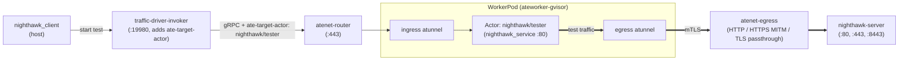

# Nighthawk Egress Benchmark

Benchmarks the Agent Substrate egress dataplane (`atunnel` -> `atenet-egress`) using [Nighthawk](https://github.com/envoyproxy/nighthawk).

## Architecture


```mermaid
flowchart LR
    client["nighthawk_client<br/>(host)"]
    invoker["traffic-driver-invoker<br/>(:19980, adds ate-target-actor)"]
    router["atenet-router<br/>(:443)"]

    subgraph worker["WorkerPod (ateworker-gvisor)"]
        atunnel-ingress["ingress atunnel"]
        actor["Actor: nighthawk/tester<br/>(nighthawk_service :80)"]
        atunnel-egress["egress atunnel"]
    end

    egress["atenet-egress<br/>(HTTP / HTTPS MITM / TLS passthrough)"]
    server["nighthawk-server<br/>(:80, :443, :8443)"]

    client -->|"start test"| invoker
    invoker -->|"gRPC + ate-target-actor: nighthawk/tester"| router
    router --> atunnel-ingress
    atunnel-ingress --> actor
    actor ==>|"test traffic"| atunnel-egress
    atunnel-egress ==>|"mTLS"| egress
    egress ==> server
```

## Prerequisites

The actor, the worker pool, and `nighthawk-server` are sized to outscale `atenet-egress` with one Envoy worker thread, so a run measures the gateway and not the load generator or the origin server. The sizes target a multi-node benchmark cluster, such as 3 x `c3-standard-22` nodes (22 vCPUs and 88 GiB each):

- `traffic-driver-template.yaml.tmpl` gives the `nighthawk/tester` sandbox 16 vCPUs and 8 GiB, so `nighthawk_service` runs the 16 worker threads that the example `nighthawk_client` command below asks for (`--concurrency 16`) without CPU throttling.
- `traffic-driver.yaml.tmpl` requests 12 vCPUs and 8 GiB for the worker pod and limits it to 18 vCPUs and 10 GiB. The request fits a `c3-standard-22` node beside the system DaemonSets, and the limit leaves burst room for the actor and the worker's atunnel. The worker pod and `nighthawk-server` request 18 vCPUs together, so the scheduler may place them on the same node; this benchmark accepts that.
- `nighthawk-server.yaml` runs `nighthawk_test_server` with `--concurrency 8` and 6-8 vCPUs, so upstream HTTP and TLS on `:80`, `:443`, and `:8443` do not saturate before the gateway.

1. **Multi-node benchmark cluster with Agent Substrate deployed**:
   - **Existing cluster** (with `.ate-dev-env.sh` configured):
     ```bash
     go run ./cmd/ate-setup deploy ate-system \
       --credential-provider='{"name":"k8s.io"}' \
       --ingress-allowed-spiffe-ids=spiffe://cluster.local/ns/nighthawk/sa/default
     ```
   - To set the `atenet-egress` Envoy worker thread count (`--concurrency`), prefix the command above with `E2E_ATE_ENVOY_CONCURRENCY=<n>`. `E2E_ATE_ENVOY_CONCURRENCY=1` measures a single Envoy core.
   - Provision the CA bundle in `ate-system` so `atenet-egress` trusts `nighthawk-server`'s `servicedns` certificate on `:443`. The script defaults to a kind context, so name the cluster's context:
     ```bash
     KUBECTL_CONTEXT=<context> hack/setup-e2e-egress-tls-kind.sh
     ```
   - To run on a smaller cluster, lower `requests.cpu` and `requests.memory` in `traffic-driver.yaml.tmpl` and `nighthawk-server.yaml` before deploying.
2. **`kubectl-ate`**: `deploy-traffic-driver.sh` builds it from `./cmd/kubectl-ate` into a temporary directory.
3. **Docker** running locally (used to run `nighthawk_client`).

## Setup

### 1. Deploy `nighthawk-server` and `traffic-driver-invoker`

```bash
./benchmarking/nighthawk-egress/deploy.sh
```

### 2. Deploy the worker pool, actor template, and `nighthawk/tester` actor

```bash
./benchmarking/nighthawk-egress/deploy-traffic-driver.sh
```

### 3. Port-forward `traffic-driver-invoker`

In a separate terminal, forward local port `19980` to the `traffic-driver-invoker` service:

```bash
kubectl -n nighthawk port-forward svc/traffic-driver-invoker 19980:19980
```

## Running the Benchmark

Run `nighthawk_client` against the port-forwarded `traffic-driver-invoker` endpoint (`grpc://127.0.0.1:19980`), which routes the gRPC request to `nighthawk_service` inside the `nighthawk/tester` actor:

```bash
docker run --rm --network=host --entrypoint /usr/local/bin/nighthawk_client envoyproxy/nighthawk-dev:latest --nighthawk-service grpc://127.0.0.1:19980 --rps 1000 --concurrency 16 --protocol http1 --duration 60  http://nighthawk-server.nighthawk.svc:80
```

Nighthawk multiplies `--rps` by `--concurrency`, so this command targets 16,000 requests per second in total.

See [Nighthawk CLI help](https://github.com/envoyproxy/nighthawk#using-the-nighthawk-client-cli) for all command line options.

### Target URLs and Default Egress Policy

| Egress Mode | Target URL | Port |
|---|---|---|
| Plaintext HTTP | `http://nighthawk-server.nighthawk.svc:80` | `80` |
| HTTPS (TLS MITM) | `https://nighthawk-server.nighthawk.svc:443` | `443` |
| TLS Passthrough | `https://nighthawk-server.nighthawk.svc:8443` | `8443` |

## Cleanup

Delete the `nighthawk/tester` actor, actor template, atespace, and worker pool:

```bash
./benchmarking/nighthawk-egress/deploy-traffic-driver.sh --delete
```

Delete `nighthawk-server` and `traffic-driver-invoker` from `nighthawk`:

```bash
./benchmarking/nighthawk-egress/deploy.sh --delete
```

Neither script deletes the `nighthawk` namespace. Delete it with `kubectl delete namespace nighthawk` after `deploy-traffic-driver.sh --delete`, because the actor, template, and atespace live in the ate API, not in the namespace.
