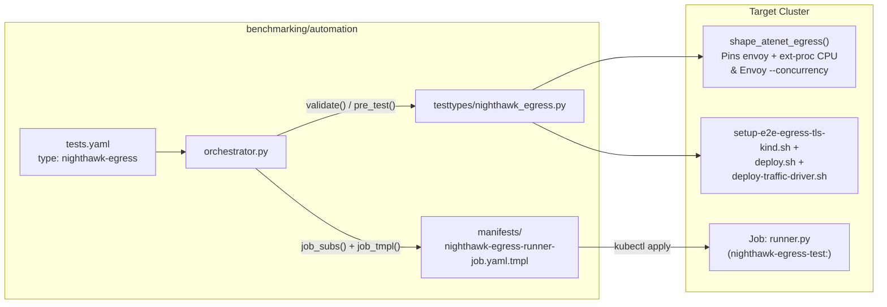

# Nighthawk Egress Benchmark

Benchmarks the Agent Substrate egress dataplane (`atunnel` -> `atenet-egress`) using [Nighthawk](https://github.com/envoyproxy/nighthawk) in [adaptive load mode](https://github.com/envoyproxy/nighthawk/blob/main/docs/root/adaptive_load_controller.md).

## Objective

For a given `atenet-egress` CPU configuration (`envoyCpu`) and egress mode (`http`, `mitm`, `passthrough`), find the maximum request rate the egress gateway sustains while keeping tail latency (`mean + 2stdev`), success rate (`>= 0.998`), and open-loop send rate (`>= 0.90`) within their thresholds. Before and after each session, scrape `atenet-egress` Prometheus counters to verify that requests traversed the expected Envoy filter chain and `ext_proc` policy stream.

## Architecture

The benchmark runs `nighthawk_service` inside a sandboxed actor (`nighthawk/tester`) so every outbound request traverses the egress dataplane from the actor network namespace through `egress-atunnel` and `atenet-egress` to `nighthawk-server`.


```mermaid
flowchart LR
    subgraph runner_job["nighthawk-egress-runner Job (benchmarking ns)"]
        runner["runner.py"]
        alc["nighthawk_adaptive_load_client<br/>exponential ramp + binary search"]
        runner --> alc
    end

    invoker["traffic-driver-invoker<br/>(:19980, adds ate-target-actor)"]
    router["atenet-router<br/>(:443)"]

    subgraph worker["WorkerPod (ateworker-gvisor)"]
        atunnel-ingress["ingress atunnel"]
        actor["Actor: nighthawk/tester<br/>(nighthawk_service :80)"]
        atunnel-egress["egress atunnel<br/>(HTTP/2 CONNECT pool, 100 streams/conn)"]
    end

    subgraph gateway["atenet-egress Pod (envoy + ext-proc pinned to envoyCpu)"]
        envoy["envoy (:443, :15090/stats/prometheus)<br/>listener egress + internal mitm_listener"]
        extproc["ext-proc sidecar<br/>EgressPolicy evaluation"]
        envoy <-->|"gRPC ext_proc"| extproc
    end

    server["nighthawk-server<br/>(:80 HTTP, :443 MITM, :8443 Passthrough)"]

    alc -->|"gRPC ExecutionStream"| invoker
    invoker -->|"mTLS + ate-target-actor: nighthawk/tester"| router
    router -->|"mTLS"| atunnel-ingress
    atunnel-ingress --> actor
    actor ==>|"outbound HTTP/1.1 or TLS"| atunnel-egress
    atunnel-egress ==>|"mTLS HTTP/2 CONNECT"| envoy
    envoy ==>|"upstream HTTP / TLS"| server
    runner -.->|"scrape before & after (:15090)"| envoy
```

### Egress Modes

`egress-policy.yaml` grants `nighthawk/tester` one rule per mode for `nighthawk-server.nighthawk.svc` and `nighthawk-server.nighthawk.svc.cluster.local`. The actor's `/etc/resolv.conf` keeps the pod's search domains and options (`SandboxResolvConf` in `internal/ateworker/actornet/resolvconf.go`), so it inherits kubelet's `ndots:5`, and `internal/atunnel/dns/evaluator.go` evaluates the `cluster.local`-suffixed query while Envoy matches `Host` or SNI `nighthawk-server.nighthawk.svc`. `atenet-egress` selects the inner filter chain from the matched rule kind (see `cmd/atenet/internal/router/README.md`).

| Egress Mode | Target URL | Port | Filter chain |
|---|---|---|---|
| Plaintext HTTP (`http`) | `http://nighthawk-server.nighthawk.svc:80/` | `80` | `egress_cleartext` |
| HTTPS TLS MITM (`mitm`) | `https://nighthawk-server.nighthawk.svc:443/` | `443` | `egress_tls_mitm` |
| TLS Passthrough (`passthrough`) | `https://nighthawk-server.nighthawk.svc:8443/` | `8443` | `egress_passthrough` |

`egress-atunnel` pools mTLS HTTP/2 connections to `atenet-egress:443` (`ClientConn.Reserve` in `internal/atunnel/egress/client.go`) up to Envoy's `http2_protocol_options.max_concurrent_streams: 100` on listener `egress` (`manifests/ate-install/atenet-egress.yaml`), opening one upstream mTLS TCP connection per 100 concurrent `CONNECT` streams.

For TLS modes (`:443` and `:8443`), `spec.py` configures an `envoy.extensions.transport_sockets.tls.v3.UpstreamTlsContext` `transport_socket` with `sni: "nighthawk-server.nighthawk.svc"`, `alpn_protocols: ["http/1.1"]`, and an exact DNS SAN matcher on `nighthawk-server.nighthawk.svc`. In `mitm` mode, `nighthawk_service` validates the `sdsmint` leaf certificate against the actor's projected trust bundle (`trusted_ca.filename: "/run/ate/egress-trust-bundle/trust-bundle.pem"`). In `passthrough` mode, `runner.py` reads the `servicedns.podcert.ate.dev` `ClusterTrustBundle` mounted at `/run/servicedns-ca/ca.crt` (`--servicedns-ca-cert`) and embeds it via `trusted_ca.inline_string`.

## Adaptive Runner Lifecycle and Module Graph

### Adaptive Benchmark Lifecycle

```mermaid
sequenceDiagram
    participant Dev as run-dev.sh / orchestrator.py
    participant Job as runner.py (K8s Job)
    participant Prom as atenet-egress (:15090)
    participant ALC as nighthawk_adaptive_load_client
    participant Inv as traffic-driver-invoker (:19980)
    participant Actor as nighthawk/tester (nighthawk_service)
    participant Srv as nighthawk-server (:80/:443/:8443)
    participant GCS as GCS / Local Artifacts

    Dev->>Job: 1. Build image, shape atenet-egress, render Job manifest, kubectl apply
    Job->>Job: 2. Render spec.textproto via spec.build_egress_session_spec()
    Job->>Prom: 3. Scrape gateway_before.prom across pod IPs & parse baseline counters
    Job->>ALC: 4. Launch nighthawk_adaptive_load_client (--spec-file)
    loop Adjusting stages (exponential ramp + binary search) & Testing stage
        ALC->>Inv: gRPC ExecutionRequest (target URI, RPS, concurrency=16)
        Inv->>Actor: Route via atenet-router (ate-target-actor: nighthawk/tester)
        Actor->>Srv: Open-loop HTTP/TLS traffic via egress-atunnel & atenet-egress
        Actor-->>ALC: ExecutionResponse (histograms, HTTP/SSL/pool counters)
    end
    ALC-->>Job: Write output.textproto & exit
    Job->>Prom: 5. Scrape gateway_after.prom & compute gateway_counter_deltas()
    Job->>GCS: 6. Write capacity.json, stats.jsonl, results.json, status.json & upload to --dest
```

### Python Module Graph

`benchmarking/nighthawk-egress` shares the protobuf descriptor loader, `AdaptiveLoadSessionSpec` builder (`build_session_spec`), and `AdaptiveLoadSessionOutput` parser (`parse_output_textproto`, `stage_rows`, `stats_records`, `write_jsonl`, `session_succeeded`) in `benchmarking/nighthawk_common`.


```mermaid
flowchart TD
    subgraph common["benchmarking/nighthawk_common"]
        cm_spec["spec.py<br/>build_session_spec()<br/>spec_dict_to_textproto()<br/>load_pool()"]
        cm_out["output.py<br/>parse_output_textproto()<br/>stage_rows()<br/>stats_records() / write_jsonl()<br/>session_succeeded()"]
    end

    subgraph egress["benchmarking/nighthawk-egress"]
        eg_spec["spec.py<br/>MODE_URIS (:80, :443, :8443)<br/>build_egress_session_spec()"]
        eg_out["output.py<br/>GATEWAY_COUNTER_KEYS<br/>parse_gateway_prometheus()<br/>gateway_counter_deltas()<br/>capacity_summary()"]
        eg_run["runner.py<br/>scrape_gateway_prometheus()<br/>main()"]
        eg_df["Dockerfile<br/>copies /out/nighthawk.desc + nighthawk_common"]
    end

    cm_spec --> eg_spec
    cm_out --> eg_out
    eg_spec --> eg_run
    eg_out --> eg_run
    eg_df -.->|"packages"| cm_spec
    eg_df -.->|"packages"| cm_out
    eg_df -.->|"packages"| eg_run
```

## Key Design Decisions

### 1. Unified 25 ms Tail-Latency SLO (`latency-ns-mean-plus-2stdev <= 25 ms`)

`spec.build_egress_session_spec` defaults to `tail_latency_slo_ms=25.0` across all three egress modes (`http`, `mitm`, `passthrough`), matching `benchmarking/nighthawk-ingress`. Every run records `slo_max_rps` (the highest RPS stage passing all thresholds) and `slo_max_stage` in `capacity.json`, with `binding_threshold` listing the breached thresholds on the lowest failing stage above `slo_max_rps`.

### 2. Connection Pool and Pending Queue Sizing (`connections=16, max_pending=32`)

Setting a large `max_pending_requests` (such as `10000`) on an HTTPS or TLS pool (`mitm` or `passthrough`) queues thousands of pending requests during overload stages and starts TLS handshakes that remain in flight when an adjusting stage ends. Tearing down `Http1PoolImpl` with in-flight TLS handshakes triggers an upstream Nighthawk C++ crash (`Pure virtual function called!`) inside `nighthawk_service`.

Bounding `max_pending` to `32` per worker with `connections=16` (256 parallel connections across 16 workers) reuses connections while draining pending requests cleanly at stage boundaries. When 256 connections limit client concurrency on high-RPS suites, `capacity.json` sets `client_pool_bound: true` (`upstream_rq_pending_overflow > 0` or `queue_to_connect_p50_ms > 1.0`).

### 3. 10-Counter Gateway Dataplane Proof (`output.py`)

`runner.py` resolves all pod endpoints of `atenet-egress-metrics.ate-system.svc` (`atenet-egress-metrics.yaml`), scrapes `:15090/stats/prometheus` before and after the adaptive session, and computes deltas for 10 gateway counters via `gateway_counter_deltas()`:

| `capacity.json` key | Prometheus series on `atenet-egress:15090` | Increments in |
|---|---|---|
| `egress_connect_2xx` | `envoy_http_downstream_rq_xx{envoy_http_conn_manager_prefix="egress_connect",envoy_response_code_class="2"}` | all modes |
| `egress_downstream_cx_total` | `envoy_http_downstream_cx_total{envoy_http_conn_manager_prefix="egress_connect"}` | all modes |
| `mitm_downstream_cx_total` | `envoy_listener_downstream_cx_total{envoy_listener_address="mitm"}` | all modes |
| `mitm_ssl_handshake` | `envoy_listener_ssl_handshake{envoy_listener_address="mitm"}` | `mitm` |
| `cleartext_ext_proc_streams` | `envoy_http_ext_proc_egress_policy_cleartext_streams_started{envoy_http_conn_manager_prefix="mitm_cleartext"}` | `http` |
| `mitm_ext_proc_streams` | `envoy_http_ext_proc_egress_policy_mitm_streams_started{envoy_http_conn_manager_prefix="mitm_http"}` | `mitm` |
| `passthrough_cx_total` | `envoy_tcp_downstream_cx_total{envoy_tcp_prefix="passthrough"}` | `passthrough` |
| `ext_proc_upstream_rq_total` | `envoy_cluster_upstream_rq_total{envoy_cluster_name="ext_proc_server"}` | all modes |
| `forward_proxy_cx_overflow` | `envoy_cluster_upstream_cx_overflow{envoy_cluster_name=~"egress_forward_proxy.*"}` | 0 (circuit breaker) |
| `forward_proxy_rq_pending_overflow` | `envoy_cluster_upstream_rq_pending_overflow{envoy_cluster_name=~"egress_forward_proxy.*"}` | 0 (circuit breaker) |

The prefixes match the `stat_prefix` values in `manifests/ate-install/atenet-egress.yaml`.

When gateway pod IPs remain stable across the run, `output.capacity_summary` evaluates four checks on the deltas:

- `ext_proc_invariant_ok`: `ext_proc_upstream_rq_total == egress_connect_2xx + cleartext_ext_proc_streams + mitm_ext_proc_streams`.
- `mode_exclusivity_ok` (`_check_mode_exclusivity` in `output.py`) checks that inactive filter chains recorded zero traffic:
  - `http`: `passthrough_cx_total == 0`, `mitm_ssl_handshake == 0`, and `mitm_ext_proc_streams == 0`.
  - `mitm`: `passthrough_cx_total == 0` and `cleartext_ext_proc_streams == 0`.
  - `passthrough`: `mitm_ssl_handshake == 0`, `cleartext_ext_proc_streams == 0`, and `mitm_ext_proc_streams == 0`.
- `forward_proxy_overflow_ok`: `forward_proxy_cx_overflow == 0` and `forward_proxy_rq_pending_overflow == 0`.
- `gateway_counter_reset`: `true` if any counter delta is negative (for example after a container restart).

In active traffic, `http` increments `cleartext_ext_proc_streams`, `mitm` increments `mitm_ssl_handshake` and `mitm_ext_proc_streams`, and `passthrough` increments `passthrough_cx_total` with one `ext_proc` request per `CONNECT` tunnel and zero per inner request.

## Prerequisites

The actor, the worker pool, and `nighthawk-server` are sized to outscale `atenet-egress`, so a run measures the gateway rather than the load generator or origin server. The sizes target a multi-node benchmark cluster such as 3 x `c3-standard-22` nodes (22 vCPUs and 88 GiB each):

- `traffic-driver-template.yaml.tmpl` gives the `nighthawk/tester` sandbox 16 vCPUs and 8 GiB, so `nighthawk_service` runs 16 worker threads (`--client-concurrency 16`) without CPU throttling.
- `traffic-driver.yaml.tmpl` requests 12 vCPUs and 8 GiB for the worker pod and limits it to 18 vCPUs and 10 GiB. The request fits a `c3-standard-22` node beside the system DaemonSets, and the limit leaves burst room for the actor and the worker's atunnel. The worker pod and `nighthawk-server` request 18 vCPUs together, so the scheduler may place them on the same node.
- `nighthawk-server.yaml` runs `nighthawk_test_server` with `--concurrency 8` and 6-8 vCPUs, so upstream HTTP and TLS on `:80`, `:443`, and `:8443` do not saturate before the gateway.

1. **Multi-node benchmark cluster with Agent Substrate deployed** (with `.ate-dev-env.sh` configured at the repository root):
   ```bash
   go run ./cmd/ate-setup deploy ate-system \
     --credential-provider='{"name":"k8s.io"}' \
     --ingress-allowed-spiffe-ids=spiffe://cluster.local/ns/nighthawk/sa/traffic-driver-invoker
   ```
   - `traffic-driver-invoker` runs under ServiceAccount `nighthawk/traffic-driver-invoker` (`traffic-driver-invoker.yaml`), so `atenet-router` requires `spiffe://cluster.local/ns/nighthawk/sa/traffic-driver-invoker` in `--ingress-allowed-spiffe-ids`.
   - For manual runs without `run-dev.sh`, provision the CA bundle in `ate-system` so `atenet-egress` trusts `nighthawk-server`'s `servicedns` certificate on `:443` (`run-dev.sh` and `orchestrator.py` run this automatically unless `--skip-deploy` is passed):
     ```bash
     KUBECTL_CONTEXT="$(kubectl config current-context)" hack/setup-e2e-egress-tls-kind.sh
     ```
   - To run on a smaller cluster, lower `requests.cpu` and `requests.memory` in `traffic-driver.yaml.tmpl` and `nighthawk-server.yaml` before deploying.
2. **`kubectl-ate`**: `deploy-traffic-driver.sh` builds it from `./cmd/kubectl-ate` into a temporary directory.
3. **Docker** running locally (builds the runner image in `run-dev.sh`, or runs `nighthawk_client` for manual checks).

## Settled 25 ms Tail-Latency SLO GKE Results (`c3-standard-22`)

Measured on GKE cluster `nighthawk-bench-1` (`us-east1-b`, 4 x `c3-standard-22` nodes, 22 vCPUs and 88 GiB RAM per node) with `envoy` and `ext-proc` in `deployment/atenet-egress` both pinned to `envoyCpu` (`1 vCPU` and `2 vCPU` at the default `connections=16, max_pending=32`, plus `4 vCPU` runs at `connections=64, max_pending=32`):

### Throughput and Latency Summary

| Mode | `envoyCpu` (`envoy` + `ext-proc`) | Conns / MaxPending | SLO (`mean+2stdev`) | Converged | Binding Threshold(s) | `slo_max_rps` | Testing Stage `achieved_rps` | `p50_ms` | `p90_ms` | `p95_ms` | `p99_ms` | `error_rate` |
|---|---:|---:|---:|:---:|---|---:|---:|---:|---:|---:|---:|---:|
| `http` | `1 + 1` | `16 / 32` | `25 ms` | `true` | `latency-ns-mean-plus-2stdev` | **7,424.0** | **7,424.0** | 10.81 | 16.52 | 21.78 | 31.97 | 0.000132 |
| `mitm` | `1 + 1` | `16 / 32` | `25 ms` | `true` | `latency-ns-mean-plus-2stdev`, `send-rate` | **8,484.3** | **8,546.7** | 14.45 | 30.43 | 32.25 | 36.39 | 0.000246 |
| `passthrough` | `1 + 1` | `16 / 32` | `25 ms` | `true` | `send-rate` | **41,673.2** | **41,673.2** | 5.83 | 6.96 | 7.38 | 8.43 | 0.000102 |
| `http` | `2 + 2` | `16 / 32` | `25 ms` | `true` | `latency-ns-mean-plus-2stdev`, `send-rate` | **16,426.8** | **16,044.6** | 15.50 | 21.26 | 22.24 | 24.41 | 0.000266 |
| `mitm` | `2 + 2` | `16 / 32` | `25 ms` | `true` | `latency-ns-mean-plus-2stdev`, `send-rate` | **8,725.8** | **8,795.4** | 12.85 | 27.48 | 29.18 | 32.55 | 0.000188 |
| `passthrough` | `2 + 2` | `16 / 32` | `25 ms` | `true` | `send-rate` | **44,069.1** | **42,447.4** | 5.76 | 6.95 | 7.31 | 8.13 | 0.000101 |
| `http` | `4 + 4` | `64 / 32` | `25 ms` | `true` | `latency-ns-mean-plus-2stdev` | **10,432.0** | **10,432.0** | 1.18 | 1.81 | 3.93 | 14.62 | 0.0 |
| `mitm` | `4 + 4` | `64 / 32` | `25 ms` | `false` | `latency-ns-mean-plus-2stdev`, `success-rate` | **18,383.1** | **18,542.9** | 3.10 | 23.93 | 29.11 | 42.65 | 0.0 |
| `passthrough` | `4 + 4` | `64 / 32` | `25 ms` | `false` | `send-rate` | **65,848.5** | **65,870.5** | 11.93 | 15.72 | 17.21 | 20.32 | 0.0 |

Across all six `connections=16` runs, the 256-connection pool (`16` workers x `16` connections) held `cx_churn_ratio = 1.0` (`upstream_cx_total = 256` in the 60s `testing` stage, `0` connect failures or timeouts, and `sequencer_blocking_p99_ms = 0.0`). In `mitm` and `passthrough` at `2 + 2` vCPU, `egress-atunnel` on the single `traffic-driver` pod multiplexed 256 tunnels onto 3 outer HTTP/2 connections (`100` streams per connection), and `SO_REUSEPORT` placed the active outer connections onto one Envoy worker thread (`mitm_listener` stays on the accepting worker thread), capping `atenet-egress:envoy` near `1,000m`.

### Gateway Counter Deltas (`gateway_counters`)

| Run | `egress_connect_2xx` | `egress_downstream_cx_total` | `mitm_downstream_cx_total` | `mitm_ssl_handshake` | `cleartext_ext_proc_streams` | `mitm_ext_proc_streams` | `passthrough_cx_total` | `ext_proc_upstream_rq_total` |
|---|---:|---:|---:|---:|---:|---:|---:|---:|
| `http` (1 CPU, 25ms) | 2,125 | 3 | 2,125 | 0 | **1,455,712** | 0 | 0 | **1,457,837** |
| `mitm` (1 CPU, 25ms) | 4,069 | 5 | 4,069 | **4,069** | 0 | **2,069,056** | 0 | **2,073,125** |
| `passthrough` (1 CPU, 25ms) | 5,345 | 9 | 5,345 | 0 | 0 | 0 | **5,345** | **5,345** |
| `http` (2 CPU, 25ms) | 6,860 | 7 | 6,860 | 0 | **3,798,074** | 0 | 0 | **3,804,934** |
| `mitm` (2 CPU, 25ms) | 3,948 | 5 | 3,948 | **3,948** | 0 | **2,121,294** | 0 | **2,125,242** |
| `passthrough` (2 CPU, 25ms) | 6,904 | 7 | 6,904 | 0 | 0 | 0 | **6,904** | **6,904** |
| `http` (4 CPU, 25ms, `conn=64`) | 8,018 | 11 | 8,006 | 0 | **1,641,973** | 0 | 0 | **1,649,991** |
| `mitm` (4 CPU, 25ms, `conn=64`) | 10,187 | 10 | 10,187 | **10,187** | 0 | **3,041,258** | 0 | **3,051,445** |
| `passthrough` (4 CPU, 25ms, `conn=64`) | 12,245 | 11 | 12,245 | 0 | 0 | 0 | **12,245** | **12,245** |

### Peak Container CPU and Memory Utilization (`kubectl top pods --containers`)

| Run | `atenet-egress:envoy` | `atenet-egress:ext-proc` | `atenet-router:envoy` | `traffic-driver:worker` | `nighthawk-server` |
|---|---:|---:|---:|---:|---:|
| `http` (1 CPU, 25ms) | `1,000m` / `52Mi` | `469m` / `17Mi` | `6m` / `25Mi` | `7,178m` / `667Mi` | `409m` / `20Mi` |
| `mitm` (1 CPU, 25ms) | `1,000m` / `54Mi` | `515m` / `20Mi` | `7m` / `25Mi` | `7,490m` / `672Mi` | `232m` / `23Mi` |
| `passthrough` (1 CPU, 25ms) | `999m` / `56Mi` | `14m` / `23Mi` | `8m` / `25Mi` | `12,460m` / `679Mi` | `2,310m` / `27Mi` |
| `http` (2 CPU, 25ms) | `1,998m` / `56Mi` | `971m` / `27Mi` | `7m` / `25Mi` | `8,298m` / `698Mi` | `843m` / `29Mi` |
| `mitm` (2 CPU, 25ms) | `1,001m` / `65Mi` | `513m` / `22Mi` | `7m` / `25Mi` | `7,550m` / `677Mi` | `505m` / `29Mi` |
| `passthrough` (2 CPU, 25ms) | `999m` / `67Mi` | `123m` / `22Mi` | `8m` / `25Mi` | `12,370m` / `681Mi` | `2,383m` / `30Mi` |
| `http` (4 CPU, 25ms, `conn=64`) | `2,345m` / `115Mi` | `1,138m` / `20Mi` | `7m` / `25Mi` | `6,805m` / `762Mi` | `515m` / `35Mi` |
| `mitm` (4 CPU, 25ms, `conn=64`) | `2,957m` / `143Mi` | `1,554m` / `21Mi` | `7m` / `25Mi` | `8,103m` / `769Mi` | `715m` / `33Mi` |
| `passthrough` (4 CPU, 25ms, `conn=64`) | `1,929m` / `144Mi` | `1,539m` / `21Mi` | `8m` / `26Mi` | `11,510m` / `784Mi` | `3,385m` / `45Mi` |

## Running the Benchmark

### Quick Dev Run (`run-dev.sh`)

With `.ate-dev-env.sh` configured and `ate-system` deployed on the cluster, `run-dev.sh` validates the run knobs through `benchmarking/automation/orchestrator.py`, builds and pushes `${KO_DOCKER_REPO}/nighthawk-egress-test:<tag>`, shapes `deployment/atenet-egress` and deploys the `nighthawk` rig via `testtypes.nighthawk_egress` (or shapes `deployment/atenet-egress` alone when `--skip-deploy` is passed), submits the `nighthawk-egress-runner-job.yaml.tmpl` Job, streams progress logs, and prints `capacity.json` from GCS:

```bash
./benchmarking/nighthawk-egress/run-dev.sh --mode http --envoy-cpu 1 --tail-latency-slo-ms 25
./benchmarking/nighthawk-egress/run-dev.sh --skip-deploy --mode mitm --envoy-cpu 1 --tail-latency-slo-ms 25
./benchmarking/nighthawk-egress/run-dev.sh --skip-deploy --mode passthrough --envoy-cpu 1 --tail-latency-slo-ms 25
```

See `./benchmarking/nighthawk-egress/run-dev.sh --help` for `--measuring-period`, `--testing-stage-duration`, `--convergence-deadline`, `--connections`, `--max-pending`, and `--dest` overrides (default `--dest` is `gs://${BUCKET_NAME}/nighthawk-egress-results`).

### CI Automation (`benchmarking/automation`)

`benchmarking/automation/tests.yaml` registers four `type: nighthawk-egress` suites (`egress_gatewaycap_http_1cpu`, `egress_gatewaycap_mitm_1cpu`, `egress_gatewaycap_passthrough_1cpu`, and `egress_gatewaycap_http_2cpu`), dispatched by `benchmarking/automation/orchestrator.py` to `benchmarking/automation/testtypes/nighthawk_egress.py`. Because `nighthawk-egress` deploys its own gVisor rig (`USES_SHARED_WORKLOADS = False`), `sandboxClass` must be `gvisor` and shared-workload top-level fields (`workerCount`, `actorMemory`, `actorCPU`, `workerMemory`, `workerWaitTimeout`, `isolate`) are rejected.


```mermaid
flowchart LR
    subgraph Orchestrator["benchmarking/automation"]
        TY["tests.yaml<br/>type: nighthawk-egress"]
        ORCH["orchestrator.py"]
        NHE["testtypes/nighthawk_egress.py"]
        TMPL["manifests/<br/>nighthawk-egress-runner-job.yaml.tmpl"]
    end

    subgraph Cluster["Target Cluster"]
        SHAPE["shape_atenet_egress()<br/>Pins envoy + ext-proc CPU<br/>& Envoy --concurrency"]
        SETUP["setup-e2e-egress-tls-kind.sh +<br/>deploy.sh +<br/>deploy-traffic-driver.sh"]
        JOB["Job: runner.py<br/>(nighthawk-egress-test:<tag>)"]
    end

    TY --> ORCH
    ORCH -->|"validate() / pre_test()"| NHE
    NHE --> SHAPE
    NHE --> SETUP
    ORCH -->|"job_subs() + job_tmpl()"| TMPL
    TMPL -->|"kubectl apply"| JOB
```

```yaml
  - name: egress_gatewaycap_http_2cpu
    description: "Egress gateway capacity (cleartext HTTP): Nighthawk adaptive max-RPS search under a 25ms tail-latency SLO, Envoy at 2 CPUs"
    type: nighthawk-egress
    targetCluster: dev
    duration: 30m
    nighthawk-egress:
      mode: http
      envoyCpu: 2
      tailLatencySloMs: 25
```

### Configuration Knobs (`nighthawk-egress:` block in `tests.yaml`)

| Knob (`tests.yaml`) | CLI Flag (`runner.py`) | Default | Description |
|---|---|---|---|
| `envoyCpu` | `--envoy-cpu` | *(required)* | CPU request and limit pinned on `envoy` and `ext-proc` in `deployment/atenet-egress` (at 1 replica), plus Envoy `--concurrency`. |
| `mode` | `--mode` | `http` | Egress dataplane path: `http` (`:80`), `mitm` (`:443`), or `passthrough` (`:8443`). |
| `tailLatencySloMs` | `--tail-latency-slo-ms` | `25` | Latency SLO bound (`mean + 2stdev`) in milliseconds (`0` disables). |
| `clientConcurrency` | `--client-concurrency` | `16` | Nighthawk worker threads inside `nighthawk/tester`. |
| `connections` | `--connections` | `16` | HTTP/1.1 connections per Nighthawk worker thread. |
| `maxPending` | `--max-pending` | `32` | Max queued requests per connection pool before overflow failure. |
| `initialRps` | `--initial-rps` | `500` | Starting total RPS across all worker threads. |
| `expFactor` | `--exp-factor` | `2.0` | Multiplicative step factor (`> 1.0`) during exponential search. |
| `measuringPeriod` | `--measuring-period` | `20s` | Duration of each adaptive search step. |
| `convergenceDeadline` | `--convergence-deadline` | `600s` | Total time budget for the adaptive search phase. |
| `testingStageDuration` | `--testing-stage-duration` | `60s` | Duration of the confirmation stage at the converged RPS. |
| `successRateThreshold` | `--success-rate-threshold` | `0.998` | Minimum fraction of 2xx responses (`(0, 1]`) without pool overflow or connection errors. |
| `sendRateThreshold` | `--send-rate-threshold` | `0.9` | Minimum achieved-to-intended RPS ratio (`(0, 1]`). |

`runner.py` also accepts `--servicedns-ca-cert` (default `/run/servicedns-ca/ca.crt`, mounted from `servicedns.podcert.ate.dev/identity` in `nighthawk-egress-runner-job.yaml.tmpl` and read when `--mode passthrough`), `--invoker-addr`, `--gateway-metrics-url`, `--desc-path`, and `--port-forward`.

### Output Artifacts

Each run writes its artifacts under `<dest>/runs/<name>/run_date=YYYY-MM-DD/run_ts=<epoch>/run_tag=<tag>/`:

| File | Description |
|---|---|
| `capacity.json` | Verdict summary: `mode`, `envoy_cpu`, `converged`, `testing_stage_completed`, `testing_passed`, `slo_max_rps`, `slo_max_stage`, `binding_threshold`, `client_pool_bound`, `gateway_counters`, `tunnels_per_stage`, `requests_per_connection`, `cx_churn_ratio`, connection setup telemetry (`queue_to_connect_*`, `sequencer_blocking_*`), gateway checks (`ext_proc_invariant_ok`, `mode_exclusivity_ok`, `forward_proxy_overflow_ok`, `gateway_counter_reset`), and testing-stage `p50_ms`, `p95_ms`, and `p99_ms`. |
| `stats.jsonl` | Per-stage JSONL records with Nighthawk built-in metrics (`achieved_rps` and `send_rate` are recomputed from the exact stage duration, with Nighthawk's own values under the `*_cpp` keys), HTTP/SSL/pool counters, `requests_per_connection`, `cx_churn_ratio`, `queue_to_connect_*`, `sequencer_blocking_*`, latency percentiles, and `failed_thresholds`. |
| `results.json` | Full `AdaptiveLoadSessionOutput` converted to JSON. |
| `spec.textproto`, `output.textproto` | Raw Nighthawk input spec and output textproto. |
| `gateway_before.prom`, `gateway_after.prom` | Raw Prometheus snapshots from `atenet-egress:15090/stats/prometheus` before and after the run. |
| `status.json`, `logs.txt` | Adaptive client exit code, `converged`, `testing_stage_completed`, `slo_max_rps`, and combined stdout/stderr logs. |

### Manual Setup and Single-Rate Check

To deploy the workload components manually and drive a single fixed-rate `nighthawk_client` run:

```bash
./benchmarking/nighthawk-egress/deploy.sh
./benchmarking/nighthawk-egress/deploy-traffic-driver.sh
kubectl -n nighthawk port-forward svc/traffic-driver-invoker 19980:19980
```

In a second terminal, run `nighthawk_client` against `grpc://127.0.0.1:19980`:

```bash
docker run --rm --network=host --entrypoint /usr/local/bin/nighthawk_client envoyproxy/nighthawk-dev:latest --nighthawk-service grpc://127.0.0.1:19980 --rps 1000 --concurrency 16 --protocol http1 --duration 60 http://nighthawk-server.nighthawk.svc:80/
```

Nighthawk multiplies `--rps` by `--concurrency`, so this command targets 16,000 requests per second in total. See [Nighthawk CLI help](https://github.com/envoyproxy/nighthawk#using-the-nighthawk-client-cli) for all command line options.

## Cleanup

Delete the `nighthawk/tester` actor, actor template, atespace, and worker pool:

```bash
./benchmarking/nighthawk-egress/deploy-traffic-driver.sh --delete
```

Delete `nighthawk-server`, `traffic-driver-invoker`, and the `atenet-egress-metrics` Service:

```bash
./benchmarking/nighthawk-egress/deploy.sh --delete
```

Neither script deletes the `nighthawk` namespace during manual runs (`orchestrator.py` deletes it during automated suite teardown). Delete it manually with `kubectl delete namespace nighthawk` after `deploy-traffic-driver.sh --delete`, because the actor, template, and atespace live in the ate API rather than in the namespace.
