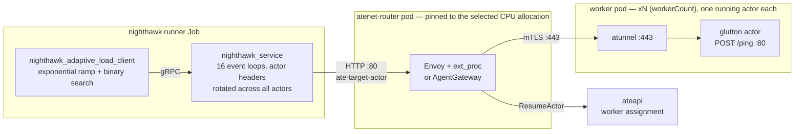
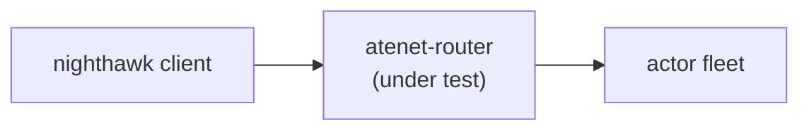

# Nighthawk ingress-capacity benchmark

## Objective

Measure the scale and performance of substrate's networking
infrastructure. This benchmark covers the ingress routing path
(`atenet-router --mode=ingress`); egress will be a separate benchmark.

The concrete measurement, per dataplane CPU configuration:

> **What is the maximum request rate the ingress path sustains while
> tail latency stays under the SLO?\***

The benchmark finds that number automatically using
[Nighthawk](https://github.com/envoyproxy/nighthawk) (Envoy's benchmarking
client) in
[adaptive mode](https://github.com/envoyproxy/nighthawk/blob/main/docs/root/adaptive_load_controller.md):
it ramps open-loop load until a threshold breaks, binary-searches the
boundary, and confirms with a longer run. Run
it across proxy CPU configurations to get a capacity-per-core curve, or
continuously in CI to catch routing-path performance regressions.

\* *The SLO bounds latency **mean+2σ**, not a true percentile: Nighthawk's
adaptive search can only gate on its
[built-in metrics](https://github.com/envoyproxy/nighthawk/blob/main/docs/root/adaptive_load_controller.md#available-metric-plugins)
(success-rate, send-rate, rps, latency mean/stdev). mean+2σ ≈ p95–p97 only
for a bell-shaped latency distribution; true p50/p95/p99 are still reported
per stage, but do not steer the search.*

## What it measures

Every request exercises the **full production routing path** — created and
warmed sandboxed actors, actor-reference header routing, the dataplane routing
decision, and the mTLS hop to the worker:



Client-measured latency therefore covers: network to the selected dataplane,
its routing decision (including the ateapi lookup), the mTLS hop, and the
actor's handler.

**"Capacity" means all three of the following hold at once** — each threshold
catches a failure mode the others can't see:

| Threshold (tests.yaml knob) | Guards against | Typical symptom at the limit |
|---|---|---|
| `tailLatencySloMs` — latency mean+2σ ≤ X ms (see [Objective](#objective)) | the router getting *slow* | queues build inside the dataplane, tail latency climbs past the SLO |
| `successRateThreshold` (0.999) | the router getting *fast but wrong* | 503s from parking overflow, 504 route timeouts |
| `sendRateThreshold` (0.9) | the *client* being unable to deliver the load | paced requests skipped once latency × RPS exceeds the connection pools |

## How it works

One Kubernetes Job per `type: nighthawk-ingress` tests.yaml entry, driven by
[`../automation/orchestrator.py`](../automation/orchestrator.py):

1. **Pin the router.** The orchestrator patches the `atenet-router`
   Deployment. Envoy tests give both Envoy and its ext_proc sidecar
   `envoyCpu` and set Envoy `--concurrency`; AgentGateway tests give its
   single proxy container `agentgatewayCpu`. Waits for rollout; every test
   tears substrate down afterwards, so nothing leaks.
2. **Create + warm actors.** The runner creates one glutton actor per
   WorkerPool worker (the entry's `workerCount`) via ateapi and POSTs
   `/ping` through the router with each actor's routing header until it
   answers 200.
3. **Adaptive search.** Open-loop traffic with the actor routing header rotated
   across all actors; `clientConcurrency` event loops (default 16,
   decoupled from `envoyCpu`) and large per-loop pools so the harness is
   never the bottleneck. Exponential ramp → binary search → a 60s
   **testing stage** at the converged rate.
4. **Upload results** (see below). The Job exits 0 only if the session
   converged and all artifacts uploaded.

## How to run it

### In CI

Add a `type: nighthawk-ingress` entry to the tests file the orchestrator
runs (`--tests`), e.g.:

```yaml
- name: ingress_routercap_envoy_2cpu
  type: nighthawk-ingress
  targetCluster: dev
  duration: 30m          # job-wait budget only
  workerCount: 50        # also the actor fleet size: one warm actor per worker
  nighthawk-ingress:
    envoyCpu: 2
    tailLatencySloMs: 25

- name: ingress_routercap_agentgateway_2cpu
  type: nighthawk-ingress
  targetCluster: dev
  duration: 30m
  workerCount: 50
  ateArgs: ["--atenet-router=agentgateway"]
  nighthawk-ingress:
    dataplane: agentgateway
    agentgatewayCpu: 2
    tailLatencySloMs: 25
```

### On a dev cluster

One-time prerequisites: a cluster from the GKE Quickstart in the repo
README, with nodes big enough for the router, actor fleet, and runner. Envoy
uses `2 × envoyCpu` CPUs (proxy plus `ext_proc`); AgentGateway uses
`agentgatewayCpu`; the runner requests `clientConcurrency+1`.

#### Reproducible 2-CPU topology

For the 50-actor, 2-CPU capacity run, use six `c3-standard-22` nodes on GKE
1.37 or later, where PodCertificate and ClusterTrustBundle are GA.

| Role | Nodes | Placement |
| --- | ---: | --- |
| Router under test | 1 | `ROUTER_NODE` |
| Nighthawk runner | 1 | `RUNNER_NODE` |
| Control-plane headroom | 1 | `CONTROL_PLANE_NODE` |
| Actor workers | 3 | `WORKER_NODES` |

The [cluster creator](create-gke-cluster.sh) makes that layout durable at the
node-pool level. The router, runner, and worker pools carry both their role
label and a matching `NoSchedule` taint. The benchmark manifests add the
corresponding toleration, so unrelated pods cannot silently share a measured
node. The control-plane pool is intentionally untainted: it is the only pool
available to Kubernetes and Substrate system pods.

The validated load profile is: 50 warm glutton actors, 16 event loops, 1,000
connections per loop, 500 initial RPS, 10-second adjustment stages, a 60-second
final stage, 99.9% success-rate threshold, 90% send-rate threshold, and a
25 ms mean-plus-two-standard-deviations latency SLO. Record the Kubernetes and
proxy versions with every result; topology materially changes capacity.

Create the cluster once. It does not delete or modify an existing cluster and
writes the discovered node names to a topology file. It creates only GKE and
its node pools; create the snapshot bucket and IAM bindings through the normal
[`tools/setup-gcp`](../../tools/setup-gcp/README.md) workflow first.

```bash
bash benchmarking/nighthawk-ingress/create-gke-cluster.sh \
  --project "$PROJECT_ID" --cluster substrate-nighthawk --location us-east4-a \
  --topology-file /tmp/substrate-nighthawk-topology.env
```

After provisioning the standard Substrate dependencies, deploy the system and
apply the placement patch. The WorkerPool and runner use matching selectors and
tolerations, so the actor fleet and load generator stay off the router node.

```bash
hack/install-ate.sh --deploy-ate-system
bash benchmarking/nighthawk-ingress/setup-gke-topology.sh \
  --config /tmp/substrate-nighthawk-topology.env

benchmarking/workloads/deploy.sh --deploy --worker-count 50 --sandbox-class gvisor \
  --node-selector benchmarking.ate.dev/nighthawk-role=worker \
  --toleration benchmarking.ate.dev/nighthawk-role=worker:NoSchedule
./benchmarking/nighthawk-ingress/run-dev.sh --dataplane agentgateway --proxy-cpu 2 \
  --runner-node "$(awk -F= '/^RUNNER_NODE=/{gsub(/\"/, \"\", $2); print $2}' /tmp/substrate-nighthawk-topology.env)"
```

Then each benchmark run is one command, ~8–10 min:

```bash
./benchmarking/nighthawk-ingress/run-dev.sh --envoy-cpu 2 --runner-node "$RUNNER_NODE"
```

[`run-dev.sh`](run-dev.sh) runs only the benchmark layer. One invocation:

1. Verifies the prerequisites above, printing the fix for anything missing.
2. Pins the router if its current cpu differs from `--envoy-cpu`, so CPU
   sweeps need no redeploy.
3. Builds the runner image **from your working tree** — uncommitted changes
   included, and such runs are tagged `-dirty`.
4. Submits the Job, streams its logs, and prints the resulting
   `capacity.json`.

Flags: `--envoy-cpu`, `--proxy-cpu`, `--dataplane`, `--runner-node`, `--actors`,
`--tail-latency-slo-ms`, `--atespace`, `--dest` (see
`--help`). It needs a running Docker daemon and gcloud/kubectl credentials.

Notes:

- The script does not redeploy substrate — if substrate code changed,
  rerun `hack/install-ate.sh --deploy-ate-system` first.
- `--atespace` isolates actor *fleets* between experiments sharing a
  cluster; capacity runs themselves still need the router exclusively
  (the cpu pin is global and the run saturates it).
- The full clone + deploy/teardown-per-test cycle is the orchestrator's
  job and runs in CI — see "In CI" above.

### Reading the results

Artifacts land under
`<dest>/runs/<name>/run_date=.../run_ts=.../run_tag=<commit>/`.
Start with `capacity.json`, drill into `stats.jsonl`:

| file | contents |
|---|---|
| `capacity.json` | **the verdict**: `slo_max_rps` — the highest rate that passed every threshold (the number to track), `binding_threshold` — which limit defined it, and separately prefixed `testing_*` measurements from the final boundary-probe stage. That stage can fail by design; do not treat its percentiles as capacity-stage percentiles. |
| `stats.jsonl` | one record per stage: Nighthawk's builtin metrics under `metric_nighthawk.builtin_*` keys (note: `achieved_rps` counts requests *sent*, errors included), status counts, latency percentiles, and the stage's `failed_thresholds` |
| `results.json` | full session, 1:1 with Nighthawk's output |
| `spec.textproto`, `output.textproto` | exact Nighthawk input/output, for reproducibility |
| `status.json`, `logs.txt` | run metadata + process logs |

## Tuning

### Configuration knobs (the `nighthawk-ingress:` block)

The fleet size is the entry's top-level `workerCount` (required): the
benchmark warms one actor per worker, so it is also the number of glutton
actors receiving rotated actor-reference header traffic. Everything else lives in the
`nighthawk-ingress:` block:

| Knob | Default | Meaning |
|---|---|---|
| `dataplane` | `envoy` | Proxy implementation: `envoy` or `agentgateway`. AgentGateway tests must add `ateArgs: ["--atenet-router=agentgateway"]`. |
| `envoyCpu` | required for Envoy | cpu `requests=limits` on both router containers, and Envoy's `--concurrency`. |
| `agentgatewayCpu` | required for AgentGateway | cpu `requests=limits` on AgentGateway's single proxy container. |
| `runnerNodeSelector` | `{}` | Optional node selector for the Nighthawk Job. Use it with `runnerTolerations` when the runner node is tainted. |
| `runnerTolerations` | `[]` | Kubernetes tolerations for the Nighthawk Job. |
| `atespace` | `ingress-benchmark` | Actor namespace; name it per *experiment*, never per run (atespaces are never auto-deleted). |
| `tailLatencySloMs` | 0 (disabled) | The SLO: upper bound on latency mean+2σ (~p95 proxy), in ms. |
| `successRateThreshold` | 0.999 | Minimum 2xx fraction of sent requests. |
| `sendRateThreshold` | 0.9 | Minimum sent fraction of the paced schedule (open-loop backstop). |
| `clientConcurrency` | 16 | Nighthawk event loops; the runner Job requests `clientConcurrency+1` CPUs. Deliberately decoupled from `envoyCpu`. |
| `connections` | 1000 | Client connections per event loop. |
| `maxPendingRequests` | 10000 | Client-side queue per event loop. |
| `initialRps` | 500 | Total starting RPS of the exponential ramp. |
| `exponentialFactor` | 2.0 | Ramp multiplier per step; smaller = tighter bracket around the knee, more steps. |
| `measuringPeriod` | 10s | Length of each adjusting step. |
| `convergenceDeadline` | 600s | The session errors if the search hasn't converged by then. |
| `testingStageDuration` | 60s | Final confirmation run at the converged rate. |

### Sizing the rig: hit the router's ceiling, not the harness's

Three components sit in series; the reported capacity is whichever
saturates first. The sizing knobs exist to make that the router:



**One rule:** client and fleet must each handle ~2× the capacity you
expect to measure — the ramp overshoots before converging, and the rig
must survive the overshoot stages, not just the converged rate. A failed
stage's row in `stats.jsonl` tells you who saturated:

- `send_rate` below threshold — the client; raise `clientConcurrency`.
- 502s — the actor fleet; raise `workerCount`.
- latency climbing smoothly into the SLO — the router itself; that is
  the measurement.
