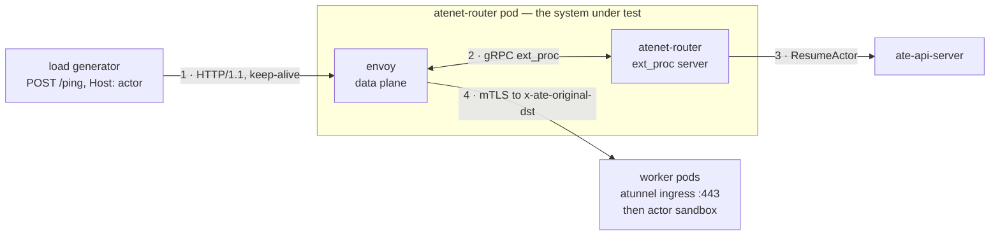
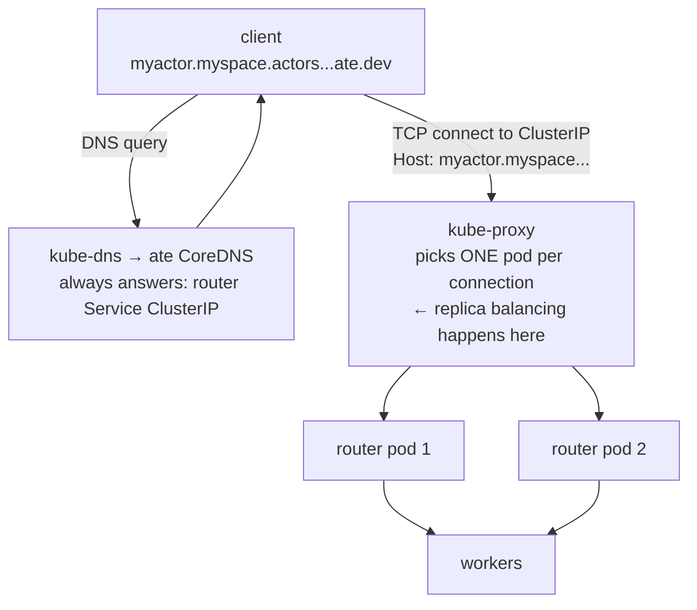

# routercap

Measures how much load one `atenet-router` pod absorbs before it stops
absorbing, and what the failure looks like when it does. The output is a time
series per run — `runs/<timestamp>/report.html` — and the findings live in
[RESULTS.md](RESULTS.md).

## Why this test exists

Every actor request goes through `atenet-router`, and nobody had measured
what one pod can take. Without that figure there is no basis for the replica
count, for the CPU limits in
[atenet-router.yaml](../../manifests/ate-install/atenet-router.yaml), or for
an alert threshold — and no way to tell a regression from a busier week.

A single "N QPS" number would not settle it either. What matters is the shape
at the edge: whether throughput plateaus or collapses, whether latency
degrades or cliffs, and whether the binding constraint is CPU at all. So the
harness walks a rising load ladder and records the whole curve, at several
Envoy CPU sizes.

### Why not locust

Locust-style load tests are closed-loop: each simulated user sends a request,
waits for the reply, then sends the next. The moment the router slows down,
the users slow down with it — offered load sags exactly when the system is
most interesting, and the latency samples miss the worst moments because
fewer requests were in flight during them. The literature calls this
coordinated omission. A closed-loop test of this router would report a
flattering curve that bends where the client throttled, not where the router
failed.

This harness is open-loop: a pacer fires requests on a fixed schedule whether
or not earlier ones have returned, so offered load stays the independent
variable all the way through a collapse. The repo's boomer/locust rig
(`cmd/benchmarking/boomer-glutton`) remains the right tool for
workload-shaped soak tests; it is the wrong instrument for finding a wall.

## What this measures

`atenet-router` is one pod with two containers. `envoy` is the data plane.
`atenet-router` is a Go sidecar acting as Envoy's ext_proc server: it
decides, per request, which worker the actor is on and resumes it if it is
not running.



Envoy holds the request open across step 2, so every in-flight request
occupies one ext_proc slot and, at step 4, one upstream connection and one
source port. That is why concurrency is a measured series and not an
afterthought.

### The latency

End-to-end client-observed latency of one `/ping` request, timed from when
the pacer scheduled it to be sent — not from when it left the socket.
Concretely, the clock covers, in order:

* any wait inside the generator (the request was due but blocked: no idle
  connection, dial in progress). This wait is counted on purpose: at load it
  usually means the router has not answered the requests already on the
  connections, and a real client's request queues in its own pool the same
  way,
* the TCP/TLS dial if a fresh connection was needed,
* Envoy's handling, the ext_proc call to the sidecar (warm actor resume
  included), the round trip to the worker,
* the response coming back and being read.

Starting the clock at the scheduled time avoids coordinated omission, the
standard way load tests lie: a clock that starts at the actual send never
measures a stall, because nothing is sent during one. Here, a request that
was due while the router stalled carries the whole stall in its latency.
Timeouts count their full elapsed time instead of vanishing, and percentiles
are computed from raw per-request samples, not histogram estimates.

## What this doesn't measure

**Cold actor starts.** Every actor is created and resumed before the ladder
begins; a cold resume takes ~3.8 s and would otherwise land inside the first
rung as router latency. The warm per-request control-plane lookup stays in
the path (it is part of every real request) and is reported separately as
`resume` — 0.7-1.5 ms in healthy windows.

**DNS and kube-proxy.** In production a client resolves the actor's hostname
through ate's CoreDNS (which always answers with the router Service's
ClusterIP) and kube-proxy picks a router pod per TCP connection. This harness
dials router pod IPs directly, skipping both hops, so a wall indicts Envoy
with zero doubt — not conntrack, not kube-dns, not a NAT rule. What the
skipped hops would add is small and knowable (a per-connection DNAT costing
microseconds, a DNS lookup per dial); what they would cost the measurement is
attribution.



When a run drives more than one router replica, the harness balances across
them itself, round-robin with each actor stuck to one replica — a cleaner split than
kube-proxy's random per-connection assignment, so multi-replica numbers are
an upper bound with a caveat. The boomer rig dials the Service DNS name, so
it too skips ate's CoreDNS but does pass through kube-proxy; only a real
client exercises the full path.

## What this produces

A run directory holds three raw-data files per arm — `samples.jsonl` (the
windows), `run.json` (the header) and `worker-cpu.jsonl` (per-thread CPU) —
plus the artifacts charts.py renders from them: `report.html` (every chart
embedded), the standalone SVGs, and `summary.json` (per-rung aggregates in
machine-readable form, for CI gates). Only `report.html` is committed; the
data behind it stays on the machine that ran the sweep. Debug
files (the rendered Job manifest, the binary's stderr, the thread sampler's
raw dumps) survive only when an arm fails. Six series per arm, all computed over
the same wall-clock window, so a vertical line through the chart panels is
one moment:

| Series | What it is | Why read it |
|---|---|---|
| offered QPS | requests the pacer *scheduled* | the independent variable, taken from the schedule so a struggling generator cannot redefine the x-axis |
| latency p50, p95 | client-observed, from scheduled send time | p50 is the healthy-path cost; p95 is where degradation shows first |
| per-hop share | the mean request split across before-Envoy, Envoy, sidecar, worker | says *which* hop the latency is in |
| router CPU | cores, `envoy` and `atenet-router` separately | says whether the ceiling is CPU at all |
| per-thread CPU | the hottest and the mean Envoy worker thread, 0-1 axis | one thread can saturate while the container average reads idle; lines hugging is balance, a gap is skew |
| router memory | working set, both containers | says whether a plateau is a slow leak |

The throughput panel carries four companions — achieved, success, in-flight
and the generator's connection pool — because the gaps between them are the
finding: achieved against offered says whether the router kept up, and a pool
step marks a window where a stall made the generator dial thousands of fresh
connections.

### Reading the per-thread CPU panel

Envoy assigns each connection to one worker thread for life, and container
CPU is the sum across threads, so one drowning thread can hide inside an
idle-looking total. The panel plots the busiest single thread against the
per-thread mean on a 0-1 axis:

* lines hugging: load is balanced across threads,
* a gap opening: skew, one thread doing far more than its share,
* hottest at the 1.0 line: that thread is saturated, and requests assigned
  to it queue no matter how idle the container looks.

### Reading the per-hop share panel

Each window's mean request is split into four spans that do not overlap and
sum to the whole; the panel draws each as a percentage of that window's mean:

```
100% ┌────────────────┐ ─┐                    ─┐
     │   worker leg   │  │ measured:           │
     ├────────────────┤  │ upstream_rq_time    │
     │    sidecar     │  │ measured:           ├─ in-Envoy time
     ├────────────────┤  │ route.duration      │  (downstream_rq_time,
     │  Envoy itself  │  │ residual            │   measured)
     ├────────────────┤ ─┘                    ─┘
     │  before Envoy  │    residual  ←  the rig's share: generator
  0% └────────────────┘               queueing plus the dial
        one window's mean request = 100%
```

Two rules are built into the drawing. The spans are means, not percentiles —
percentiles do not decompose. And the panel hatches itself wherever Envoy's
whole-millisecond rounding is worth more than 5% of the mean request, which
is most healthy windows; the split is for reading collapses. Raw milliseconds
for any window are in the hover readout and `samples.jsonl`.

## Methodology

### Load generation

The pacer fires on a fixed tick. The generator measures itself: dispatch lag
(scheduled vs actual send) near zero means the x-axis is real. The transport
dials without a per-host cap on purpose — a cap would queue requests
internally, which is a closed loop wearing an open loop's clothes; the pool
size is plotted instead. The default ladder is 16 rungs, +1,000 QPS each,
45 s per rung with the first 10 s discarded so no window blends a rung's ramp
with its steady state. Load spreads over one pre-warmed actor per worker pod
(100 by default, 200 in the shipped runs).

Six guards separate "the rig ran out" from "the router ran out": generator
CPU, dispatch lag, client keep-alive, client port headroom, per-worker
connection rate, and control-plane throttling. A fatal trip ends the arm and
marks it rig-limited. Thresholds and reasoning are in
[guards.go](../../internal/benchmarking/routercap/guards.go). Envoy's own
port-exhaustion and breaker counters are deliberately data, not guards — that
cliff is what the run came to measure.

### Data collection

CPU and memory come from cAdvisor on the kubelet — the only source with raw
cumulative counters, CFS accounting and a per-container timestamp together
(Envoy exports no process CPU counter; `metrics.k8s.io` pre-averages over a
window it picks). The sampler runs off cAdvisor's clock: it polls until the
router container's timestamp advances, and every number in a record — CPU,
memory, Envoy deltas, latency percentiles — is computed over exactly that
`[t0, t1)` interval. The ~10 s that costs is the honest resolution of any
container CPU figure on a kubelet-managed node; `t0`, `t1` and
`alignment_spread_ms` ship in every record so the claim is checkable. The
full argument is at the top of
[cadvisor.go](../../internal/benchmarking/routercap/cadvisor.go).

### Cluster setup, and why

`provision.sh` builds a dedicated cluster, `substrate-routercap`, with four
tainted node pools plus GKE's small untainted `default-pool`:

| Pool | Nodes (default) | Runs |
|---|---|---|
| `router` | 1 × `c3-standard-88` | `atenet-router`, alone |
| `workers` | 2 × `c3-standard-88` | worker pods (the shipped runs used 4 nodes / 200 pods) |
| `loadgen` | 1 × `c3-standard-88` | the generator, alone |
| `system` | 1 × `c3-standard-88` | api-server, controller, dns, valkey |
| `default-pool` | 1 × `e2-standard-8` | GKE addons only |

The isolation that matters is the node, not the QoS class. Only the router
containers get explicit CPU limits, because Envoy's limit is the variable
under test. A CPU limit is CFS quota, and quota does not partition the things
that bite at this scale — NIC queues, conntrack, L3, memory bandwidth — which
are all per node. The router node stays at 88 cores even though the largest
arm needs 16: the arm's limit should be the only thing constraining Envoy.

### Layout

| Path | What it is |
|---|---|
| `benchmarking/routercap/provision.sh` | one-shot cluster build |
| `benchmarking/routercap/run.sh` | sweep driver: patches the router per arm, launches the generator Job, demuxes its output into the run directory |
| `benchmarking/routercap/common.sh` | shared config and helpers for the two scripts |
| `benchmarking/routercap/charts.py` | renders `report.html`, SVGs and `summary.json` from raw data only |
| `benchmarking/routercap/demux.py` | splits the Job's stdout stream (data) from stderr (logs) into per-arm files |
| `benchmarking/routercap/threads.sh` + `threads.py` | per-thread CPU sampler (ephemeral debug container reading /proc) and its parser |
| `benchmarking/routercap/manifests/` | the generator Job template |
| `benchmarking/routercap/runs/` | one directory per run; raw data is committed, HTML/SVG are regenerated |
| `cmd/benchmarking/routercap/` | the generator binary |
| `internal/benchmarking/routercap/` | the library: pacer, sender, actor pool, cAdvisor windows, Envoy/sidecar scrapers, span math, guards, records |

## How to reproduce

### Prerequisites

<details>
<summary>What you need before starting</summary>

* `gcloud` authenticated against a project that can create GKE clusters and
  `c3-standard-88` nodes in `us-central1-a`.
* The environment configuration sourced first (`source .ate-dev-env.sh`)
  so `PROJECT_ID`, `KO_DOCKER_REPO`, etc. are set.
* `kubectl`, `ko` (via `hack/run-tool.sh`) and `python3` on the path.

</details>

### Step 1: provision the cluster

* Creates the `substrate-routercap` cluster with its tainted node pools.
* Installs the substrate control plane.
* Applies the worker pool: one worker pod per replica on the worker nodes.
* Pins each component to its pool.

```bash
benchmarking/routercap/provision.sh
```

### Step 2: smoke-test the rig

* Runs one small arm with 2 actors and 3 short rungs. Measures nothing.
* Proves the wiring: the router patch takes, the Job launches, the scrapes
  and cAdvisor windows fill, and the run directory lands.

```bash
benchmarking/routercap/run.sh --smoke
```

### Step 3: run the sweep

* For each arm, `run.sh` patches the router (Envoy CPU limit and
  `--concurrency`, which restarts the pod).
* Purges any actors an earlier arm left behind, then creates and
  warm-resumes one actor per worker pod.
* Walks the ladder and writes `runs/<timestamp>/arm-<N>c/`.

```bash
benchmarking/routercap/run.sh --arms "2 4 8"
```

### Step 4: regenerate charts (optional)

* Re-renders `report.html`, the SVGs and `summary.json` from raw data only,
  so any past run directory works, including one whose cluster is long gone.

```bash
python3 benchmarking/routercap/charts.py benchmarking/routercap/runs/<timestamp>
```

### Step 5: tear down

* Deletes the cluster directly.
* Do not use `hack/teardown.sh`: it targets your dev cluster and revokes
  project-level IAM shared with every other cluster in the project.

```bash
gcloud container clusters delete substrate-routercap \
  --location=us-central1-a --project="${PROJECT_ID}" --quiet
```
