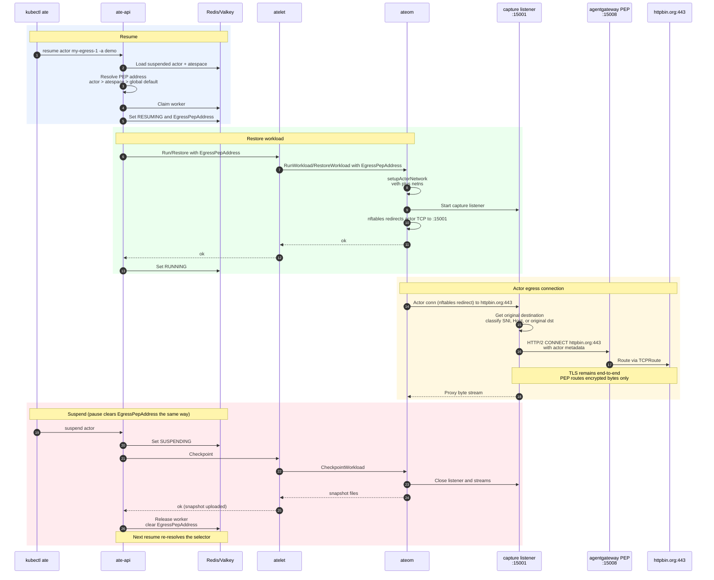

# Egress Capture

This documents the demo install path and the ateom capture setup using
the dedicated egress demo. The demo is a small HTTP actor that resumes through
the router and opens an outbound HTTPS request to `https://httpbin.org/get`
by default.

## Architecture

Egress capture has no global on/off switch. PEP selection is **consumer-driven**,
following the Istio ambient waypoint model: an actor (or its atespace, or a
global default) names the egress PEP it wants via the `ate.dev/use-egress-pep`
selector, exactly as Istio's `istio.io/use-waypoint` names a waypoint. The
difference from Istio is that the selector's value is the PEP **address**
(`<host>:<port>`) directly — ate-api has **no Gateway API dependency at all**: it
does not watch, look up, or validate any Gateway resource. On actor resume it
reads the actor's selector (falling back to the atespace's, then the
`--default-egress-pep` flag) and sends that address to ateom as given. An empty
address means no redirect, so capture is enabled per actor only when a selector
resolves to an address. The reusable capture core lives in `internal/egress`: it
owns capture listeners, authority derivation, CONNECT tunnel transports, and byte
proxying. The runtime-specific `ateom` egress proxy setup supplies the
original-destination lookup and packet-capture rules.

The current gVisor and MicroVM implementations start a local capture listener
and install actor-network redirects for TCP egress. From the actor's point of
view it still opens a normal TCP connection to the original destination. Future
hypervisor implementations should reuse `internal/egress` for the local
listener, authority derivation, tunnel transport, and byte proxying. Each
runtime still provides its own egress proxy setup for redirecting actor traffic
and recovering the original destination.

The redirected connection lands on `ateom`, which records the original
destination and derives a stable CONNECT authority from the first bytes of the
actor connection:

| Actor traffic | Authority source | Example CONNECT authority |
| --- | --- | --- |
| HTTPS / any TCP port | TLS ClientHello SNI + original destination port | `httpbin.org:443` |
| Plaintext HTTP / any TCP port | HTTP `Host` header, defaulting to original destination port when the header has no port | `example.com:80` |
| Other TCP | Original destination address | `203.0.113.10:2222` |

The shared capture core then opens a plaintext HTTP/2 CONNECT stream to the PEP
address ate-api resolved for the actor. That address is whatever the selector
supplied — for the demo, the agentgateway service DNS name
`ate-egress.agentgateway-system.svc.cluster.local:15008`. ate-api does not
resolve or health-check it; a wrong address simply fails the tunnel at connect
time. Agentgateway maps the CONNECT authority to its configured TCP listener and
routes the tunnel to a Kubernetes Service backed by an EndpointSlice.

The demo setup configures only `httpbin.org:443` for egress. Any other CONNECT
authority, including plaintext HTTP destinations or fallback original IP:port
authorities, needs its own matching agentgateway Service, EndpointSlice,
listener, and route. For HTTPS, TLS is still end-to-end between the actor and
the external service; agentgateway only routes the encrypted bytes after
CONNECT succeeds.

### Selecting a PEP for an actor

Selection lives on the consumer via the `ate.dev/use-egress-pep` label, whose
value is the PEP address `<host>:<port>`. ate-api reads it from three tiers and
uses the highest-precedence one that is set:

| Selector | Scope | Precedence |
| --- | --- | --- |
| `--default-egress-pep` flag on ate-api | Global (any actor) | lowest |
| `ate.dev/use-egress-pep` on the **Atespace** | All actors in the atespace | medium |
| `ate.dev/use-egress-pep` on the **Actor** | One actor | highest |

On resume, ate-api walks actor → atespace → global default in order and uses the
first tier whose value is set (`resolveEgressPEPAddress` in
`cmd/ateapi/internal/controlapi/egress_pep.go`). The value is passed straight
through to ateom; ate-api never contacts the Gateway API.

#### Fall-through

| Situation | Result |
| --- | --- |
| A tier's selector is unset | Skipped; ate-api uses the next tier |
| No tier is set | Empty PEP address → no redirect, capture off |
| An actor/atespace selector is not a valid `<host>:<port>` | Configuration error; rejected at `CreateActor` / `UpdateActor` / `CreateAtespace`, and the resume fails loudly as defense-in-depth |
| The global default (`--default-egress-pep`) is not a valid `<host>:<port>` | ate-api logs a warning at startup and degrades to no global default (the value is cleared, never sent to ateom); actor/atespace selectors are unaffected |

Each tier supplies exactly one address, so selection is unambiguous — there is no
tie-breaking.

#### Trust model

The control surface is the ate-api API. Who can point an actor at a PEP is
governed entirely by RBAC on `CreateActor` / `UpdateActor` / `CreateAtespace`
and on the `--default-egress-pep` flag (set at install). Because the selector
carries a raw address and ate-api enforces no allowlist, anyone who can set an
actor/atespace selector can direct that actor's egress tunnel to any reachable
`<host>:<port>`. Restrict those RPCs to the platform team. (This trades the old
Gateway-label allowlist for zero Gateway API dependency — an explicit choice.)

#### When the binding is (re)computed

The PEP binding is a **snapshot taken at resume**, recorded on the actor as
`egress_pep_address`. Selector changes have no effect on RUNNING actors.

```
   create
      │
      ▼
  SUSPENDED ──────────────────────────────────┐
      │  resume / boot                         │
      ▼                                        │
  RESUMING   ── resolve PEP now:               │
      │         AssignWorkerStep reads the     │
      │         actor/atespace/global selector │
      │         and writes its address to      │
      │         actor.egress_pep_address       │
      ▼                                        │
  RUNNING    ── uses the PEP captured at        │
      │         resume for its whole lifetime;  │
      │         selector changes are IGNORED    │
      │  suspend / pause                        │
      ▼                                        │
  SUSPENDED / PAUSED ── egress_pep_address ─────┘
                        cleared; re-resolved
                        on the next resume
```

The full resume / egress / suspend sequence, component by component:



To move a running actor to a different PEP: change its `ate.dev/use-egress-pep`
selector **and** cycle the actor (see "Point an actor at a different PEP").

## Prerequisites

- A working Kubernetes cluster and kubeconfig.
- `kubectl`, `helm`, `jq`, and `curl`.
- `kubectl ate` available from this repo, for example:

```bash
go install ./cmd/kubectl-ate
export PATH="$(go env GOPATH)/bin:${PATH}"
```

## Install with capture enabled

For a normal cluster:

```bash
./hack/install-ate.sh --egress --deploy-ate-system
```

For kind:

```bash
./hack/install-ate-kind.sh --egress --deploy-ate-system
```

This deploys agentgateway with a static `httpbin.org:443` egress route, sets
ate-api's
`--default-egress-pep=ate-egress.agentgateway-system.svc.cluster.local:15008`
(the global-default selector address), and deploys the ATE system. Actors and
atespaces can override the default with an `ate.dev/use-egress-pep` selector.

A malformed `--default-egress-pep` does not crash-loop ate-api; it logs a
warning at startup and degrades to no global default (see the "Fall-through"
table). Grep ate-api startup logs for `Ignoring invalid --default-egress-pep`
to catch a typo.

The install script resolves `httpbin.org` during install and creates the
`httpbin-egress` Service and EndpointSlice for those IPs. For the default HTTPS
demo request, `ateom` derives the CONNECT authority from TLS SNI and the
original destination port.

Verify the static agentgateway resources:

```bash
kubectl get gateway -n agentgateway-system ate-egress
kubectl get tcproute -n agentgateway-system httpbin-egress
kubectl get agentgatewaypolicy -n agentgateway-system ate-egress-connect
kubectl get service -n agentgateway-system httpbin-egress
kubectl get endpointslice -n agentgateway-system httpbin-egress
```

Expected resources include:

```text
gateway.gateway.networking.k8s.io/ate-egress
tcproute.gateway.networking.k8s.io/httpbin-egress
agentgatewaypolicy.agentgateway.dev/ate-egress-connect
service/httpbin-egress
endpointslice.discovery.k8s.io/httpbin-egress
```

ate-api does not read these resources; the Gateway is the agentgateway PEP the
selector address points at. No `ate.dev/egress-pep` marker is needed.

## Deploy and call the egress actor

Deploy the egress demo:

```bash
./hack/install-ate.sh --deploy-demo-egress
```

For kind, keep using the kind wrapper so the demo uses the same local image
registry and snapshot bucket settings:

```bash
./hack/install-ate-kind.sh --deploy-demo-egress
```

Create an actor:

```bash
kubectl ate create atespace demo
kubectl ate create actor my-egress-1 --template ate-demo-egress/egress -a demo
```

Forward the router locally:

```bash
kubectl port-forward -n ate-system svc/atenet-router 8000:80
```

From another terminal, send an external request through the router. The actor
will make an outbound HTTPS request to `https://httpbin.org/get` by default:

```bash
curl -i -X POST \
  -H "Host: my-egress-1.demo.actors.resources.substrate.ate.dev" \
  http://localhost:8000
```

Expected response:

```text
HTTP/1.1 200 OK
egress target: https://httpbin.org/get
upstream status: 200 OK
body bytes read: ...
```

The response must name `https://httpbin.org/get`. That proves the actor opened a
TCP connection to `httpbin.org:443` from inside the sandbox.

To test a different `httpbin.org` path, pass it as the `url` query parameter:

```bash
curl -i -X POST --get \
  -H "Host: my-egress-1.demo.actors.resources.substrate.ate.dev" \
  --data-urlencode "url=https://httpbin.org/headers" \
  "http://localhost:8000"
```

Do not use this query parameter for a different host or port unless you also
update the agentgateway route. `ateom` will derive the new CONNECT authority
from TLS SNI, the HTTP `Host` header, or the original destination, but the demo
agentgateway config only routes `httpbin.org:443`.

## Verify capture was installed

Find the worker pod hosting the actor:

```bash
actor_json=$(kubectl ate get actor my-egress-1 -a demo -o json)
ateom_ns=$(jq -r '.actors[0].ateomPodNamespace' <<<"${actor_json}")
ateom_pod=$(jq -r '.actors[0].ateomPodName' <<<"${actor_json}")

echo "${ateom_ns}/${ateom_pod}"
```

Check the ateom logs:

```bash
kubectl logs -n "${ateom_ns}" "${ateom_pod}" -c ateom | grep "Started actor egress capture listener"
```

Expected output includes one log line for the local capture listener:

```text
Started actor egress capture listener ... "port":15001 ... "pepAddress":"ate-egress.agentgateway-system.svc.cluster.local:15008"
```

After the egress request, the logs should also show the captured stream:

```bash
kubectl logs -n "${ateom_ns}" "${ateom_pod}" -c ateom | grep "Proxying captured actor egress"
```

Expected output includes:

```text
Proxying captured actor egress ... "originalDestination":"...:443" ... "connectAuthority":"httpbin.org:443"
```

## Check which PEP an actor uses

ate-api records the PEP it resolved for the actor on its most recent resume, so
you can read the binding directly instead of inferring it from selectors.

From the actor status (`null` means no PEP matched — the field is omitted from
JSON when empty — so capture is off):

```bash
kubectl ate get actor my-egress-1 -a demo -o json | jq -r '.actors[0].egressPepAddress'
```

Expected value for the demo:

```text
ate-egress.agentgateway-system.svc.cluster.local:15008
```

ate-api also logs the resolution on each resume. This is the easiest way to
answer "which actors fall through to a global PEP" — grep the PEP address across
ate-api logs:

```bash
kubectl logs -n ate-system deploy/ate-api-server-deployment | grep "Resolved egress PEP for actor"
```

Expected output includes:

```text
Resolved egress PEP for actor ... "actorId":"my-egress-1" "atespace":"demo" "pepAddress":"ate-egress.agentgateway-system.svc.cluster.local:15008"
```

Actors that matched no PEP log `Resolved no egress PEP for actor; egress capture
disabled` instead, and their `egressPepAddress` status field is absent.

## Point an actor at a different PEP

Suppose you want `my-egress-1` to egress through a second Gateway,
`ate-egress-alt`, instead of the shared `ate-egress` PEP. Because an actor's PEP
is a snapshot taken at resume (see "When the binding is (re)computed"), you both
set the actor's selector and cycle the actor. You do not touch the actor's
current Gateway — the actor's `ate.dev/use-egress-pep` selector out-ranks the
atespace and global-default tiers regardless.

1. Create the alternate Gateway. No labels are needed on it — ate-api never reads
   Gateways; selection happens entirely on the actor:

```bash
kubectl apply -f - <<'EOF'
apiVersion: gateway.networking.k8s.io/v1
kind: Gateway
metadata:
  name: ate-egress-alt
  namespace: agentgateway-system
spec:
  gatewayClassName: agentgateway
  listeners:
  - name: connect
    port: 15008
    protocol: HTTP
    allowedRoutes:
      namespaces:
        from: Same
  - name: https
    port: 443
    protocol: TCP
    allowedRoutes:
      kinds:
      - group: gateway.networking.k8s.io
        kind: TCPRoute
      namespaces:
        from: Same
EOF
```

   The `connect` listener on `15008` is the address the selector will point at
   (`ate-egress-alt.agentgateway-system.svc.cluster.local:15008`).

2. Give the alternate Gateway the CONNECT policy and a route to the backend.
   The Gateway alone is not enough: without these the tunnel opens but agentgateway
   has nothing routing `httpbin.org:443`, and egress fails with a 502 / connection
   reset. The `httpbin-egress` Service and EndpointSlice created by the installer
   are backend resources and can be reused as-is; you only need a CONNECT policy
   and a TCPRoute parent for the new Gateway:

   ```bash
kubectl apply -f - <<'EOF'
apiVersion: agentgateway.dev/v1alpha1
kind: AgentgatewayPolicy
metadata:
  name: ate-egress-alt-connect
  namespace: agentgateway-system
spec:
  targetRefs:
  - group: gateway.networking.k8s.io
    kind: Gateway
    name: ate-egress-alt
  frontend:
    connect:
      mode: Tunnel
EOF
   ```

   Attach the existing `httpbin-egress` TCPRoute to the alternate Gateway by
   adding it as a second parent (this leaves `ate-egress` routing intact):

   ```bash
   kubectl patch tcproute -n agentgateway-system httpbin-egress --type=json \
     -p '[{"op":"add","path":"/spec/parentRefs/-","value":{"group":"gateway.networking.k8s.io","kind":"Gateway","name":"ate-egress-alt","sectionName":"https"}}]'
   ```

   Confirm both the policy and route attached before continuing:

   ```bash
   kubectl get agentgatewaypolicy -n agentgateway-system ate-egress-alt-connect
   kubectl get tcproute -n agentgateway-system httpbin-egress \
     -o jsonpath='{range .status.parents[*]}{.parentRef.name}{" Accepted="}{.conditions[?(@.type=="Accepted")].status}{"\n"}{end}'
   ```

3. Point the actor at the alternate Gateway and cycle it so ate-api re-resolves
   the PEP. A running actor keeps its old PEP until it is suspended (or paused)
   and resumed:

   ```bash
   kubectl ate update actor my-egress-1 -a demo \
     --egress-pep ate-egress-alt.agentgateway-system.svc.cluster.local:15008
   kubectl ate suspend actor my-egress-1 -a demo
   kubectl ate resume actor my-egress-1 -a demo
   ```

   `update actor --egress-pep` sets the actor's `ate.dev/use-egress-pep` label to
   the given address. Equivalently, set it once at creation with `kubectl ate
   create actor ... --egress-pep <host>:<port>`, for example:

   ```bash
   kubectl ate create actor my-egress-1 --template ate-demo-egress/egress -a demo \
     --egress-pep ate-egress-alt.agentgateway-system.svc.cluster.local:15008
   ```

   To scope a whole atespace, set the selector when you create the atespace:

   ```bash
   kubectl ate create atespace demo \
     --egress-pep ate-egress.agentgateway-system.svc.cluster.local:15008
   ```

   The atespace-tier selector can only be set at atespace creation — there is no
   `kubectl ate update atespace`. To change the atespace default afterward,
   override it per actor with `update actor --egress-pep` (highest precedence);
   new actors can pass `--egress-pep` at creation so they never inherit the old
   default. Recreating the atespace is only an option while it is empty:
   `delete atespace` refuses a non-empty atespace, so once actors exist the
   per-actor override is the practical path.

4. Confirm the actor now points at the alternate PEP:

   ```bash
   kubectl ate get actor my-egress-1 -a demo -o json | jq -r '.actors[0].egressPepAddress'
   ```

   Expected value:

   ```text
   ate-egress-alt.agentgateway-system.svc.cluster.local:15008
   ```

5. Drive traffic again and verify it goes through the new PEP:

   ```bash
   curl -i -X POST \
     -H "Host: my-egress-1.demo.actors.resources.substrate.ate.dev" \
     http://localhost:8000
   ```

   The authoritative signal is the ateom capture log, which names the PEP
   configured for the actor's current activation (see "Verify capture was
   installed" for how to find the worker pod):

   ```bash
   kubectl logs -n "${ateom_ns}" "${ateom_pod}" -c ateom | grep "Started actor egress capture listener"
   # ... "pepAddress":"ate-egress-alt.agentgateway-system.svc.cluster.local:15008"
   ```

   On the agentgateway side, match any request the alt Gateway handled rather
   than a specific protocol — the CONNECT frontend logs `protocol=http`, and a
   `protocol=tcp` line only appears once bytes tunnel end to end (a 5xx from the
   upstream can prevent it):

   ```bash
   kubectl logs -n agentgateway-system \
     -l gateway.networking.k8s.io/gateway-name=ate-egress-alt \
     --all-containers --tail=200 | grep "gateway=agentgateway-system/ate-egress-alt"
   ```

To revert, clear the actor's selector so it falls back to the global default
(`ate-egress`), then cycle it; afterward you can remove the alternate Gateway's
route parent and delete the Gateway and its CONNECT policy:

```bash
kubectl ate update actor my-egress-1 -a demo --egress-pep ""
kubectl ate suspend actor my-egress-1 -a demo
kubectl ate resume actor my-egress-1 -a demo

kubectl patch tcproute -n agentgateway-system httpbin-egress --type=json \
  -p '[{"op":"remove","path":"/spec/parentRefs/1"}]'
kubectl delete gateway -n agentgateway-system ate-egress-alt
kubectl delete agentgatewaypolicy -n agentgateway-system ate-egress-alt-connect
```

## Check agentgateway logs

The `ate-egress` Gateway creates an agentgateway dataplane pod in the
`agentgateway-system` namespace. Check dataplane logs with:

```bash
kubectl logs -n agentgateway-system \
  -l gateway.networking.k8s.io/gateway-name=ate-egress \
  --all-containers --tail=200
```

After a successful egress request, dataplane logs should include a TCP route
entry similar to:

```text
request gateway=agentgateway-system/ate-egress listener=https route=agentgateway-system/httpbin-egress ... protocol=tcp
```

If the Gateway, TCPRoute, or policy is not being programmed, check the
agentgateway controller logs:

```bash
kubectl logs -n agentgateway-system deploy/agentgateway --tail=200
```

## Clean up

```bash
kubectl ate suspend actor my-egress-1 -a demo
kubectl ate delete actor my-egress-1 -a demo
./hack/install-ate.sh --delete-demo-egress
```

## Troubleshooting

If redeploying fails with `The ActorTemplate "egress" is invalid: spec:
Invalid value: Spec is immutable`, recreate the demo resources:

```bash
./hack/install-ate-kind.sh --delete-demo-egress
./hack/install-ate-kind.sh --deploy-demo-egress
```

If capture listener logs are missing after setting an actor/atespace selector on
an already-running ATE system, no ate-api restart is needed — the selector is
read from the actor and atespace at resume. The usual cause is that the actor was
already running: the PEP binding is a snapshot taken at resume, so cycle the
actor (suspend, then resume) to re-resolve. Selector changes never affect a
RUNNING actor. Confirm which address resolved from ate-api logs
(`Resolved egress PEP for actor`) or the actor's `egressPepAddress` field; if the
address is wrong, the tunnel fails at connect time in ateom.

Changing the global default (`--default-egress-pep`) does require an ate-api
restart, since it is a process flag / ConfigMap value read at boot:

```bash
kubectl rollout restart deployment/ate-api-server-deployment -n ate-system
kubectl rollout status deployment/ate-api-server-deployment -n ate-system
```

Capture is decided per resume from the PEP address ate-api sends to ateom, so
worker pods do not need to carry any egress config or be restarted. An actor
already running before its selector was set picks up capture on its next resume.

Worker images must include egress support: an older ateom silently ignores the
PEP address, so `egressPepAddress` on the actor can report a binding the
sandbox does not enforce. If capture logs are missing despite a resolved PEP,
check the WorkerPool's ateom image version.

If the egress request fails after changing the `url` host or port, remember that
this demo only configures agentgateway for `httpbin.org:443`. Add matching static
agentgateway backend resources for the CONNECT authority that `ateom` will send:

- HTTPS: SNI plus the original destination port, for example `example.com:443`.
- Plaintext HTTP: `Host` header authority, defaulting to the original
  destination port when the header has no port, for example `example.com:80`.
- Other TCP: captured original destination IP and port, for example
  `203.0.113.10:2222`.
