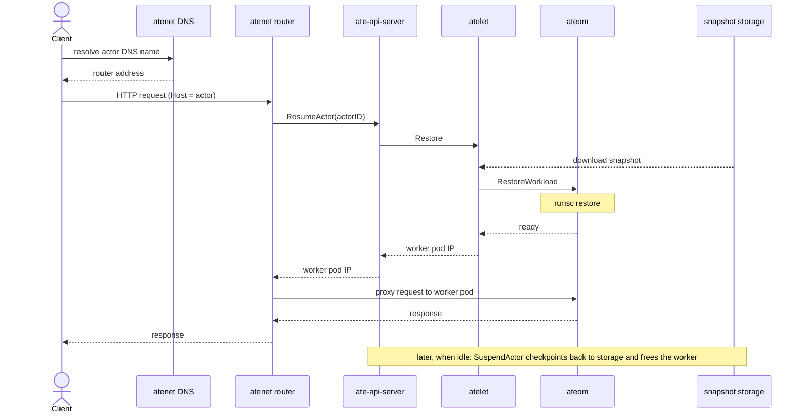
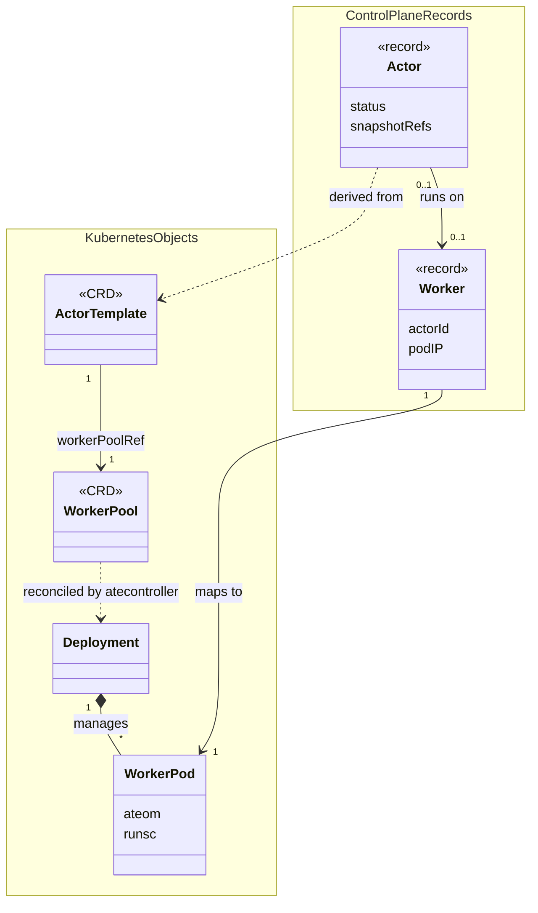
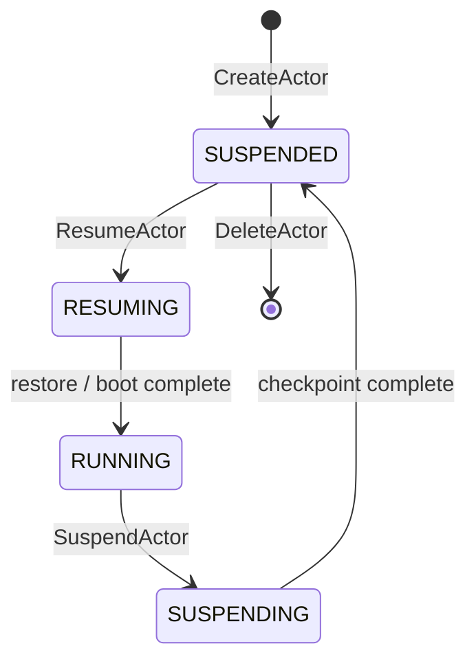

# Agent Substrate Glossary

This document defines the core terms used across Agent Substrate and shows how
they relate to each other. It documents the names as they exist in the codebase;
proposals to rename any of these terms are tracked separately (see issue #131).

For deeper detail, see the [Architecture](architecture.md) and
[API Guide](api-guide.md).

## How the pieces fit together

**Activation flow (UML sequence diagram).** A request reaches an actor through
the networking stack, which resumes it onto a worker if it is suspended:

**Resource model (UML class diagram).** The CRDs and control-plane records
behind that flow, with their relationships and multiplicities:

**Actor lifecycle (UML state machine diagram).** An Actor's `status` moves
through these states:

## Resources (declarative, Kubernetes CRDs)

- **ActorTemplate**: the definition of an actor "class": the container image(s),
  pause image, `runsc` version, and snapshot configuration. Creating an
  `ActorTemplate` triggers creation of a [Golden Snapshot](#snapshots) (the
  controller boots, briefly runs, then checkpoints a golden actor). It is treated
  as immutable: spec changes after creation are not reconciled, so you create a
  new template for a new version rather than editing an existing one. It is
  analogous to a Pod template, but for a checkpointable workload.

- **WorkerPool**: declares warm compute capacity, a fleet of pre-started worker
  pods. It is reconciled into a Kubernetes `Deployment` by the
  [atecontroller](#components).

## Records (dynamic state, in the control-plane store)

These are not Kubernetes objects; they live in the control-plane database
(Valkey/Redis) because they change too frequently for etcd.

- **Actor**: a single instance derived from an `ActorTemplate`, identified by a
  DNS-1123 actor ID. It is the unit that is suspended and resumed, and it moves
  between workers over its lifetime. An Actor record tracks status
  (`SUSPENDED` → `RESUMING` → `RUNNING` → `SUSPENDING` → `SUSPENDED`) and its
  snapshot references. (Some older internal docs call this a "session".)

- **Worker**: a record representing one worker pod in a `WorkerPool`. It
  records which Actor it currently hosts, if any (so idle versus busy is implied
  by that field). A Worker hosts at most one Actor at a time; many Actors are
  multiplexed across a pool over time.

## Components

- **ate-api-server** (binary `ateapi`): the control plane. A gRPC server
  exposing the `Control` service, which owns the Actor lifecycle (`CreateActor`,
  `ResumeActor`, `SuspendActor`, `DeleteActor`), schedules Actors onto Workers,
  and coordinates their snapshots, all backed by the state store. It tracks
  `Worker` records by watching worker pods, and also exposes a `SessionIdentity`
  service. The `kubectl-ate` CLI talks to it.

- **atecontroller**: the Kubernetes controller that reconciles the CRDs (for
  example, it turns a `WorkerPool` into a `Deployment`).

- **atelet**: the node-level supervisor, run as a DaemonSet (the "Herder"). It
  pulls images, assembles OCI bundles, drives the sandbox lifecycle on the node
  via ateom (`RunWorkload` / `CheckpointWorkload` / `RestoreWorkload`), and
  streams snapshots to and from snapshot storage.

- **ateom** (image `ateom-gvisor`): the "interior gVisor" coordinator that runs
  inside each worker pod. It exposes a gRPC interface (over a unix socket) for
  `atelet` to trigger `RunWorkload`, `CheckpointWorkload`, and `RestoreWorkload`,
  which it carries out by invoking the sandbox runtime. This decouples the
  physical pod lifecycle from the sandboxed agent process.

- **atenet**: the networking stack. It provides a DNS server for actor
  resolution and an Envoy-based **router** (with an External Processing server)
  that intercepts mesh traffic, extracts the actor ID from the `Host` header,
  and calls `ResumeActor` on the control plane, which resumes the actor onto a
  worker if it is suspended and returns the worker pod to route to.

- **podcertcontroller**: issues short-lived pod certificates (lifetime capped at
  24h) via two signers: a service-DNS server identity and a pod/workload client
  identity (equivalent to KSA tokens). Components use these as their TLS identity
  to authenticate connections to one another (mutual TLS).

- **kubectl-ate**: a `kubectl` plugin CLI for managing the Actor lifecycle
  (create, resume, suspend, delete, logs) and listing Workers.

## Runtime concepts

- **gVisor**: the sandboxing technology Substrate uses to isolate and snapshot
  actors. It is currently the only supported sandbox; runtime modularity (e.g.
  microVMs) is on the roadmap.

- **runsc**: gVisor's runtime binary. `ateom` invokes it to start an actor's
  sandbox (`runsc create` then `start`) and to `checkpoint` and `restore` it. Its
  binary is pinned per `ActorTemplate` by URL and SHA-256 (the `runsc` config).
  Substrate's suspend/resume relies on its checkpoint/restore.

- **pause container**: the sandbox root container for an actor (its CRI
  container type is `sandbox`). It is sandbox infrastructure, not the actor's
  own workload; the application containers run inside the sandbox it establishes.

- **Checkpoint / Restore**: the `runsc` operations that capture a running
  actor's sandbox (both its memory and disk state) to a snapshot, and reload it.
  They underpin Suspend and Resume.

- **Suspend (`SuspendActor`)**: hibernate a running Actor by checkpointing it to
  a snapshot and freeing its Worker.

- **Resume (`ResumeActor`)**: activate a suspended Actor by restoring it onto a
  Worker. The common path restores from a snapshot rather than cold-booting.

## Snapshots

- **Golden Snapshot**: the initial checkpoint captured once, when an
  `ActorTemplate` is created, from a temporary "golden" boot of the workload. By
  default an Actor of that template is first restored from this shared snapshot;
  resuming with `boot` set instead cold-starts from the `ActorTemplate` spec.

- **Last Snapshot**: the most recent per-Actor snapshot, written on Suspend and
  used to restore that specific Actor on the next Resume.

- **Snapshot storage**: the object store (GCS or S3) where snapshots are
  persisted so Actor state is durable and portable across the cluster.

## Networking

- **Uniform DNS Mesh**: every Actor is reachable at a uniform address,
  `<actor-id>.actors.resources.substrate.ate.dev`, resolved by atenet. Traffic to
  that name is routed (and the Actor resumed if needed) automatically.
