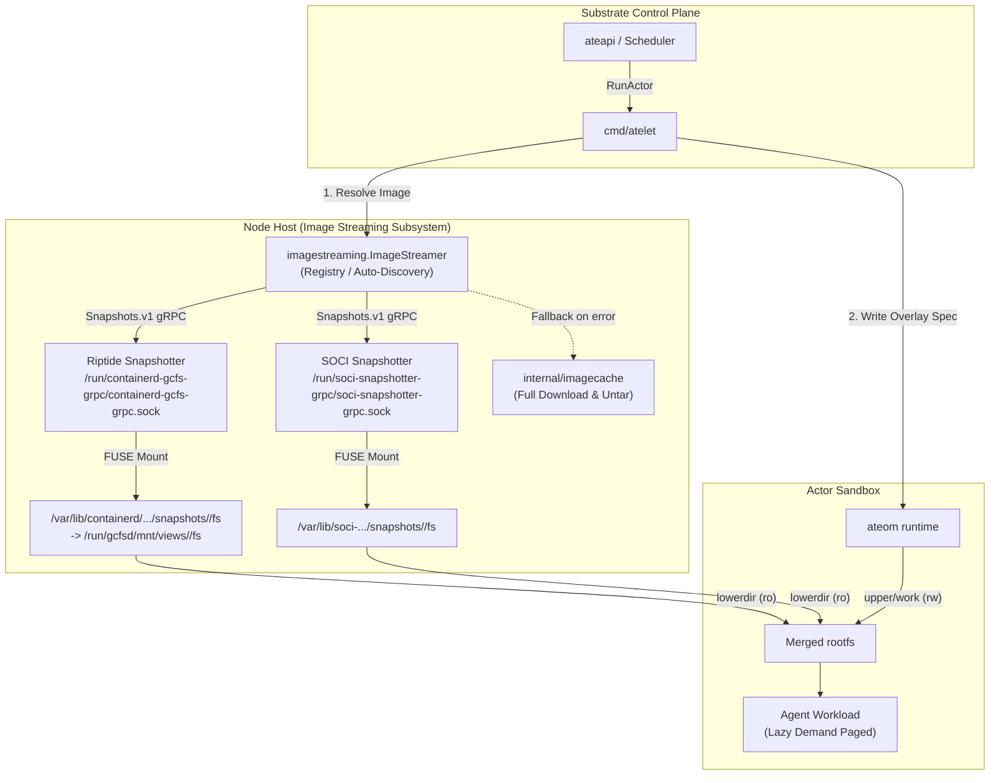
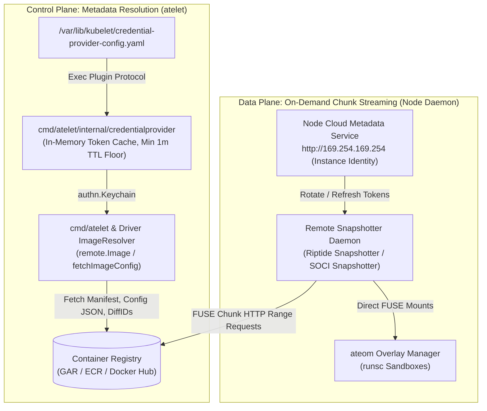

# One-Pager: Extensible Image Streaming API for Agent Substrate

**Author:** Kui Yue & Antigravity  
**Status:** Approved / Implemented  
**Date:** September 15, 2026  
**Target Package:** `internal/imagestreaming`  
**Related Docs:** [Image Streaming Performance Report](image-streaming-performance-report.md), [PoC Comparative Analysis](image-streaming-poc-comparison.md), [Architecture](architecture.md)

---

## 1. Context & Motivation
Agent Substrate’s goal is sub-500ms agent startup. Profiling shows that container image downloading and unpacking (taking 1.5 to 4+ minutes for 2GB–50GB images) is the primary bottleneck.

Image streaming addresses this by replacing upfront layer downloads with on-demand demand paging over FUSE: because agent workloads typically touch only 5%–15% of their rootfs during startup, streaming reduces image ready time from **>100s down to <2.5s** (a 38x–94x speedup).

However, Substrate clusters operate across heterogeneous cloud environments, for example:
- **Google Cloud (GKE):** Riptide Snapshotter (`/run/containerd-gcfs-grpc/containerd-gcfs-grpc.sock`).
- **AWS (EKS):** Seekable OCI snapshotter (`/run/soci-snapshotter-grpc/soci-snapshotter-grpc.sock`).
- **Bare Metal / Local Dev:** No streaming daemon available (traditional local cache required).

### 1.1. Dual-Adoption Strategic Vision: Google Internal & External Industry Streaming

A foundational architectural requirement for Agent Substrate is **hybrid and multi-cloud workload portability**. Substrate cannot be coupled exclusively to proprietary Google infrastructure, nor can it sacrifice the deep performance optimizations available within Google Cloud.

The new `internal/imagestreaming` API is intentionally architected to serve as a **dual-adoption bridge**:
1. **Google Internal Streaming Adoption:** First-class support for Google Cloud / internal GKE streaming infrastructure powered by **Google Riptide** and Google Cloud Artifact Registry streaming metadata, unlocking sub-second cold starts on GKE TPU/GPU and CPU worker fleets.
2. **External Streaming Product Adoption:** Native adoption of external, industry-standard streaming products, anchored in this design by **AWS Seekable OCI (SOCI)** (`soci-snapshotter-grpc`). The same interface readily accommodates broader open-source OCI streaming standards (such as eStargz, Nydus, or Dragonfly) without modifying Substrate's core scheduling or execution paths.

By standardizing both **internal Google Riptide** and **external AWS SOCI** on the open CNCF Remote Snapshotter standard, we prove that Agent Substrate delivers a vendor-agnostic streaming runtime: workloads achieve equivalent 38x–94x cold boot latency reductions whether deployed on Google Cloud, AWS, or multi-cloud infrastructures.

### 1.2. Problem Statement
Substrate requires a unified, provider-agnostic Go API that:
1. Decouples the actor lifecycle engine (`cmd/atelet`) from cloud-specific streaming implementations.
2. Composes streamed layers into Substrate’s capability-less OCI overlay bundle architecture.
3. Provides automatic socket discovery with seamless, zero-disruption fallback to traditional image download and untar.
4. Preserves workload isolation and emits end-to-end OpenTelemetry telemetry.

---

## 2. Goals & Non-Goals

### Goals
- **Dual-Adoption Portability:** Unify Google internal streaming (Riptide) and external cloud products (AWS SOCI) behind an identical contract, enabling seamless multi-cloud deployment without vendor lock-in.
- **Provider-Agnostic Abstraction:** A clean `ImageStreamer` Go interface in `internal/imagestreaming` supporting pluggable backends.
- **Sub-Second Ready Time:** Enable virtual layer mount paths in `<2.5s` cold, and `<5µs` warm.
- **Overlayfs Drop-In Compatibility:** Deliver layer paths directly consumable by `ateom`'s read-only lowerdir overlay composition (`layerN/fs:...:layer0/fs`).
- **Zero-Disruption Fallback:** Transparently fall back to standard `imagecache.Store` (full layer untar) on unsupported images or daemon faults.
- **Automatic Daemon Discovery:** Support `--image-streamer=auto` to auto-detect ambient node daemons (Section 5.7).
- **Telemetry Integration:** Emit OpenTelemetry Weaver instruments tracking streaming operations, outcomes, and latency.

### Non-Goals
- **In-Process FUSE Implementation:** Substrate does not implement custom FUSE filesystems in Go; it interfaces with host-level snapshotter daemons via gRPC/UNIX sockets.
- **Replacing Local Cache:** Traditional image caching (`internal/imagecache`) remains the authoritative baseline for non-streamable images.

---

## 3. High-Level Architecture & Core Design Principles

### 3.1. Core Principle: Standardizing on CNCF Remote Snapshotters While Bypassing Containerd CRI

In standard Kubernetes environments, image streaming operates through a multi-tier chain:
```
Kubelet (Node Agent)
  └── containerd (CRI Runtime Engine: containerd.sock)
        └── Remote Snapshotter Plugin (Riptide Snapshotter / SOCI Snapshotter)
              └── FUSE mounts (/run/.../fs)
                    └── runsc / runc (Container Sandbox)
```

**Agent Substrate standardizes directly on the CNCF Remote Snapshotter gRPC standard (`containerd.services.snapshots.v1.Snapshots`) while bypassing `kubelet` and `containerd` CRI (`containerd.sock`):**
```
ateapi (Substrate Control Plane)
  └── atelet (Worker Node Daemon)
        └── internal/imagestreaming/drivers/remotesnapshotter
              └── Remote Snapshotter Daemon (Riptide Snapshotter / SOCI Snapshotter)
                    └── FUSE mounts
                          └── ateom (Substrate Sandbox Overlay Manager)
```

#### Why Standardize on CNCF Remote Snapshotters:
1. **Clean CloudProvider Extraction:** Substrate core avoids importing proprietary vendor client libraries or custom protocol buffers. By speaking the standard CNCF `containerd.services.snapshots.v1.Snapshots` gRPC API, a single unified driver (`remotesnapshotter`) connects identically to the Google Riptide Snapshotter (`containerd-gcfs-grpc`), AWS SOCI Snapshotter (`soci-snapshotter-grpc`), eStargz (`containerd-stargz-grpc`), or Nydus.
2. **Reusing Ecosystem Snapshotter Capabilities:** Rather than reimplementing layer mounting, deduplication, chunk caching, and view management inside Substrate, Substrate leverages the robust, production-hardened remote snapshotter plugins maintained by Google and AWS.
3. **Preserving the Actor Multiplexing Model:** Substrate continues to bypass the Kubernetes control plane and `containerd.sock` CRI engine. Worker Pods remain pre-warmed and long-running. Connecting directly to the local snapshotter UNIX socket avoids containerd CRI daemon lock contention, namespace metadata sweeps, and Pod lifecycle delays.
4. **Direct Overlay LowerDir Integration:** Snapshot mounts returned by `Prepare` / `View` are directly integrated into `ateom`'s sandbox lowerdir overlay spec (`layerN/fs:...:layer0/fs`), matching traditional unpacked layers.

### 3.2. Structural Alignment: Google Riptide & AWS SOCI

By standardizing on the CNCF Remote Snapshotter interface, Google Riptide and AWS SOCI share an identical integration contract:

| Architectural Dimension | Google Cloud Riptide (`riptide`) | AWS Seekable OCI (`soci`) |
| :--- | :--- | :--- |
| **Daemon Endpoint** | `/run/containerd-gcfs-grpc/containerd-gcfs-grpc.sock` (Riptide Snapshotter) | `/run/soci-snapshotter-grpc/soci-snapshotter-grpc.sock` (SOCI Snapshotter) |
| **Interface Protocol** | `containerd.services.snapshots.v1.Snapshots` | `containerd.services.snapshots.v1.Snapshots` |
| **Runtime Interaction** | **Bypasses containerd CRI:** speaks direct snapshotter gRPC | **Bypasses containerd CRI:** speaks direct snapshotter gRPC |
| **FUSE Mount Location** | `/var/lib/containerd/io.containerd.snapshotter.v1.gcfs/snapshotter/snapshots/<id>/fs` $\to$ `/run/gcfsd/mnt/views/<diffID>/fs` | `/var/lib/soci-snapshotter-grpc/snapshotter/snapshots/<id>/fs` |
| **Layer View RPC** | `Prepare` / `View` with remote labels | `Prepare` / `View` with remote labels |
| **Metadata Index** | Google Cloud Artifact Registry (GAR) Streaming Manifests | OCI Artifact SOCI Index (`application/vnd.amazon.soci.index.v1+json`) |
| **Registry Scope** | **GAR / GCR exclusively** (external registries fall back to non-streaming) | Any OCI registry supporting SOCI index artifacts (ECR, etc.) |
| **Authentication Source** | Ambient Node Identity via GCE Metadata Service (`169.254.169.254`) | Ambient Node Identity via EC2 Instance Profile / link-local metadata |

#### Special Characteristics and Encapsulation Boundaries

1. **Riptide Snapshotter Encapsulation & CNCF gRPC Standard:**
   Substrate communicates directly with the **Riptide Snapshotter** (`containerd-gcfs-grpc`) over its local UNIX domain socket. Substrate does not manage, monitor, or communicate with any underlying or low-level FUSE daemon; all layer virtualization, chunk demand-paging, and mount lifecycles are entirely encapsulated within the Riptide Snapshotter. While the Riptide Snapshotter implements the CNCF `containerd.services.snapshots.v1.Snapshots` gRPC API, it possesses Google-specific optimizations and out-of-band mechanisms (such as internal FUSE mounting engines and specialized metadata indexing for Google Cloud Artifact Registry) that are not part of the upstream CNCF remote snapshotter specification. From Substrate's perspective, `cmd/atelet` interfaces with the Riptide Snapshotter strictly through the standard CNCF `Snapshots.v1` gRPC contract (Section 3.4).

2. **Registry Scope: Google Artifact Registry (GAR) Exclusivity:**
   Google Riptide is exclusively designed to stream container images hosted in Google Artifact Registry (GAR) or Google Container Registry (GCR). Riptide acceleration relies on server-side streaming manifests and layer transformations generated within Google Cloud. External registries (such as Docker Hub, Quay.io, or AWS ECR) do not contain Riptide streaming metadata. When an image from an external registry is targeted on GKE, the Riptide Snapshotter declines each layer's `Prepare` (Section 3.4), and Substrate falls back to traditional non-streaming local caching (`imagecache.EnsureImage`).

### 3.3. Architecture Flow Diagram



### 3.4. The Snapshotter Contract

The generic driver (`internal/imagestreaming/drivers/remotesnapshotter`) depends on exactly two things:

1. **The `containerd.services.snapshots.v1.Snapshots` gRPC API.** The driver calls `Stat`, `Prepare`, `View`, and `Remove`. It never calls `Commit`.
2. **containerd's [remote snapshotter protocol](https://github.com/containerd/containerd/blob/main/docs/snapshotters/remote-snapshotter.md).** The driver labels each `Prepare` with the layer's chain ID (`containerd.io/snapshot.ref`) and the `containerd.io/snapshot/cri.*` labels (image reference, manifest digest, layer digest, and image layers). It reads the result the way containerd's unpacker does.

Nothing else is part of the contract. The driver doesn't read provider-specific labels (such as the Riptide Snapshotter's streaming labels on `Stat`), match provider-specific errors, or use side channels such as credential sockets or CRI proxies. Any snapshotter that follows the protocol, including the Riptide Snapshotter, SOCI, eStargz, and Nydus, works with the same driver.

The driver handles each layer, bottom to top, as follows:

| Call | Result | Driver Action |
| :--- | :--- | :--- |
| `Stat(chainID)` | Found | The layer is already on the node. Create a read-only `View` with the chain ID as its parent. |
| `Stat(chainID)` | `NotFound` | Call `Prepare` with a unique key, the parent layer's chain ID, and the labels above. |
| `Prepare` | `AlreadyExists` | The snapshotter provided the layer and committed it under the chain ID. Confirm with `Stat(chainID)`, then create a `View`. The snapshotter has consumed the prepare key, so the driver leaves it alone. |
| `Prepare` | Mounts with a nil error | **Declined.** The snapshotter can't provide the layer and expects the caller to unpack it into the mounts and commit it. The driver removes the prepared snapshot without committing it and returns `imagestreaming.ErrNotStreamable`. |
| Any call | Any other error | The driver removes the prepared snapshot, if it created one, and returns the error. |

The driver calls `Stat(chainID)` before `Prepare` for the same reasons containerd's unpacker does:
- **The layer may already be on the node.** An earlier pull, another image built on the same layers, or a Pod whose image the snapshotter provided to containerd may have committed it under its chain ID. One `Stat` finds it, and the driver skips `Prepare`. `Stat` doesn't find layers that containerd unpacked itself, because containerd commits those under its own snapshot names.
- **`Prepare` can't report that a layer is already on the node.** It either provides the layer (`AlreadyExists`) or declines it (mounts). A snapshotter that can't stream a layer may decline it even when the layer is already committed locally, and the driver would then pull the whole image unnecessarily.

After `AlreadyExists`, the driver calls `Stat(chainID)` again, because `AlreadyExists` can also mean that the prepare key already exists. The second `Stat` confirms that the layer is under its chain ID before the driver uses it as the parent of a `View`.

If any layer is declined or fails, the driver removes the views it created for the image, and atelet pulls the whole image with `imagecache.EnsureImage` (Section 5.6). Layers committed under their chain IDs stay on the node for later pulls.

The contract has two limits:
- **`AlreadyExists` means the layer is on the node, not that it is streamed.** A snapshotter may also provide a layer from local content, such as a GKE secondary boot disk. The driver treats both the same because the content is valid.
- **The contract carries no credentials.** See Section 5.5.3.

---

## 4. API Specification

The core abstraction lives in `internal/imagestreaming` and consists of three components:

### 4.1. Core Interface (`ImageStreamer`)

```go
package imagestreaming

import (
    "context"
    v1 "github.com/google/go-containerregistry/pkg/v1"
)

// ImageStreamer is the generalized interface implemented by streaming backends.
type ImageStreamer interface {
    // Name returns the provider identifier ("riptide", "soci").
    Name() string

    // CanStream is a cheap check that the provider is available. It need not
    // inspect the image: PrepareLayers returns ErrNotStreamable if the
    // provider declines the image.
    CanStream(ctx context.Context, req *StreamRequest) (bool, error)

    // PrepareLayers prepares and mounts the virtual layer directories on the node.
    PrepareLayers(ctx context.Context, req *StreamRequest) (*StreamResult, error)

    // ReleaseLayers decrements the reference count or releases mounted views.
    ReleaseLayers(ctx context.Context, req *StreamRequest) error

    // ReconcileLeases restores active lease tracking and reference counts for
    // surviving actor workloads on node or process startup.
    ReconcileLeases(ctx context.Context, active []*ActiveLease) error
}
```

### 4.2. Request, Result, and Lease Models

```go
// StreamRequest holds the image reference and optional credentials.
type StreamRequest struct {
    ImageRef   string       // Fully-qualified OCI reference (e.g. us-docker.pkg.dev/...:tag)
    AuthConfig *AuthConfig // Optional credentials for resolving the manifest; never sent to the snapshotter
}

// ActiveLease describes an active image lease restored during startup reconciliation.
type ActiveLease struct {
    ImageRef    string   // Fully-qualified OCI reference
    ImageDigest string   // Manifest digest ("sha256:<hex>")
    LayerDirs   []string // Host directory paths of mounted layer trees
    RefCount    int      // Number of active actor containers referencing this image
}

// StreamResult contains the prepared layers consumable by overlayfs.
type StreamResult struct {
    ImageDigest string     // Canonical manifest digest (sha256:<hex>)
    Config      *v1.Config // Parsed OCI container configuration
    LayerDirs   []string   // Host directories of mounted layers, bottom-most first
}
```

### 4.3. Registry & Factory Pattern

```go
type Factory func(ctx context.Context, cfg Config) (ImageStreamer, error)

// Register enables driver packages (e.g. drivers/riptide, drivers/soci) to
// register themselves via blank import (_ "github.com/.../drivers/soci").
func Register(name string, f Factory)

// Get constructs an instance of a registered streaming provider.
func Get(ctx context.Context, name string, cfg Config) (ImageStreamer, error)

// Providers returns all registered driver names in lexicographical order.
func Providers() []string
```

---

## 5. Runtime Integration & Contract with `atelet`

### 5.1. The Layer Wrapper Contract
`cmd/atelet` runs without elevated privileges (no `CAP_SYS_ADMIN`), and `ateom` constructs the final overlay mount. To maintain this clean separation, `ImageStreamer` produces a standard layer wrapper directory under `/var/lib/ateom-gvisor/streaming/<driver>` (shared with `ateom` via the `run-ateom` hostPath volume) for each layer in `LayerDirs`:

```
/var/lib/ateom-gvisor/streaming/<driver>/<sanitized_image_key>/
├── lease.json                                # Persisted config, digest, and snapshot view keys for restart recovery
├── layer-0/
│   ├── fs -> /var/lib/containerd/io.containerd.snapshotter.v1.gcfs/snapshotter/snapshots/<id>/fs
│   │         (which for Riptide symlinks to /run/gcfsd/mnt/views/<diffID>/fs)
│   └── finalized                             # Sentinel marker
├── layer-1/
│   ├── fs -> /var/lib/containerd/io.containerd.snapshotter.v1.gcfs/snapshotter/snapshots/<id>/fs
│   └── finalized
└── ...
```

- **`fs` Symlink:** Exposes the virtual layer filesystem tree to `ateom`'s overlay lowerdir. Both `/var/lib/containerd/io.containerd.snapshotter.v1.gcfs` (`RiptideSnapshotterRoot`), `/run/gcfsd` (`RiptideFUSERoot`), and `/var/lib/soci-snapshotter-grpc` (`SOCISnapshotterRoot`) are mounted into `atelet` and `ateom` with `HostToContainer` mount propagation so both pods can resolve the full symlink chain.
- **`finalized` Marker:** Notifies `ateom` that the layer is immutable, instructing it to bypass whiteout materialization loops and mount directly.
- **`lease.json` Metadata:** Records the resolved `v1.Config`, `digest`, `layerDirs`, and snapshotter `-view` keys so `ReconcileLeases` can reconstruct complete lease state across `atelet` restarts and sweep orphaned views.

### 5.2. Pluggable Resolution with Local Cache Fast Path & Automatic Fallback
Both container rootfs images (`containers[*].image`) and mounted OCI image volumes (`volumes[*].image` in `resolveImageVolumes`) resolve through `ensureContainerImage` in `cmd/atelet/oci.go`. The internal sandbox `pause` container (`ocispec.PauseContainer`) passes a `nil` streamer in `prepareOCIBundles` and always uses `imageCache`, avoiding a pointless streaming round-trip for the tiny (~300 KB) digest-pinned infrastructure image.

In `cmd/atelet/oci.go`:
```go
func ensureContainerImage(ctx context.Context, imageCache *imagecache.Store, streamer imagestreaming.ImageStreamer, ...) (*imagecache.Image, error) {
    // 1. Local cache fast path: if a digest-pinned image is already unpacked in
    // the local imageCache, return it immediately with zero network or gRPC I/O.
    if imageCache != nil && streamer != nil {
        if img, err := imageCache.CachedImage(ctx, ref); err == nil && img != nil {
            return img, nil
        }
    }
    // 2. Remote streaming path:
    if streamer != nil {
        if canStream, err := streamer.CanStream(ctx, req); err == nil && canStream {
            if res, err := streamer.PrepareLayers(ctx, req); err == nil && len(res.LayerDirs) > 0 {
                instruments.RecordImageStreaming(ctx, streamer.Name(), "success", dur)
                return &imagecache.Image{Digest: res.ImageDigest, Config: *res.Config, LayerDirs: res.LayerDirs}, nil
            }
        }
        instruments.RecordImageStreaming(ctx, streamer.Name(), outcome, dur)
    }
    // 3. Fallback path: standard local cache download & untar
    return imageCache.EnsureImage(ctx, ref)
}
```

### 5.3. Mount Lifecycle Management, Garbage Collection & Reboot Recovery

Mounts and open file descriptors consume host kernel resources (VFS dentries, mount table slots, file descriptors). In a high-density actor multiplexing environment where actors may remain idle/sleeping for extended periods, releasing mounts eagerly prevents resource exhaustion while preserving rapid wake-up latency.

#### 5.3.1. Reference Counting & Garbage Collection
The generic driver implements reference counting across actors sharing the same base images:
- **Active-Only Leases in Prototype:** Our prototype's `leases` map tracks `refCount` for each image:
  - **PrepareLayers on Run/Wake:** When an actor starts or resumes from sleep, `PrepareLayers` ensures layer mounts are active and increments the reference count (`refCount++`) for both container rootfs images and mounted OCI image volumes.
  - **Concurrent Cold-Start Deduplication:** Concurrent `PrepareLayers` calls for the same cold image reference are coalesced via an in-flight map (`d.inflight`). A single leader goroutine resolves the manifest and prepares the snapshot views, while concurrent callers wait for completion and increment `refCount++` on the shared `imageLease`.
  - **Negative Decline Cache (`DefaultDeclineTTL`):** When the snapshotter declines a layer (`imagestreaming.ErrNotStreamable`), the driver caches the decline in memory for `DefaultDeclineTTL` (10 minutes) so subsequent starts of the same unstreamable image reference immediately skip registry resolution and snapshotter RPCs.
  - **Release on Checkpoint / Sleep / Terminate:** When an actor transitions to Sleep/Paused state via `atelet.Checkpoint`, or when an actor terminates (`atelet.Terminate`), `atelet` releases its image leases (`ReleaseLayers`), decrementing `refCount` for each container image and mounted OCI image volume.
  - **Unmount on Zero RefCount:** Only when `refCount == 0` (no other running actor on the worker references the image) does the driver issue `RemoveSnapshot` on the `-view` keys and unmount the virtual directories from the host.
  - **Microsecond Warm Re-attachment:** Benchmarks confirm that warm layer re-attachment takes only **~1.8µs to 2ms** (the snapshotter daemon retains compressed chunks and metadata in local cache). Thus, waking actors incur negligible overhead while host mount tables remain clean.

#### 5.3.2. Parallel Layer Preparation vs. OCI Parent Dependency
- **Can layers be prepared concurrently?**
- **OCI Parent Dependency:** In containerd snapshotters, layer $N$ requires committed layer $N-1$ as its parent in overlayfs (ChainID dependency: $\text{ChainID}_N = \text{SHA256}(\text{ChainID}_{N-1} + \text{" "} + \text{DiffID}_N)$). Therefore, initial snapshot preparation across the layer stack must proceed sequentially from bottom to top.
- **Concurrency Opportunity:** However, tag/manifest resolution, container config fetching, and snapshot `Stat` lookups for pre-existing layers can run concurrently across layers. Furthermore, once layers are prepared and mounted, chunk downloads happen completely concurrently and on-demand across all layers during actor startup as the sandbox accesses files.

#### 5.3.3. Candidate Future Improvements (Deferred Post-GA)
- **Approach 2: Idle TTL / LRU Grace Period:** Rather than unmounting `-view` snapshots immediately upon Checkpoint, hold the lease during a configurable grace window (e.g. 5 minutes). If the actor wakes within the window, layer reuse is instant (zero RPCs). If it stays asleep past TTL, background GC unmounts the views.
- **Approach 3: Watermark-Driven Mount GC:** Retain warm mounts indefinitely across sleeping actors until host pressure thresholds are reached (e.g., active mount count > 100 or memory pressure), triggering LRU eviction of idle mounts.
- **Committed ChainID Snapshot Eviction:** While active `-view` snapshots are removed immediately when `refCount == 0`, the underlying immutable layer snapshots committed under their `ChainID` remain in the snapshotter daemon's metadata store so subsequent actors (or images sharing base layers) hit `Stat(chainID) == OK` in microseconds. Because remote snapshotter `ChainID` snapshots store only lightweight streaming index metadata rather than unpacked layer tarballs, keeping them warm on the node is desirable at GA, with LRU/TTL eviction of committed `ChainID` snapshots deferred to future work.

*Decision:* Approach 1 (Active-Only Leases with strict reference counting and immediate `-view` cleanup) is adopted for the initial implementation for simplicity, determinism, and zero state-machine complexity, with Approaches 2, 3, and committed `ChainID` eviction documented for future optimization as workload density demands.

#### 5.3.4. Node Reboot Resiliency & Startup Recovery
- **Substrate Lifecycle Reality:** Substrate intentionally drains/crashes active actor workloads upon a node reboot (it does not attempt live in-memory VM migration).
- **Startup Recovery in the Driver:** When `atelet` starts up after a reboot or crash, it executes an **Actor-Derived Reconciliation Model** (matching how Kubernetes `kubelet` recovers state and how Substrate's non-streaming image cache GC discovers roots):
  1. `credentialprovider.New(...)` reloads the credential config immediately from the host (`/var/lib/kubelet/credential-provider-config.yaml`).
  2. The streaming daemon (Riptide Snapshotter `/run/containerd-gcfs-grpc/containerd-gcfs-grpc.sock` / SOCI Snapshotter `/run/soci-snapshotter-grpc/soci-snapshotter-grpc.sock`) is already running as a host service with its fresh metadata access.
  3. `reconcileStreamingLeases(streamer, actorsDir)` (in `cmd/atelet/streaming_reconcile.go`) scans surviving on-node bundle overlay specs (`ateompath.ActorsDir/*/bundles/*/rootfs-overlay.json`).
  4. It parses each bundle's `OverlaySpec.ImageRef`/`Layers` and `ImageVolumes[*].ImageRef`/`Layers` across all resident/running actors, aggregating them into `[]*ActiveLease` entries with exact live reference counts, and calls `streamer.ReconcileLeases(ctx, active)`.
  5. `Driver.ReconcileLeases` reads `lease.json` from each active image's wrapper directory (`/var/lib/ateom-gvisor/streaming/<driver>/<sanitized_image_key>/lease.json`) to restore the full `imageLease` (`refCount`, `digest`, `config`, `layers`, `workDir`, and `snapshotKeys`).
  6. Subsequent container creations or wakeups can immediately reuse warm mounts without redundant snapshotter or registry RPCs, and when all surviving actors for an image later release their leases, `ReleaseLayers` has the full `snapshotKeys` and `workDir` needed for clean teardown.
- **Orphan View Garbage Collection (Sweeper):** During `ReconcileLeases` (which runs on startup even when zero active leases are found), the driver scans `/var/lib/ateom-gvisor/streaming/<driver>/` for any wrapper directory not referenced by an active actor on disk, removes its `-view` snapshot keys from the remote snapshotter daemon (using its `lease.json`), and deletes the wrapper directory.

### 5.4. Cold-Start Reliability & Sandbox Warmup: Host-Side Enumeration Probing & Metadata Prefetch

When streaming container images over FUSE, workloads encounter two distinct cold-node initialization phenomena: an asynchronous directory-index loading race condition, and sandbox traversal latency inside gVisor (`runsc`). To eliminate both without stalling actor startup, the streaming driver integrates a two-stage operational warmup pattern:

```
[atelet / driver.PrepareLayers]
       │
       ├── 1. Synchronous Enumeration Probe (os.ReadDir) ──► Guarantees daemon index is listable (prevents ENOENT race)
       │
       ├── 2. Return StreamResult (Ready in <2.5s) ────────► ateom boots actor sandbox immediately
       │
       └── 3. Background Goroutine (warmRootfsMetadata) ───► Host-side WalkDir(lstat) prefetches inode metadata
                                                             (eliminates gVisor Sentry/Gofer latency stalls)
```

#### 1. Synchronous Enumeration Probe: Eliminating the Cold-Start `ENOENT` Race
* **The Failure Mode:** Immediately after the snapshotter creates a FUSE view for a newly pulled layer, lookups for specific known file paths (e.g., `/bin/sh`) succeed instantly, but its internal directory index loads asynchronously. During this brief sub-second window, directory enumerations (`getdents64` / `readdir`) through the FUSE mount may either return empty or fail with `ENOENT`. If an actor starts during this window and scans directories (such as Python inspecting `sys.path` or Node.js module resolution), the application crashes on boot.
* **The Probe Mechanism:** In the driver, immediately after creating the layer view, the driver performs a quick listability probe on the host:
  ```go
  probeStart := time.Now()
  for attempt := 1; ; attempt++ {
      entries, err := os.ReadDir(viewPath)
      if err == nil && len(entries) > 0 {
          break
      }
      if time.Since(probeStart) > listableTimeout {
          return nil, fmt.Errorf("layer view %q not listable within %s: %w", viewPath, listableTimeout, err)
      }
      time.Sleep(100 * time.Millisecond)
  }
  ```
* **Performance Impact:** On a warm node where the image was previously mounted, `os.ReadDir` returns in **<1ms** on the first try. On a completely cold layer, it absorbs the 200ms–400ms index initialization window on the host, guaranteeing that `ateom` never mounts a half-initialized rootfs.

#### 2. Background Host-Side Metadata Warmup: Eliminating gVisor Sentry/Gofer Stalls
* **The Sandbox Bottleneck:** Substrate runs actors inside gVisor sandboxes. Unlike standard containers where syscalls go directly to the host kernel, filesystem operations inside gVisor traverse the **Sentry (guest kernel) $\rightarrow$ Gofer (9P/virtiofs server) $\rightarrow$ Host VFS $\rightarrow$ FUSE $\rightarrow$ Registry**. If metadata is resolved lazily, every `stat(2)` or `access(2)` during application initialization pays heavy sandbox round-trip penalties while waiting on remote FUSE reads.
* **The Host-Side Solution:** Because the snapshotter's metadata cache operates at the **host node level**, walking the directory tree directly on the host pre-populates the in-memory index for all containers on that machine. Right after `PrepareLayers` succeeds, `atelet` triggers an asynchronous background walker:
  ```go
  go warmLayerMetadata(viewPath)
  ```
  ```go
  func warmLayerMetadata(root string) {
      _ = filepath.WalkDir(root, func(_ string, d fs.DirEntry, err error) error {
          if err != nil {
              return nil
          }
          // lstat forces daemon to pull and cache the directory entry and inode record
          _, _ = d.Info()
          return nil
      })
  }
  ```
* **Why This Is Safe and Efficient:**
  1. **Zero Payload Contention:** The walker strictly invokes `d.Info()` (`lstat`), forcing the daemon to fetch directory indexes and inode headers. It **deliberately does not read file bytes**, avoiding network and cache contention with the workload's actual data reads.
  2. **Non-Blocking:** Running in a background goroutine ensures the actor sandbox starts immediately without adding any latency to the critical startup path.
  3. **Amortized Across Multiplexed Actors:** In Substrate, multiplexed actors share underlying container images. Waking the metadata once on the host benefits all subsequent actors scheduled on that node.

### 5.5. Credential Management & Auth Strategy: Two-Layer Decoupled Auth Model

Authentication in the Substrate image streaming runtime is strictly separated into two independent, cloud-agnostic layers: the **Control Plane (Metadata Resolution)** and the **Data Plane (Chunk Streaming)**.



#### 5.5.1. Control Plane: Unifying with PR #917
- **Problem in Current Code:** In our initial prototype branch, `defaultImageResolver` had `google.Keychain` hardcoded, and `fetchImageConfig` pulled anonymously. This breaks on EKS, AKS, or non-GCP registries.
- **Solution using PR #917:**
  - PR #917 adds `cmd/atelet/internal/credentialprovider`, which implements `authn.Keychain` by reading `/var/lib/kubelet/credential-provider-config.yaml` and executing the node's local credential binaries over stdio.
  - We update the `ImageStreamer` interface / `remotesnapshotter` driver to accept `WithKeychain(keychain authn.Keychain)` (propagated ambiently via `WithKeychainContext` and `KeychainFromContext`).
  - `atelet` passes its initialized `authn.Keychain` directly into `remotesnapshotter` and `fetchImageConfig`.
  - **Result:** Resolving manifests, configs, and diffIDs for Artifact Registry, AWS ECR, and Azure ACR uses the exact same node-level credential mechanism without compiling any cloud provider SDKs into `atelet`.

#### 5.5.2. Data Plane: Token Refresh & Expiration
- **Question:** How does credential refreshing and timeout handling work when a workload runs for a long time or survives a restart?
- **How It Actually Works Under the Hood:**
  - The streaming daemon (Riptide Snapshotter `/run/containerd-gcfs-grpc/containerd-gcfs-grpc.sock` on GKE, SOCI Snapshotter `/run/soci-snapshotter-grpc/soci-snapshotter-grpc.sock` on EKS) runs as a node-level daemon with direct access to the VM instance metadata service.
  - **On GKE (Riptide Snapshotter):** The Riptide Snapshotter fetches Google OAuth2 access tokens directly from `http://metadata.google.internal/computeMetadata/v1/instance/service-accounts/default/token` (or `http://169.254.169.254`). The metadata server automatically rotates tokens before they expire (1-hour validity). The snapshotter handles refreshing internally whenever it performs HTTP Range requests against Artifact Registry.
  - **On AWS (SOCI Snapshotter):** The SOCI snapshotter uses the EC2 instance profile or link-local metadata service, which automatically negotiates and refreshes AWS authorization tokens.
- **Why We Do Not Pass Tokens via Snapshot Labels:** Containerd snapshotters explicitly avoid passing bearer tokens inside `PrepareSnapshotRequest.Labels` because labels are stored persistently in SQLite/bbolt and exposed via `Stat()`/`List()` RPCs, which would leak credentials.

#### 5.5.3. Architectural Decision on `imagePullSecrets` and Fallback Behavior

A fundamental architectural question is how Agent Substrate handles Kubernetes `imagePullSecrets` for private registries in the image streaming path.

##### The Core Architectural Rule:
**Under the snapshotter contract (Section 3.4), workloads that require explicit `imagePullSecrets` never stream, on either Google Riptide or external OSS streaming solutions like AWS SOCI. They always fall back to traditional non-streaming mode (`imagecache.EnsureImage`).**

Image streaming in Substrate is strictly scoped to **ambient Node Identity** (GCE VM Service Account on GKE, EC2 Instance Profile on EKS). This holds at GA and after the next step below; only the future work in Section 5.5.4 would change it.

##### Why `imagePullSecrets` Cannot Be Used with Image Streaming:

1. **CNCF Snapshotter Protocol Invariant:**
   Substrate communicates with remote snapshotters strictly via the standard CNCF `containerd.services.snapshots.v1.Snapshots` gRPC API (`Prepare`, `View`, `Stat`, `Remove`). This protocol contains **no RPC field or metadata header for client authentication credentials**.
2. **Strict Prohibition of Token Injection via Snapshot Labels:**
   Attempting to pass bearer tokens, registry passwords, or authorization headers inside `PrepareSnapshotRequest.Labels` is strictly forbidden:
   - Snapshotter daemons (both Riptide Snapshotter and SOCI Snapshotter) persist snapshot labels unencrypted to disk in their internal metadata stores (SQLite or bbolt).
   - Labels are visible to any node process querying the snapshotter via `Stat()` and `List()` RPCs, creating a severe credential leak and cross-tenant privilege escalation risk.
3. **How Streaming Snapshotters Handle Pull Secrets in Standard Kubernetes vs. Substrate:**
   - *In Standard Kubernetes (CRI Proxy Architecture):* In standard Kubernetes, Kubelet communicates with containerd through the CRI runtime interface (`CRI.PullImage`). When a pod specifies `imagePullSecrets`, Kubelet supplies those credentials in the CRI call. Remote snapshotters (the Riptide Snapshotter, AWS SOCI, eStargz, and Nydus) can deploy an opt-in **CRI proxy service** that sits between Kubelet and containerd. The CRI proxy intercepts `PullImage`, captures the credentials, caches them in memory keyed by image reference, and uses them for on-demand chunk fetches.
   - *In Agent Substrate (Bypassing Kubelet & CRI):* Substrate’s entire performance thesis relies on bypassing Kubelet and containerd CRI (`containerd.sock`) to achieve sub-500ms startup without CRI lock contention or pod lifecycle overhead. Because Substrate talks directly to the Remote Snapshotter over `Snapshots.v1` gRPC, no `PullImage` call passes through the proxy, so it never sees workload credentials. Driving the proxy from Substrate is future work (Section 5.5.4).
4. **Registry Exclusivity for Google Riptide:**
   As noted in Section 3.2, Google Riptide exclusively supports Google Artifact Registry (GAR/GCR). GAR access is authenticated ambiently via the node's GCE VM Service Account through the link-local metadata server (`http://169.254.169.254`), making `imagePullSecrets` unnecessary for GAR images that the node's service account can read.

##### Fallback Behavior for Workloads with `imagePullSecrets`:
When the node's identity can't read an image:
1. The snapshotter can't fetch the image's layers, so it declines each layer's `Prepare` (Section 3.4), and the driver returns `imagestreaming.ErrNotStreamable`.
2. `cmd/atelet` falls back to Substrate's traditional image caching pipeline: `imagecache.EnsureImage`.
3. `imagecache.EnsureImage` authenticates with atelet's node-level keychain (the kubelet credential provider, Section 5.5.1), downloads and verifies the complete layers, untars them into the node's local cache directory, and composes the overlay lowerdir as usual.

Substrate doesn't support per-workload pull secrets yet. Until it does, a private image works only if the node-level keychain can read it.

##### Roadmap and Alternatives:

| Approach | Status | Description |
| :--- | :--- | :--- |
| **Fall back to non-streaming** | GA | Images that the node identity can't read use `imagecache.EnsureImage`, as described above. |
| **Authorize with workload credentials, stream with node identity** | Next step after GA | Add per-workload pull secrets to Substrate. atelet resolves the manifest with the workload's credentials, which proves the workload may read the image, and the snapshotter streams with node identity. If the node identity can't read the image, the snapshotter declines and atelet falls back to `imagecache.EnsureImage` with the workload's credentials. Streamed layers are shared node-wide, so atelet must authorize every `PrepareLayers` call, including calls that reuse an existing lease. Needs nothing beyond the snapshotter contract. |
| **Register credentials through the snapshotter's CRI proxy** | Future work | Would stream images that only the workload can read, but depends on conventions outside the contract. See Section 5.5.4. |
| **Add a credential RPC to each snapshotter** | Rejected | No standard defines one. Every provider would have to add and maintain a Substrate-specific API. |
| **Call a provider's internal credential interface directly** | Rejected | Reaches below the snapshotter's public API, breaks the encapsulation boundary in Section 3.2, and works with only one provider. |
| **Pass credentials in snapshot labels** | Rejected | Leaks credentials (item 2 above). |

#### 5.5.4. Future Work: Per-Workload Pull Secrets via the Snapshotter CRI Credential Proxy

Streaming images that only a workload's `imagePullSecrets` can read is future work. The step after GA (Section 5.5.3) authorizes with workload credentials but still streams with node identity. The candidate mechanism for going further is the CRI credential proxy that several streaming snapshotters already ship. This section records how the proxy works, where it stands relative to the standards Substrate depends on, and what adopting it would require.

##### How the Proxy Works in Standard Kubernetes:
1. Kubelet's `--image-service-endpoint` points at the snapshotter's socket instead of containerd's.
2. The snapshotter serves the CRI `runtime.v1.ImageService` on that socket. On `PullImage`, it caches the request's `AuthConfig` (the Pod's resolved `imagePullSecrets`) in memory, keyed by image reference, and forwards the call to containerd.
3. When containerd then calls `Prepare` for each layer, the snapshotter finds the cached credentials through the `containerd.io/snapshot/cri.image-ref` label and uses them for on-demand chunk fetches.

##### Current State:
- **Not part of the CNCF snapshotter API.** None of the `containerd.services.snapshots.v1.Snapshots` RPCs carries credentials. Labels can't carry them either, because snapshotters store labels on disk and return them from `Stat` and `List`.
- **The wire format is standard; the credential behavior isn't.** The proxy uses Kubernetes CRI `ImageService.PullImage`. Using that call to capture credentials is a convention that started in stargz (`cri_keychain`) and was copied by SOCI, Nydus, and the Riptide Snapshotter.
- **No specification defines** whether the proxy exists, how credentials are keyed, how long they live, or when they're dropped. Each implementation makes the proxy opt-in.
- **The implementations already behave differently.** The Riptide Snapshotter drops credentials on `RemoveImage`. SOCI checks the node's Docker config first and stops at the first non-empty credentials ([SOCI registry authentication](https://github.com/awslabs/soci-snapshotter/blob/main/docs/registry-authentication.md)), so it ignores captured credentials for registries the node already has credentials for.
- **It is the CRI path that Substrate deliberately bypasses** (Section 3.1).

##### Open Questions Before Adoption:
With the proxy, atelet would call `PullImage` with the workload's credentials on the snapshotter socket before preparing layers. Adoption depends on resolving the following:

- **containerd re-enters the critical path.** The proxy forwards `PullImage` to containerd, which records the image in its `k8s.io` namespace and creates its own snapshots alongside the driver's.
- **Kubelet image garbage collection can drop credentials.** Actors are not Pods, so kubelet sees the image as unused and may remove it under disk pressure. On the Riptide Snapshotter, that `RemoveImage` also drops the credentials while actors are still reading from the image.
- **SOCI's forwarded pull stays lazy only if containerd's CRI snapshotter is also `soci`.** Otherwise it becomes a full download. Switching it also changes how Kubernetes Pods on the node pull images.
- **Credentials must stay valid for the actor's lifetime.** Lazy loading fetches data long after startup, for example when an actor wakes after hours idle. Short-lived tokens would need to be registered again on wake and restore.
- **The credential cache is node-wide.** Once one workload registers credentials for an image, any workload on the node that streams that image is served. atelet must authorize each actor with its own credentials before attaching layers.
- **Restart recovery.** The Riptide Snapshotter rebuilds its cache from Pods' `imagePullSecrets`, and SOCI keeps captured credentials only in memory; neither covers actors. atelet would need to register credentials again when it reconciles leases, which means re-obtaining them from the control plane.
- **Image references must match.** The reference passed to `PullImage` must normalize to the same string the driver sends in `containerd.io/snapshot/cri.image-ref`.
- **Registry scope is unchanged.** Riptide still streams only from Google Artifact Registry, so on GKE the proxy helps only with GAR repositories the node's service account can't read, such as cross-project repositories.
- **Node configuration.** We need to verify whether GKE enables the Riptide Snapshotter's proxy on nodes. On EKS, SOCI's CRI credentials must be enabled in the snapshotter config.

Until these are resolved, workloads that need `imagePullSecrets` use the non-streaming path in Section 5.5.3.

### 5.6. Fallback Contract & Error Codes

A clear contract specifies when `atelet` falls back to traditional download mode. Image streaming is an acceleration optimization; it must never become a single point of failure that prevents an actor from booting. When image streaming is enabled (`--image-streamer`), `atelet` adheres to the following contract:

| Error Category | Triggering Condition | Behavior |
| :--- | :--- | :--- |
| **Daemon Unavailable / Hung** | Socket connection refused, ENOENT, `codes.Unavailable`, or `CanStream` liveness probe (`DefaultProbeTimeout = 500ms`) fails | **Fallback:** Daemon is not running, crashed, or unresponsive; `CanStream` returns `false` and `atelet` falls back to `imagecache.EnsureImage`. |
| **Unsupported Image** | The snapshotter declines a layer: `Prepare` returns mounts with a nil error instead of `AlreadyExists` (e.g. the image has no SOCI index or Riptide streaming metadata) | **Fallback:** The driver removes the prepared snapshot without committing it, records the image in the negative decline cache (`DefaultDeclineTTL = 10m`) so subsequent starts skip `CanStream`, and returns `imagestreaming.ErrNotStreamable`; fall back to standard download. |
| **External Registry (Riptide)** | Image is hosted outside Google Artifact Registry (e.g. Docker Hub, Quay) on GKE | **Fallback:** The Riptide Snapshotter declines the layers, as for an unsupported image; fall back to standard download. |
| **`imagePullSecrets` Required** | The image is readable only with a workload's pull secret, not with the node identity | **Fallback:** `Snapshots.v1` can't carry credentials, so the snapshotter declines the layers; fall back to `imagecache.EnsureImage` (Section 5.5.3). |
| **Listable Timeout** | Daemon mounts FUSE, but directory listing fails or times out (`DefaultListableTimeout`) | **Fallback:** Daemon hung or unhealthy; unmount and fall back to standard download. |
| **Control Plane Auth (`atelet`)** | Credential provider returns 401 Unauthorized for metadata resolution | **Terminal Error:** `atelet` tries the fallback, but `imagecache.EnsureImage` uses the same node-level keychain and also fails with 401. |
| **Data Plane Auth (daemon)** | The snapshotter's node identity can't read the image, but `atelet`'s keychain can | **Fallback:** The snapshotter declines the layers; `imagecache.EnsureImage` pulls with `atelet`'s keychain. |
| **Snapshotter Error** | `Stat`, `Prepare`, or `View` fails with any other error (e.g. `codes.PermissionDenied`, or a failed internal commit) | **Fallback:** The driver removes the prepared snapshot, if any, and the image's views; fall back to standard download. |

### 5.7. Provider Selection

Two atelet flags select the provider:

| `--image-streamer` | `--image-streamer-socket` | Behavior |
| :--- | :--- | :--- |
| `none` (default) | Ignored, with a warning if set | Streaming is off. Every image uses `imagecache.EnsureImage`. |
| `auto` (set by `manifests/ate-install/atelet.yaml`) | Ignored, with a warning if set | atelet uses the first socket below that exists as a Unix socket. If none does, streaming is off. |
| A registered provider: `riptide`, `soci`, or `remotesnapshotter` | Required | atelet fails to start unless the path exists and is a Unix socket. |

A named provider is an explicit choice, so a missing socket is a configuration error. `auto` is the zero-configuration path.

`auto` checks these sockets, in order:

1. `/run/containerd-gcfs-grpc/containerd-gcfs-grpc.sock`: the Riptide Snapshotter (`riptide`).
2. `/run/soci-snapshotter-grpc/soci-snapshotter-grpc.sock`: the SOCI Snapshotter (`soci`).

`auto` matches socket files, not their directories. The atelet DaemonSet mounts both socket directories from the host, so the directories exist on every node, including nodes where no snapshotter runs.

atelet logs one line at startup:

- `Image streaming enabled`, with `mode`, `provider`, `socket`, and `reachable`.
- `Image streaming disabled`, with `mode` and `reason`.

A socket file doesn't prove that the snapshotter is running, because the file can outlive the daemon. To set `reachable`, atelet calls `Stat` once on a key that doesn't exist and expects `NotFound`. The check is informational. If the snapshotter doesn't answer, atelet logs the line at Warn and keeps streaming enabled, and images fall back to `imagecache.EnsureImage` (Section 5.6) until the snapshotter answers.

---

## 6. Provider Driver Implementations

| Provider | Host Socket | Protocol | Image Indexing & Registry Scope | Control Plane Auth (atelet) | Data Plane Auth (Streaming Daemon) |
| :--- | :--- | :--- | :--- | :--- | :--- |
| **`riptide`** (Google) | `/run/containerd-gcfs-grpc/containerd-gcfs-grpc.sock` (Riptide Snapshotter) | containerd `SnapshotService` gRPC | Google Cloud Artifact Registry Streaming Manifests (**GAR/GCR only**) | Kubelet Credential Provider plugin (`authn.Keychain`) | VM link-local metadata service (`http://169.254.169.254`) / Node IAM |
| **`soci`** (AWS) | `/run/soci-snapshotter-grpc/soci-snapshotter-grpc.sock` (SOCI Snapshotter) | containerd `SnapshotService` gRPC | OCI Artifact SOCI Index (`application/vnd.amazon.soci.index.v1+json`) | Kubelet Credential Provider plugin (`authn.Keychain`) | VM link-local metadata service (`http://169.254.169.254`) / Node IAM |

---

## 7. Telemetry & Observability

Image streaming instrumentation is codified in the OpenTelemetry Weaver registry (`docs/metrics/registry/metrics.yaml`):

1. **`ate.imagestreaming.requests` (Counter):**
   - Counts the images atelet tries to stream.
   - Labels: `ate.imagestreaming.provider` (`riptide`, `soci`), `ate.imagestreaming.outcome` (`success`, `fallback`, `error`).
2. **`ate.imagestreaming.duration` (Histogram):**
   - Measures how long each attempt takes, in seconds.
   - Labels: `ate.imagestreaming.provider`, `ate.imagestreaming.outcome`.

atelet also logs the outcome for each image, at levels that keep busy nodes quiet:

| Log Message | Level | When |
| :--- | :--- | :--- |
| `Image streamed` | Debug | The image was streamed. |
| `Image streaming unavailable; falling back to cache` | Debug | `CanStream` returned false, for example because the snapshotter doesn't answer. |
| `Image not streamable; falling back to cache` | Info | The snapshotter declined a layer (`imagestreaming.ErrNotStreamable`). |
| Other messages ending in `falling back to cache` | Warn | Any other error, for example a failed `PrepareLayers`. |

Use the `ate.imagestreaming.requests` counter to measure streaming across a node, and `--log-level=debug` to trace individual images. The startup log lines are described in Section 5.7.

---

## 8. Verified Performance Impact

Empirically validated on live GKE cluster `kuiyue-stream-test`:

| Metric | Traditional Baseline | Riptide (1.88 GB AXLearn) | SOCI (3.14 GB TensorFlow) |
| :--- | :--- | :--- | :--- |
| **Total Image Ready Time** | 100.65s – 164.85s | **2.63s (38.2x speedup)** | **1.75s (94.3x speedup)** |
| **Warm View Attachment** | 100.65s – 164.85s | **1.86 µs** | **2.23 µs** |
| **Demand Paging Throughput** | Local Disk Speed | 1.69 MB/s (uncached) | 6.20 MB/s (uncached) |
| **Cached Re-Read Throughput** | Local Disk Speed | 22.93 MB/s (VFS cache) | 43.96 MB/s (VFS cache) |
| **Data Integrity** | 100% | 100% (0 errors) | 100% (0 errors) |
