# Comparative Analysis: Image Streaming Architectures for Agent Substrate

**Authors:** Kui Yue & Antigravity  
**Date:** September 17, 2026  
**Status:** Evaluation & Architectural Decision Record  
**Subject:** Comparative evaluation of `dberkov/substrate@riptide-poc` vs. `internal/imagestreaming` (Decoupled Multi-Cloud Architecture)  
**Related Docs:** [Image Streaming API Design](image-streaming-api-design.md), [Image Streaming Performance Report](image-streaming-performance-report.md)

---

## 1. Executive Summary & Architectural Context

In developing container image streaming for Agent Substrate, two distinct prototypes have been explored. The primary design proposed in the [Image Streaming API Design One-Pager](image-streaming-api-design.md) is built upon **Prototype B** (`internal/imagestreaming`). Alongside it exists an earlier proof-of-concept, designated here as **Prototype A** (`dberkov/substrate@riptide-poc`). 

This document compares the approaches of both prototypes with the goal of evaluating architectural trade-offs, integrating key operational learnings, and establishing a more robust production design.

### The Two Prototypes

* **Prototype A (`dberkov/substrate@riptide-poc` — Worker-Side containerd Client):**  
  An in-worker PoC where the worker pod binary (`ateom-gvisor`) imports containerd’s Go client library and connects to the pre-existing containerd daemon running on the host Kubernetes/GKE node via a mounted Unix domain socket (`/run/containerd/containerd.sock`). It traverses the full containerd hierarchy—delegating to the middleman Riptide snapshotter plugin (`containerd-gcfs-grpc`) to prepare GCFS snapshots and mounting them from within the worker pod.

* **Prototype B (`internal/imagestreaming` — Basis of the One-Pager Design):**  
  The decoupled, host-side engine that serves as the foundation for the [Image Streaming One-Pager](image-streaming-api-design.md). Embedded directly in the node daemon (`cmd/atelet`), it bypasses the containerd daemon and CRI, talking directly to each provider's remote snapshotter (the Riptide Snapshotter, `containerd-gcfs-grpc`, or the AWS SOCI Snapshotter, `soci-snapshotter-grpc`) over its local socket with the standard CNCF `Snapshots.v1` gRPC API. It projects the resulting layer views into the worker pod (`ateom`) as standard, read-only OCI overlay lowerdirs, keeping worker sandboxes unprivileged and strictly isolated.

### Key Takeaway
While Prototype A demonstrated the viability of cold-node resume acceleration using GCFS, its in-worker execution model requires exposing host containerd sockets (violating Substrate’s workload isolation boundary), adds +131,000 lines of vendored containerd code, and couples the system to Google Cloud. 

Prototype B achieves equivalent sub-2-second resume performance while preserving sandbox isolation, eliminating containerd dependency bloat, delivering vendor-agnostic dual adoption (Google Riptide + AWS SOCI), and introducing self-healing startup reconciliation.

---

## 2. High-Level Comparison Matrix

| Architectural Dimension | Prototype A (`dberkov/substrate@riptide-poc`) | Prototype B (`internal/imagestreaming`) |
| :--- | :--- | :--- |
| **Execution Placement** | Inside `ateom-gvisor` worker pod (`cmd/ateom-gvisor/main.go`) | Inside `atelet` node daemon (`cmd/atelet/main.go`) |
| **Workload Security & Isolation** | ⚠️ **Breached:** Requires injecting 4 `hostPath` mounts (`/run/containerd`, `/var/lib/containerd`, `/run/gcfsd`, `/run/containerd-gcfs-grpc`) into untrusted worker pods | 🔒 **Preserved:** Zero host daemon socket exposure; `ateom` remains capability-less and isolated |
| **Containerd Middleman** | **Coupled to containerd:** Uses containerd v2 Go client to pull and prepare snapshots | **Bypassed:** Bypasses containerd daemon, communicating directly with each provider's remote snapshotter over `Snapshots.v1` gRPC |
| **Codebase Footprint** | ⚠️ **+131,529 lines** of vendored `containerd/v2` packages | 🧼 **Lightweight:** Clean Go implementation (<1,500 lines) using standard protobuf/gRPC and `go-containerregistry` |
| **Multi-Cloud Portability** | ❌ **Google Riptide only** (hardcoded to `"gcfs"` snapshotter and GCE metadata token) | ✅ **Vendor-Agnostic Dual Adoption:** Unified API supporting both Google Riptide (Riptide Snapshotter, `containerd-gcfs-grpc`) and AWS SOCI (`soci-snapshotter-grpc`) |
| **Image Config Resolution** | ❌ None: Requires `ActorTemplate` to explicitly declare `command`/`args` (cannot read image `ENTRYPOINT`/`ENV`) | ✅ Native: Resolves OCI config remotely from registry, preserving container `ENTRYPOINT`, `CMD`, and `ENV` |
| **Pause Container Strategy** | Exempts `pause` image (pulls via local cache; saves ~3.7s cold start) | Exempts `pause` image (pulls via local cache `sandboxRec.PauseImage`) |
| **GC & Leak Management** | Pins snapshots with `containerd.io/gc.root` label; unpinned snapshots get deleted by containerd GC | **Self-healing Startup Reconciliation** (`cmd/atelet/streaming_reconcile.go`) derived from on-disk `rootfs-overlay.json` specs |
| **Cold Mount Probing** | Includes a retry probe loop that waits until a cold Riptide layer mount is listable | Can adopt host-side metadata warmup probe |

---

## 3. Deep-Dive Architectural Comparison

### 3.1. Workload Isolation & Security Boundaries

#### Prototype A (`dberkov`): Worker-Side Mounting
In Prototype A, `ateom-gvisor` acts as the containerd client. To enable this, `cmd/atecontroller` modifies the worker pool deployment configuration (`applyStreamingPoCMounts`) to bind-mount host paths into every worker pod:
```go
// From dberkov/cmd/atecontroller/internal/controllers/workerpool_apply.go
{"cd-sock", "/run/containerd", false},
{"gcfs-sock", "/run/containerd-gcfs-grpc", false},
{"cd-lib", "/var/lib/containerd", true}, // MountPropagationHostToContainer
{"gcfsd", "/run/gcfsd", true},          // MountPropagationHostToContainer
```
* **Security Risk:** In Substrate, `ateom` pods run untrusted user agents and arbitrary code. Granting worker pods direct read/write access to the host's `/run/containerd` socket allows any compromised container to escape its sandbox, query or kill other containers on the host, and inspect host-level secrets.
* **Maintainer Caveat:** The author explicitly acknowledged this limitation:
  > *"PoC only. This path couples ateom to the node's containerd + gcfs snapshotter via hostPath mounts and a vendored containerd client. It is not a shippable integration."*

#### Prototype B (`internal/imagestreaming`): Host-Level Separation of Concerns
In Prototype B, `atelet` (the privileged node agent) prepares the layer directories on the host, while `ateom` remains an unprivileged execution sandbox:
1. `atelet` mounts the FUSE views from the local daemon into `/run/substrate/imagestreaming/...` and creates standard `layer/fs` symlinks with finalized markers.
2. `atelet` writes the runtime-neutral `rootfs-overlay.json` into the actor bundle.
3. `ateom` only receives directory paths and constructs the overlay mount in its own mount namespace.
4. **Result:** Worker pods have **zero access** to host containerd sockets, remote snapshotter sockets, or host filesystems.

---

### 3.2. Daemon Coupling & The "Middleman" Problem

```mermaid
graph TD
    subgraph "Prototype A: Multi-Tier Middleman Chain"
        AteomA["ateom-gvisor (Worker Pod)"] -->|containerd v2 Client| CD["containerd.sock"]
        CD -->|Snapshot Plugin| Plugin["Riptide Snapshotter (containerd-gcfs-grpc)"]
        Plugin -->|FUSE Mount| MountA["Bundle Rootfs"]
    end

    subgraph "Prototype B: Direct Daemon Integration"
        AteletB["atelet (Host Node Daemon)"] -->|Snapshots.v1 gRPC| DaemonB["Remote Snapshotter (Riptide or SOCI)"]
        DaemonB -->|FUSE Views| Lowerdirs["Layer Lowerdirs (/run/substrate/...)"]
        Lowerdirs -->|Standard Overlay Spec| AteomB["ateom-gvisor (Capability-less)"]
    end
```



#### The Containerd GC Conflict in Prototype A
Because Prototype A creates snapshots through containerd without creating a full Kubernetes Pod or CRI container record, containerd's internal garbage collector considers the snapshot unreferenced:
- During periodic containerd GC sweeps, containerd would delete the backing directories out from under the live overlay mount, causing every subsequent `readdir` or `open` inside the sandbox to fail with `ENOENT`.
- To suppress this, Prototype A had to tag every snapshot with `containerd.io/gc.root: <timestamp>`:
  ```go
  mounts, err := sn.Prepare(ctx, snapKey, chainID, snapshots.WithLabels(map[string]string{
      "containerd.io/gc.root": time.Now().UTC().Format(time.RFC3339),
  }))
  ```
- **The Consequence:** Pinned snapshots are *immune* to containerd collection. If an actor crashes or `ateom` is killed, the pinned snapshot permanently leaks on the host node unless cleaned up by external intervention.

#### The Direct-to-Daemon Advantage in Prototype B
By bypassing the containerd daemon, Prototype B talks to each remote snapshotter over its own socket (`/run/containerd-gcfs-grpc/containerd-gcfs-grpc.sock` for the Riptide Snapshotter, `/run/soci-snapshotter-grpc/soci-snapshotter-grpc.sock` for the SOCI Snapshotter) with the standard CNCF `Snapshots.v1` gRPC API:
- Substrate is completely decoupled from containerd image garbage collection and CRI daemon locks.
- Layer views are managed as independent FUSE mount points, allowing sub-microsecond view reuse across multiplexed actors.

---

### 3.3. Multi-Cloud Portability & Strategic Dual Adoption

#### Prototype A: Google-Only Lock-In
Prototype A is hardcoded to Google Cloud GKE:
- Snapshotter is hardcoded to `const streamingSnapshotter = "gcfs"`.
- Authentication is hardcoded to the GCE Compute Engine instance metadata server:
  ```go
  http.NewRequest("GET", "http://metadata.google.internal/computeMetadata/v1/instance/service-accounts/default/token", nil)
  ```
- Running this prototype on AWS EKS, Azure AKS, or bare-metal Kubernetes requires an architectural rewrite.

#### Prototype B: Strategic Dual-Adoption Runtime
Prototype B implements the extensible `internal/imagestreaming` provider registry:
1. **Google Internal (Riptide):** First-class support for Google Cloud Artifact Registry streaming through the Riptide Snapshotter (`containerd-gcfs-grpc`).
2. **External Cloud & Industry Standard (AWS SOCI):** Full support for Seekable OCI indices via `soci-snapshotter-grpc`.
3. **Pluggable Architecture:** Adding support for other snapshotters (such as eStargz or Nydus) requires only implementing the `ImageStreamer` interface without modifying core scheduling or actor lifecycle paths.
4. **Credential Flexibility:** Uses `google.Keychain` and ambient node credentials, supporting both Google Workload Identity and standard OCI registry authentication.

---

### 3.4. Extensibility to Open-Source Streaming (AWS SOCI, eStargz, Nydus)

Can Prototype A be easily extended to support other open-source streaming technologies by simply swapping `streamingSnapshotter = "gcfs"` to `"soci"` or `"stargz"`?

**No. In practice, extending Prototype A encounters five fundamental architectural blockers:**

1. **Hardcoded Controller `hostPath` Injections:**
   - In Prototype A, `atecontroller` (`workerpool_apply.go`) explicitly hardcodes GCFS host paths into the worker pod template (`/run/containerd-gcfs-grpc`, `/run/gcfsd`).
   - Every streaming provider uses different sockets and directories (e.g. AWS SOCI uses `/run/soci-snapshotter-grpc/...` and `/var/lib/soci-snapshotter-grpc`, eStargz uses `/run/containerd-stargz-grpc/...`).
   - To support other providers, the controller would have to dynamically inspect node environments and inject custom `hostPath` volumes into worker pods.
2. **Hardcoded Google Metadata Authentication:**
   - Prototype A (`streaming_linux.go:metadataToken`) hardcodes calls to `http://metadata.google.internal/...` to fetch an GCP OAuth2 access token.
   - Open-source registries (AWS ECR, Docker Hub, GitHub Packages) require SigV4 authorization tokens or standard Docker Basic/Bearer auth handshakes. Prototype A lacks any credential resolution framework.
3. **FUSE Mount Propagation Across Namespaces:**
   - SOCI and Nydus run separate FUSE file daemons on the host. When a snapshotter prepares a layer, the FUSE mount exists on the host.
   - For a worker pod to execute `mount.All(mounts, rootfs)` in its own container mount namespace, the worker pod requires full host mount propagation (`MountPropagationHostToContainer` and `MountPropagationBidirectional`) and host IPC capabilities, which breaks multi-tenancy.
4. **OCI Artifact Index Resolution (SOCI zTOC & eStargz):**
   - GCFS relies on server-side Artifact Registry streaming manifests.
   - In contrast, open-source streaming (AWS SOCI) stores a separate **OCI Artifact Index** (`application/vnd.amazon.soci.index.v1+json`) referencing the image manifest and housing zTOC (compressed Table of Contents) files.
   - Prototype A merely passes `snapshotters.AppendInfoHandlerWrapper(ref)` into containerd. Without an index resolver to locate and unpack the SOCI index artifact, containerd fails back to a full 100% layer download.
5. **Compounding the Security Hazard & Containerd BoltDB Lock Contention:**
   - Granting worker pods access to containerd already breaches the security boundary. Extending it to other snapshotters requires granting worker pods access to all host daemon sockets.
   - Furthermore, when dozens of multiplexed actors start concurrently, all worker pods bombard `/run/containerd/containerd.sock` with parallel `Pull` and `GetImage` calls, contending on containerd's exclusive BoltDB metadata lock (`meta.db`).

**How Prototype B Solves This:**
In Prototype B, worker pods have **zero knowledge** of the streaming provider. `atelet` runs on the host, communicates directly with provider daemons, and projects standard OCI lowerdir paths. Adding a new provider (e.g., eStargz or Nydus) requires only implementing the clean `ImageStreamer` Go interface in `internal/imagestreaming/drivers/<name>` (~300 lines of Go), with zero changes to `atecontroller` or worker pod security boundaries.

---

### 3.5. Lifecycle, Reference Counting & Reboot Recovery

#### Prototype A: Imperative Teardown without State Reconciliation
- Snapshot cleanup occurs via an imperative `RemoveStreamingSnapshots` call during `ateom.CheckpointWorkload` and `ateom.RestoreWorkload` failure paths.
- If `ateom` exits unexpectedly, or if the host node reboots, containerd has no record of which actor owns which pinned snapshot.

#### Prototype B: Self-Healing Startup Reconciliation
- **Active Root-Set Ground Truth:** Uses Substrate's existing design where every container bundle on disk records its composition in `rootfs-overlay.json` (`internal/imagecache/spec.go`).
- **Reconciliation Engine (`cmd/atelet/streaming_reconcile.go`):** On `atelet` startup, `scanActiveStreamedLeases` inspects all active actor bundles across `/var/lib/atelet/actors/*/bundles/*/rootfs-overlay.json`.
- It tallies exact live reference counts per image and populates `d.leases` in the driver via `ReconcileLeases(ctx, active)`.
- **Zero Disk Latency on Critical Path:** Ref counting operates purely in-memory during normal operations (0ms overhead); state is reconstructed from ground truth on boot, surviving crashes and reboots seamlessly.

---

### 3.6. Practical Innovations & Performance Learnings from Prototype A

Prototype A revealed two valuable operational behaviors of GCFS that validate our implementation and provide optimization opportunities:

1. **Pause Container Exemption:**
   - Streaming the tiny single-binary `pause` image costs ~3.7s of cold-start latency due to registry round trips and GCFS layer setup, while pulling it via local cache takes milliseconds.
   - *Status:* Prototype B adopts this principle; `pause` is handled via local caching (`sandboxRec.PauseImage`).
2. **GCFS Enumeration Warmup Race:**
   - Prototype A observed that immediately following a cold layer setup, a Riptide layer mount can answer the initial `readdir` with `ENOENT` while its directory index is still loading.
   - *Optimization:* Adding an enumeration probe loop (`os.ReadDir(rootfs)`) and a background host-side inode walker (`warmRootfsMetadata`) pre-populates the directory index before guest execution, avoiding Sentry/Gofer latency inside gVisor.

---

## 4. Conclusion & Recommendation

| Criteria | Verdict |
| :--- | :--- |
| **Security & Multi-Tenancy** | **Prototype B is mandatory.** Exposing host containerd sockets to worker pods (Prototype A) violates Substrate's isolation model. |
| **Portability** | **Prototype B is mandatory.** Multi-cloud adoption (Google Cloud + AWS) is a core requirement of the Substrate roadmap. |
| **Maintainability** | **Prototype B wins.** It adds <1,500 lines of clean Go code vs. 131,000+ lines of vendored third-party containerd packages. |
| **Cold-Start Performance** | **Equivalent (~1.7s–2.6s).** Both architectures achieve 38x–94x speedups over traditional image pull. |

**Recommendation:**
Adopt **Prototype B (`internal/imagestreaming`)** as the official production architecture for Agent Substrate. Incorporate Prototype A's host-side metadata warmup probe as an operational refinement within the Riptide driver.
