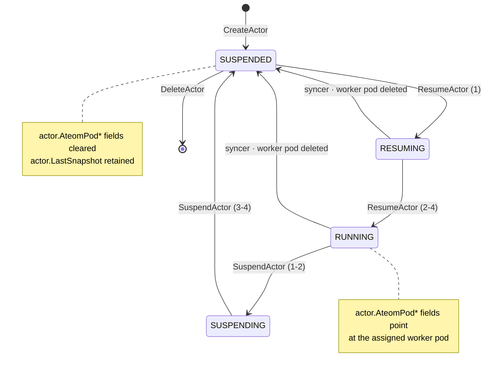
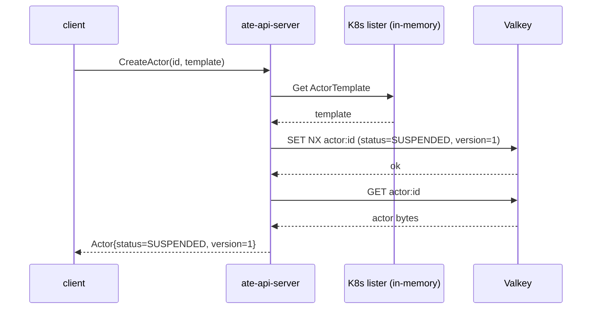
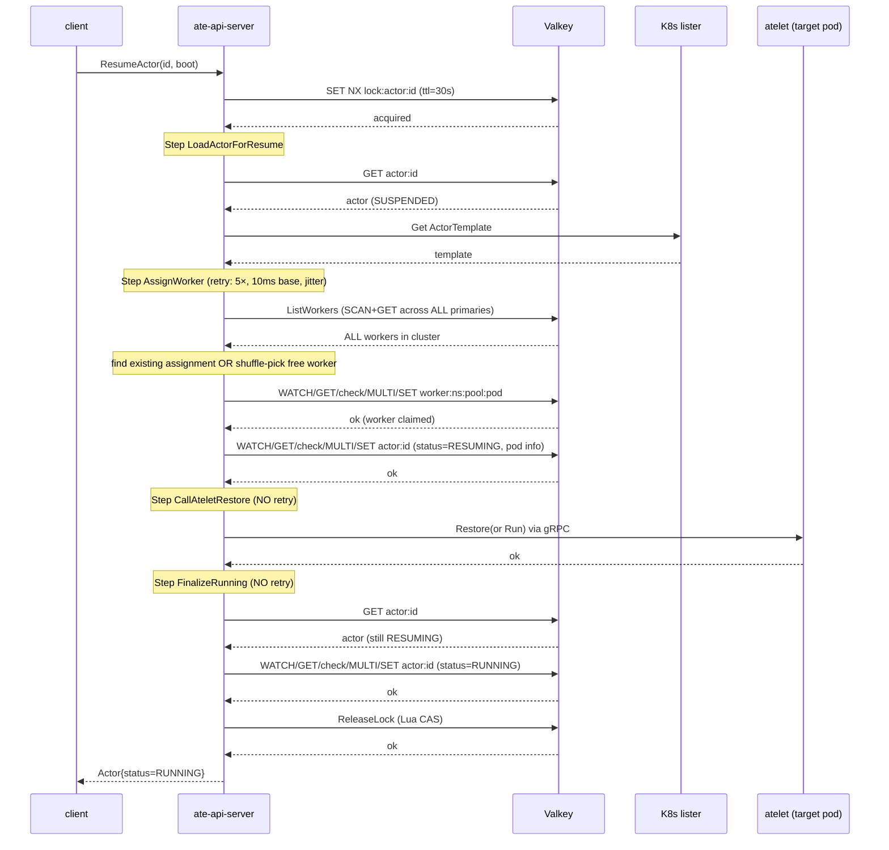
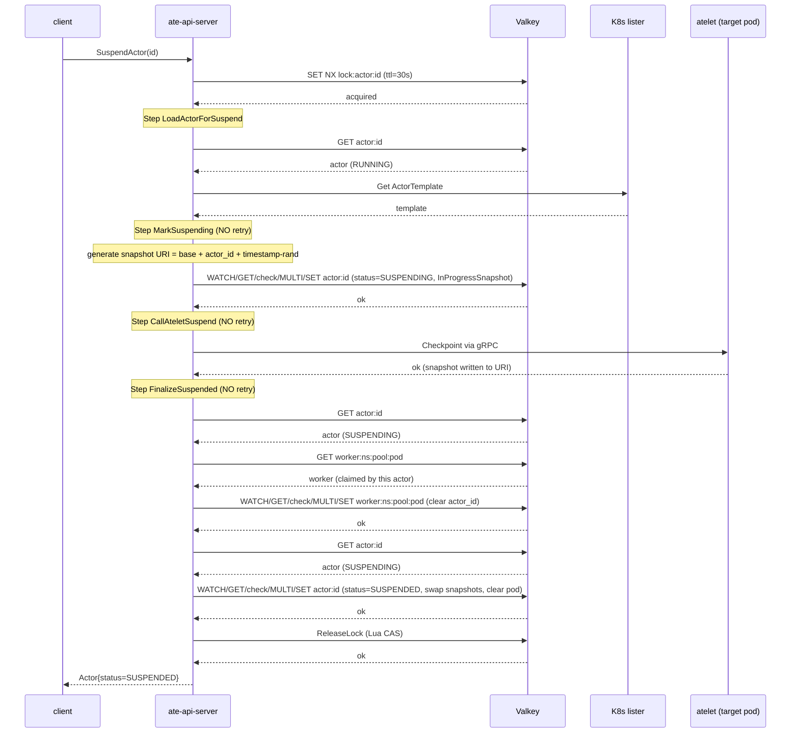
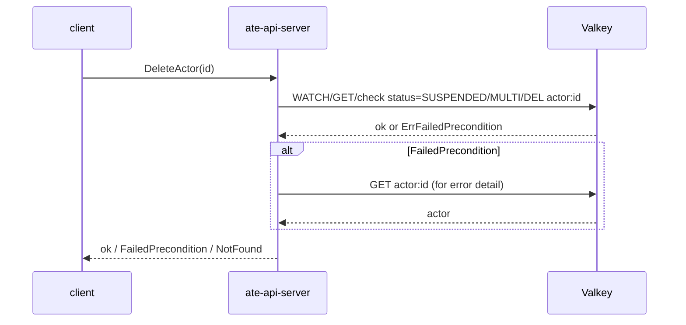

# Actor Lifecycle: Critical Path

This page documents the actor state machine, the Valkey operations each
state transition performs, the locking model that serializes concurrent
operations on the same actor, and the failure / recovery modes for every
edge.

The framing target is the **<10 ms whole-path budget** for scheduling and
state-machine operations. Where a transition does not fit that budget
today, it is called out explicitly.

## State machine

Statuses are defined by the `Actor.Status` enum in
`pkg/proto/ateapipb/ateapi.proto`. Every transition that mutates state
goes through `store.Interface.UpdateActor` with optimistic concurrency
(version-check CAS). The implicit transition driven by the
`WorkerPoolSyncer` (worker pod deletion → actor reset) is the only edge
that is *not* triggered by a client API call.

## Locking model

`ResumeActor` and `SuspendActor` both serialize per-actor via a distributed
lock at key `lock:actor:<id>`:

- **Acquire**: `SET NX EX` with a UUID token, **TTL 30 s**.
- **Release**: Lua CAS (read token, compare, delete) — safe even if the
  lock has already expired and been re-acquired by someone else.
- **Workflow timeout**: lock TTL minus 2 s padding (28 s). The workflow
  context is cancelled before the lock TTL fires, so the workflow stops
  acting before another caller can validly grab the lock.
- **Fallback safety net**: the lock TTL itself. If the API server crashes
  mid-workflow without releasing, the lock auto-expires in ≤ 30 s and
  another caller can proceed.

`CreateActor` and `DeleteActor` do **not** acquire the actor lock. They
rely on the storage-level CAS in `CreateActor` (atomic `SET NX`) and the
status-precondition CAS in `DeleteActor` (`WATCH`/`GET`/check
`STATUS_SUSPENDED`/`DEL`).

## Transition 1: `CreateActor` (∅ → SUSPENDED)

The simplest transition. See `cmd/ateapi/internal/controlapi/create_actor.go`.

**Valkey ops**: 2 (one `SET NX`, one `GET`). Single key, single shard.

**Failure modes**:

| Failure | Detection | Effect | Recovery |
|---|---|---|---|
| Actor already exists | `SET NX` returns false → `store.ErrAlreadyExists` | gRPC `AlreadyExists` to client | client picks new id |
| ActorTemplate missing | K8s lister returns `IsNotFound` | gRPC `FailedPrecondition` | create template first |
| Valkey unreachable | `SET NX` network error | gRPC `Internal` (wrapped error) | client retries |
| Crash after `SET NX`, before `GET` | client sees timeout / disconnect | actor IS created in DB | retry returns `AlreadyExists`; client treats as success and calls `GetActor` |

The post-create `GET` is a wasted round trip — `CreateActor` could
return the locally-constructed actor and avoid it. Not a critical-path
operation, but it doubles the round trips for this transition.

## Transition 2: `ResumeActor` (SUSPENDED → RUNNING)

The most expensive transition in the system. The workflow runs four
steps under the actor lock. See
`cmd/ateapi/internal/controlapi/workflow_resume.go`.

**Valkey ops (happy path, no contention)**:

| Step | Ops | Notes |
|---|---|---|
| AcquireLock | 1 (`SET NX`) | |
| LoadActor | 1 (`GET`) | |
| AssignWorker — ListWorkers | **1 SCAN + N GET** | **N = total worker count cluster-wide, fans out to every primary** |
| AssignWorker — UpdateWorker | 2 (`WATCH/GET`, `MULTI/SET/EXEC`) | |
| AssignWorker — UpdateActor | 2 (`WATCH/GET`, `MULTI/SET/EXEC`) | |
| FinalizeRunning — GetActor | 1 (`GET`) | |
| FinalizeRunning — UpdateActor | 2 (`WATCH/GET`, `MULTI/SET/EXEC`) | |
| ReleaseLock | 1 (Lua EVAL) | |
| **Total** | **10 + N** | |

At 1 ms per round trip (intra-cluster mTLS), the base cost is **~10 ms**
*before* `ListWorkers` fan-out. At 10 k workers, the `ListWorkers` fan-out
adds another 10 k+ round trips and bulk data transfer; at 100 k workers,
the fan-out alone is multiple seconds. **`ResumeActor` does not fit the
<10 ms budget at any non-trivial worker count today** — the binding
constraint is the `ListWorkers` call inside `AssignWorkerStep`. See
[`admin-operations.md`](./admin-operations.md) for details.

The atelet `Restore` / `Run` gRPC call is the actual work (image pull,
sandbox bring-up, snapshot restore). Its latency is unrelated to Valkey
but the storage tier consumes its budget before atelet is even contacted.

**Failure modes**:

| Failure | Step | Effect | Recovery |
|---|---|---|---|
| Lock already held | AcquireLock | gRPC `Aborted` ("another operation in progress") | client retries after delay |
| Valkey unreachable mid-workflow | any | step error bubbles up | lock auto-expires after 30 s; client retries; idempotent fast-forward |
| `UpdateWorker` conflict (concurrent claim) | AssignWorker | retry up to 5× with exponential backoff + jitter | usually resolves; if exhausted, surface `Aborted` |
| `UpdateActor` conflict on transition to RESUMING | AssignWorker | retry up to 5× | usually resolves |
| No free workers in pool | AssignWorker | gRPC `FailedPrecondition` ("no free workers available") | requires worker pool scale-up |
| atelet pod unreachable | CallAteletRestore | error bubbles up; **NO retry** | client retries entire workflow |
| atelet `Restore` partial success / crash | CallAteletRestore | error bubbles, actor stuck RESUMING (see "stranded states") | next `ResumeActor` re-runs Restore (idempotency assumed atelet-side) |
| Crash after `Restore` succeeded, before `FinalizeRunning` | FinalizeRunning | actor stuck RESUMING; lock expires; workload is actually running | next `ResumeActor` re-loads, sees status RESUMING, fast-forwards through AssignWorker (existing assignment), **re-invokes atelet `Restore`** (relies on atelet idempotency), then finalizes |
| `UpdateActor` conflict on transition to RUNNING | FinalizeRunning | step error bubbles up; **NO retry** | next `ResumeActor` re-finalizes |

The **NO retry** annotations are load-bearing. `FinalizeRunning` has no
`RetryBackoff()`, so a single `ErrPersistenceRetry` (from a concurrent
mutation by `releaseActorOnDeadWorker` or a racing operation) strands
the actor in RESUMING and requires an external retry to reach RUNNING.

## Transition 3: `SuspendActor` (RUNNING → SUSPENDED)

Four steps under the actor lock. See
`cmd/ateapi/internal/controlapi/workflow_suspend.go`.

**Valkey ops (happy path)**:

| Step | Ops |
|---|---|
| AcquireLock | 1 |
| LoadActor | 1 |
| MarkSuspending — UpdateActor | 2 |
| FinalizeSuspended — GetActor | 1 |
| FinalizeSuspended — GetWorker | 1 |
| FinalizeSuspended — UpdateWorker | 2 |
| FinalizeSuspended — GetActor (again) | 1 |
| FinalizeSuspended — UpdateActor | 2 |
| ReleaseLock | 1 |
| **Total** | **12** |

Twelve round trips on the happy path. No cluster-wide fan-out (unlike
`ResumeActor`), so this is closer to fitting the budget — at 1 ms per
trip it lands around 12 ms in the storage tier, plus the atelet
`Checkpoint` call. The two redundant `GetActor` calls in
`FinalizeSuspended` (lines `s.store.GetActor` called twice with no
intervening mutation by us) look like defensive re-reads that could be
folded.

**Failure modes**:

| Failure | Step | Effect | Recovery |
|---|---|---|---|
| Lock held | AcquireLock | gRPC `Aborted` | client retries |
| Actor already SUSPENDING / SUSPENDED | MarkSuspending | step IsComplete fast-forwards | proceeds idempotently |
| Worker pod unreachable | CallAteletSuspend | if `ErrWorkerPodNotFound`, **skipped** (warn-logged); else error bubbles | dangling-pod path handled; other errors require retry |
| atelet `Checkpoint` partial success | CallAteletSuspend | error bubbles, actor stuck SUSPENDING | next call re-Checkpoints to same URI (atelet must overwrite or dedup) |
| Crash after Checkpoint, before FinalizeSuspended | FinalizeSuspended | actor stuck SUSPENDING, snapshot on object storage at `InProgressSnapshot`, worker still claimed | next `SuspendActor` fast-forwards MarkSuspending, re-Checkpoints (idempotency assumed), then finalizes; **resume in this state is blocked** until a suspend retry completes |
| `UpdateWorker` conflict freeing worker | FinalizeSuspended | step error bubbles up; **NO retry** | actor stays SUSPENDING; next call retries cleanup |
| `UpdateActor` conflict on transition to SUSPENDED | FinalizeSuspended | step error bubbles up; **NO retry** | actor stays SUSPENDING; snapshot remains on `InProgressSnapshot`; LastSnapshot not promoted |

## Transition 4: `DeleteActor` (SUSPENDED → ∅)

**Valkey ops**: 2 on happy path (the `WATCH/GET/check/MULTI/DEL` dance);
one additional `GET` on the precondition-failure path for the error
message.

**No actor lock acquired.** The status-precondition CAS in the storage
layer is the only safety. This is fine for SUSPENDED → DELETED (an
already-deleted actor returns `NotFound`), but it does mean a
`DeleteActor` racing with a `ResumeActor` will either:

- See SUSPENDED at WATCH time, then EXEC fails because ResumeActor
  changed the version → `ErrPersistenceRetry` → gRPC `Aborted`; or
- See RESUMING/RUNNING/SUSPENDING at the precondition check →
  `ErrFailedPrecondition` → gRPC `FailedPrecondition` with status detail.

Either way the client gets a clean error.

**Snapshot leak.** `DeleteActor` removes the actor record only; the
snapshot URIs stored in `LastSnapshot` (and any `InProgressSnapshot`)
point at object storage that is **not cleaned up**. This is a known
operational issue, not a Valkey concern — flagging here because the
state machine's terminal transition is the right place to surface it.

## Implicit transition: syncer-driven RESET (RUNNING/RESUMING → SUSPENDED)

When a worker pod is deleted in Kubernetes, the `WorkerPoolSyncer`
(see `cmd/ateapi/internal/controlapi/syncer.go`,
`releaseActorOnDeadWorker`) attempts to reset any actor currently bound
to that worker:

1. `GetWorker` to find the bound actor id.
2. `GetActor` to confirm it still points at the dead pod (skip if a
   concurrent SuspendActor already moved it).
3. `UpdateActor` with version CAS to set status=SUSPENDED, clear pod
   fields, clear InProgressSnapshot.

**Critical property**: the syncer does **not** acquire `lock:actor:<id>`.
It relies entirely on optimistic CAS on the actor's version.

**Concurrent-with-SuspendActor analysis**:

- If SuspendActor has bumped the version (any step that did `UpdateActor`),
  syncer's `UpdateActor` gets `ErrPersistenceRetry` and **silently drops**
  the error. SuspendActor completes; status ends up SUSPENDED via the
  intended path; snapshot is preserved.
- If syncer wins the race (runs before SuspendActor's first
  `UpdateActor`), the actor is reset to SUSPENDED with **no snapshot
  promoted** (any in-progress snapshot is cleared). SuspendActor then
  loads, sees SUSPENDED, fast-forwards through everything, and returns
  success — but the user's intent ("checkpoint before suspending") is
  silently lost. The workload was never checkpointed because the worker
  was already gone.

**Concurrent-with-ResumeActor analysis**:

- If ResumeActor is mid-AssignWorker and the chosen worker dies, syncer's
  `releaseActorOnDeadWorker` either races with ResumeActor's
  `UpdateActor` (one wins, the other gets `ErrPersistenceRetry`) or
  observes the actor still pointing at the now-dead pod.
- If syncer wins: actor reset to SUSPENDED, ResumeActor's UpdateActor
  fails with `ErrPersistenceRetry`, AssignWorker retries (it has
  backoff), re-loads actor (SUSPENDED again), reassigns to a different
  free worker, proceeds.
- If ResumeActor wins: actor is now RESUMING pointing at a worker whose
  pod is being deleted. ResumeActor proceeds to CallAteletRestore,
  fails (pod gone), returns error. Actor is **stranded RESUMING pointing
  at a deleted worker**. Recovery requires another `ResumeActor` call,
  which will re-AssignWorker — but the existing-assignment check finds
  worker X (now deleted from DB by syncer) → falls through to "find free
  worker" → picks new worker. Old workload (if any) is leaked.

These race outcomes are not failures in isolation, but the system has
no observability into them today. A counter on
`releaseActorOnDeadWorker` outcomes (won race / lost race / no actor
bound) would surface how often these paths fire in production.

## Stranded states

| Status | How we got here | What the next `ResumeActor` does | What the next `SuspendActor` does | Notes |
|---|---|---|---|---|
| RESUMING (with pod ptr) | Crash after AssignWorker, before FinalizeRunning | Re-assigns same worker, **re-invokes atelet Restore**, finalizes | Marks SUSPENDING, re-Checkpoints (workload may not exist yet on atelet → unclear) | Atelet-side idempotency assumption is load-bearing |
| RESUMING (pod deleted) | Worker died mid-resume, syncer raced and lost | Re-assigns to a **different** worker, old workload leaks | Loaded actor still RESUMING, MarkSuspending advances to SUSPENDING with a *new* InProgressSnapshot, Checkpoint to a dead pod fails | Operator should `SuspendActor` first to reach a clean SUSPENDED |
| SUSPENDING | Crash after Checkpoint, before FinalizeSuspended | Aborted: lock acquired by SuspendActor retry would conflict; if no concurrent suspend, ResumeActor proceeds to AssignWorker on a still-claimed worker → conflict | Fast-forwards MarkSuspending, re-Checkpoints to same URI, finalizes | Snapshot URI is stable across retries; relies on atelet to overwrite or dedup |

There is no background reconciler that drives stranded actors to a
clean state. Recovery is **client-driven retry** in all cases. A
reconciler that periodically scans for actors stuck in transitional
states longer than some threshold and re-issues the appropriate
workflow is a known gap; the current design assumes clients (or
controllers) will retry on their own behalf.

## Risk register (lifecycle-specific)

The risks below are specific to the actor state machine. Topology /
scaling risks live in [`topology.md`](./topology.md).

1. **`ListWorkers` fan-out inside `ResumeActor`.** Every actor resume
   reads every worker in the cluster. This is the single most
   load-bearing scaling concern in the critical path. Mitigations
   exist (per-pool index, scoped scan, in-memory worker cache) but
   none are implemented today. Detail in
   [`admin-operations.md`](./admin-operations.md).

2. **No retry on `FinalizeRunning` / `FinalizeSuspended`.** These steps
   write the terminal status of the workflow but have no
   `RetryBackoff()`. A single CAS conflict (which can be caused by an
   informer-driven `UpdateActor` from `releaseActorOnDeadWorker` or any
   other writer) strands the actor in a transitional state until an
   external retry. Adding backoff to these steps is mechanically a
   one-line change; understanding the contention model first is the
   precondition.

3. **Atelet-side idempotency assumed but undocumented.** The workflow
   assumes `Restore` and `Checkpoint` can be safely re-invoked with the
   same arguments. If atelet does not enforce idempotency, retries
   double-resume (two workloads booting against the same actor id) or
   double-checkpoint (racing writers to the same snapshot URI). This is
   a contract that needs to be made explicit in the atelet protobuf
   docs, and verified.

4. **Syncer bypasses the actor lock.** `releaseActorOnDeadWorker`
   operates with optimistic CAS only. The interleaving with a racing
   `SuspendActor` can silently drop the user's snapshot intent (worker
   dies during suspend → syncer resets actor first → SuspendActor
   fast-forwards and reports success without checkpointing). Either
   acquire the lock (with a short timeout to keep the syncer
   responsive) or add explicit metrics so the path is observable.

5. **Snapshot URI stability under retry.** The snapshot URI is set
   atomically with status=SUSPENDING and stable across retries.
   However, if a SuspendActor is retried *after* the actor reaches
   SUSPENDED (i.e. lock released, status finalized), then a *new*
   SuspendActor races a stale retry, the stable-URI assumption no
   longer holds. The actor lock prevents this in practice; documenting
   it ensures any future locking change does not regress.

6. **Snapshot leak on delete.** `DeleteActor` removes the actor record
   but not the snapshot blob. Operationally, an actor that is
   resume-suspend-resume-suspend-...-delete leaves N snapshot URIs in
   object storage with no Substrate-side cleanup. Not a Valkey
   concern; flagged here as the natural place to track the lifecycle
   gap.

7. **No bounded retry budget on client-driven retries.** API errors
   like `Aborted` ("concurrent update conflict, please retry") have no
   server-side guidance about when to retry, and no per-actor circuit
   breaker. A pathological caller can hot-loop the same actor and
   starve other operations on the same shard.

## Open questions for the design eval

- What is the realistic ceiling on per-actor lifecycle QPS today? Without
  measurement, the 10 ms-budget conversation is theoretical.
- Should `AssignWorker` move to a pool-indexed scan (worker keys carry
  the pool in the key, but the scan still reads all of them)?
- Is the workflow framework (`WorkflowStep[Params, Context]`,
  `RunWorkflow`) the right place to add a global step-level retry policy
  for terminal steps, or should each step opt-in explicitly?
- Should the syncer take the actor lock?
- Is there an audit log of state-machine transitions? If not, debugging
  a stranded actor relies on log greps across the API server.
