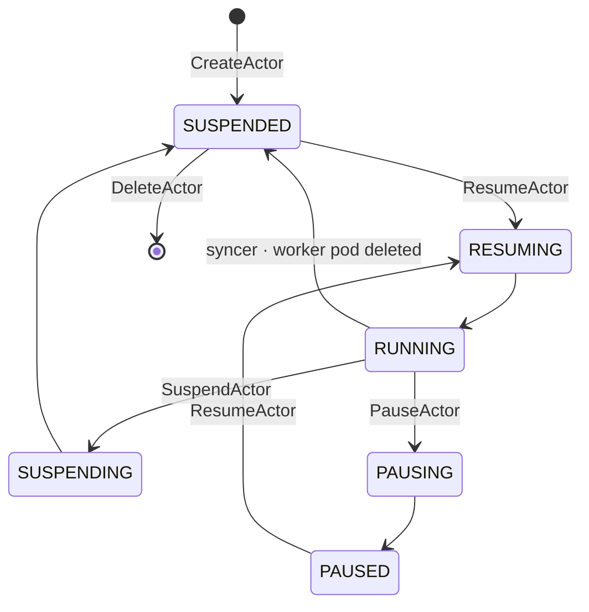

# Lifecycle

This page describes how state moves through the storage tier — the
actor state machine, the four lifecycle workflows that drive it, the
worker side (creation, assignment, release, deletion), and the worker
cache that makes scheduling fast.

## Actor state machine

The two "at rest" states differ in durability and resume cost:

- **SUSPENDED** — snapshot lives in durable object storage. Survives
  node loss. Slower resume (network pull of the snapshot).
- **PAUSED** — snapshot lives on the node where the actor was
  running. Faster resume from local cache, but lost if that node
  fails. The actor record carries
  `latest_snapshot_info.local.node_vms_with_local_snapshots` so the
  scheduler can prefer a worker on the same node for the next resume.

The transitional states (`RESUMING`, `SUSPENDING`, `PAUSING`) only
exist for the duration of the corresponding workflow. An actor stuck
in a transitional state past the lock TTL (30 s) is stranded — see
[`operations.md`](./operations.md).

## Worker side

### Source of truth: the syncer

Worker records in Valkey are not created or deleted by application
calls — they're driven entirely by the Kubernetes pod lifecycle of
worker pods. The `WorkerPoolSyncer` (`cmd/ateapi/internal/controlapi/syncer.go`)
watches worker pods via a K8s informer and reflects pod events into
the store:

- Pod **Added** (eligible) → `CreateWorker`
- Pod **Updated** (IP changed; in practice unreachable) → `UpdateWorker`
- Pod **Deleted** (or `DeletionTimestamp` set) →
  `releaseActorOnDeadWorker` (resets the actor bound to the dying
  worker, if any) followed by `DeleteWorker`

The syncer is the only writer for worker create/delete; the lifecycle
workflows below only mutate the **assignment** fields
(`actor_id` / `actor_namespace` / `actor_template`) of existing
worker records.

### Worker cache

The `cmd/ateapi/internal/workercache` package keeps an in-process
mirror of all worker records inside every `ate-api-server` pod. The
cache exists so `AssignWorkerStep` does not pay an O(N) `ListWorkers`
scan against Valkey on every actor resume — it reads `Workers()` in
microseconds.

How it stays in sync (list + watch + relist):

1. **Initial sync.** On startup, `Cache.Start` subscribes to
   `WatchWorkers` (Valkey pub/sub), then runs `ListWorkers` once to
   populate the map. `Workers()` returns "not ready" until this
   completes.
2. **Live updates.** Every `CreateWorker` / `UpdateWorker` /
   `DeleteWorker` against the store publishes a `WorkerEvent` on the
   `worker-changes` channel. The cache's subscriber goroutine
   receives events and applies them to the map. Events are compared
   by `version`; a stale event cannot overwrite a fresher cache
   entry.
3. **Periodic relist.** Re-runs `ListWorkers` on a schedule to catch
   anything pub/sub missed (slow consumer, dropped events, transient
   subscription drop).
4. **Disconnect resync.** If the subscriber's channel closes, the
   cache marks itself not-ready and re-runs the initial sync with
   exponential backoff (1 s → 30 s cap, 5 attempts).

The cache is **per API-server pod**. Each pod independently
subscribes to the cluster-wide pub/sub channel, so all pods see the
same events. Pods stay eventually-consistent with each other on the
order of pub/sub latency (sub-second steady state).

`Workers()` returns pointers directly into the cache map. Callers
that need to mutate a worker proto (e.g. setting `actor_id` during
assignment) must `proto.Clone` first to avoid corrupting the cache.

### Eligibility — which workers can run which actor

Not every free worker can run any actor. The scheduler filters via
**`eligibleWorkerPools`** (in
`cmd/ateapi/internal/controlapi/workflow_resume.go`), which intersects
three constraints:

1. **Sandbox class match.** Snapshots are not portable across sandbox
   classes (gvisor, microvm, etc.). The pool's `Spec.SandboxClass`
   must equal the template's `Spec.SandboxClass`. Hard gate.
2. **Template's worker-selector.** A K8s `LabelSelector` on the
   `ActorTemplate.Spec.WorkerSelector` that must match the pool's
   labels.
3. **Actor's worker-selector.** A `Selector` (match-labels only) on
   the `Actor.WorkerSelector` field, set at CreateActor and
   updatable. Also matched against the pool's labels.

The result is a set of `(namespace, name)` pairs of eligible worker
pools. `AssignWorkerStep` then picks a free worker whose
`(WorkerNamespace, WorkerPool)` is in that set.

Note: today eligibility is **per-pool**, not per-individual-worker.
There is no per-worker label scheduling yet — every worker in an
eligible pool is treated equivalently except for the locality
preference (next section).

### Locality preference

Within the eligible-pool set, the scheduler prefers a worker on a
node that already has the actor's local snapshot. The actor's
`latest_snapshot_info.local.node_vms_with_local_snapshots` carries
the list of node IDs that hold the snapshot; `findFreeWorker`
filters candidate workers to that node set if non-empty. If no
candidate workers are on a matching node, the resume falls back to
any free worker in the eligible pool set (and the snapshot will be
pulled from durable storage during `Restore`).

## The four workflows

All four workflows live in `cmd/ateapi/internal/controlapi/` and are
orchestrated via a generic step engine in `workflow.go`. Resume,
Suspend, and Pause all acquire a per-actor distributed lock
(`lock:actor:<id>`, 30 s TTL, 28 s workflow timeout) before running
their step sequence.

### CreateActor

Trigger: client API call. No lock; relies on storage-level CAS.

Steps:

1. Validate request, fetch the `ActorTemplate` from the K8s lister.
2. Construct an `Actor` proto with `version=1`,
   `status=STATUS_SUSPENDED`.
3. `CreateActor` (storage `SET NX`) — returns `ErrAlreadyExists` if
   the id is taken.
4. `GetActor` to return the stored record.

Failure modes covered in [`operations.md`](./operations.md).

### ResumeActor (SUSPENDED or PAUSED → RUNNING)

Trigger: client API call. Acquires `lock:actor:<id>`.

Steps:

1. **LoadActorForResume** — `GetActor` + `Get ActorTemplate`.
2. **AssignWorker** — compute `eligibleWorkerPools`, read
   `workerCache.Workers()`, look for an existing assignment from a
   previous failed attempt (idempotency), otherwise call
   `findFreeWorker` (filtered to eligible pools + node-locality
   preference) and pick a random match. Update worker (CAS) with
   the new assignment, update actor to `RESUMING` with pod
   coordinates.
3. **CallAteletRestore** — gRPC `Restore` (or `Run` if no snapshot
   exists) against the chosen worker's atelet. The atelet either
   loads from the local cache (if the node has the snapshot) or
   pulls from durable storage.
4. **FinalizeRunning** — refresh actor record, set status `RUNNING`
   (CAS).

A successful resume ends with actor `RUNNING`, worker `actor_id` =
this actor, the worker record reflecting the assignment, and a pub/sub
event from the `UpdateWorker` so other API server pods' caches see
the change.

`AssignWorker` has exponential backoff (5 attempts) on CAS conflicts.
`FinalizeRunning` does not — a single CAS conflict here strands the
actor in `RESUMING` and requires an external retry.

### SuspendActor (RUNNING → SUSPENDED)

Trigger: client API call. Acquires `lock:actor:<id>`.

Steps:

1. **LoadActorForSuspend**.
2. **MarkSuspending** — update actor to `SUSPENDING`, record an
   `in_progress_snapshot` URI (constructed from template's snapshot
   location + actor id + timestamp).
3. **CallAteletSuspend** — gRPC `Checkpoint` to the actor's atelet.
   The atelet writes the snapshot to durable storage at the
   `in_progress_snapshot` URI. If the worker pod has vanished
   (`ErrWorkerPodNotFound`), the step skips with a warning — the
   actor record will still be transitioned, but no fresh snapshot
   is written.
4. **FinalizeSuspended** — refresh actor, release the worker
   (`UpdateWorker` clearing `actor_id`), set actor status
   `SUSPENDED`, promote `in_progress_snapshot` to the
   `latest_snapshot_info.external` field, clear pod coordinates.

Suspend ends with the worker free (pub/sub event broadcast) and the
actor pointing at a fresh durable snapshot. Suspend is the only path
that produces a durably-stored snapshot.

### PauseActor (RUNNING → PAUSED)

Trigger: client API call. Acquires `lock:actor:<id>`.

Steps mirror Suspend but the snapshot is **kept local on the node**
rather than uploaded to durable storage:

1. **LoadActorForPause**.
2. **MarkPausing** — update actor to `PAUSING`.
3. **CallAteletPause** — gRPC `Pause` to the actor's atelet, which
   snapshots in-place on the node.
4. **FinalizePaused** — release the worker, set actor status
   `PAUSED`, record the node in
   `latest_snapshot_info.local.node_vms_with_local_snapshots`,
   clear pod coordinates.

Pause is faster than Suspend (no network upload) and produces no
durable artifact. A subsequent ResumeActor will prefer a worker on a
node in the local-snapshot set; if none are available, the resume
falls back to a worker without locality and the snapshot is
unavailable (PAUSED actors that lose their node go to
`SUSPENDED`-without-snapshot via syncer-driven release; the actor
record's snapshot fields no longer reference a valid blob).

### DeleteActor (SUSPENDED → ∅)

Trigger: client API call. No lock; relies on storage-level CAS with
status precondition.

`DeleteActor` does a `WATCH`/`GET`/check `status == SUSPENDED`/
`MULTI`/`DEL` against the actor key. Returns
`ErrFailedPrecondition` if the actor is not SUSPENDED;
`ErrPersistenceRetry` if another writer changed the key during the
check.

Snapshot URIs in the actor record are **not cleaned up** by
`DeleteActor` — durable snapshots leak in object storage. Tracked
under operations risks.

## Worker lifecycle, end to end

Putting the pieces together for a typical "worker pod gets created,
gets used, gets deleted" cycle:

1. **Pod created** in K8s (manually or by an autoscaler controller).
2. K8s informer in syncer sees the Add event, calls `CreateWorker`
   on the store.
3. `CreateWorker` writes to Valkey AND publishes
   `WorkerEvent{Created, worker}` on `worker-changes`.
4. Every API-server pod's worker cache receives the event and adds
   the worker to its map. Worker is now visible to all schedulers.
5. A `ResumeActor` call lands; `AssignWorker` reads
   `workerCache.Workers()`, picks this worker, `UpdateWorker` is
   called with the new assignment.
6. `UpdateWorker` writes to Valkey AND publishes
   `WorkerEvent{Updated, worker}`. Caches everywhere update.
7. Actor lifecycle continues; eventually `SuspendActor` releases the
   worker via another `UpdateWorker`/`WorkerEvent{Updated}` and the
   worker is idle again.
8. Steps 5–7 may repeat many times — the worker is reused across
   actors.
9. Eventually the pod is deleted (scale-down, node maintenance,
   crash). K8s informer sees the Delete event, syncer calls
   `releaseActorOnDeadWorker` then `DeleteWorker`.
10. `DeleteWorker` removes the key from Valkey AND publishes
    `WorkerEvent{Deleted, worker}`. Caches everywhere remove the
    worker. Worker is no longer visible to any scheduler.

Pub/sub is the load-bearing mechanism keeping all caches in step
with reality. Operational concerns around this — missed events,
broadcast amplification at scale, subscriber backpressure — are in
[`operations.md`](./operations.md).
