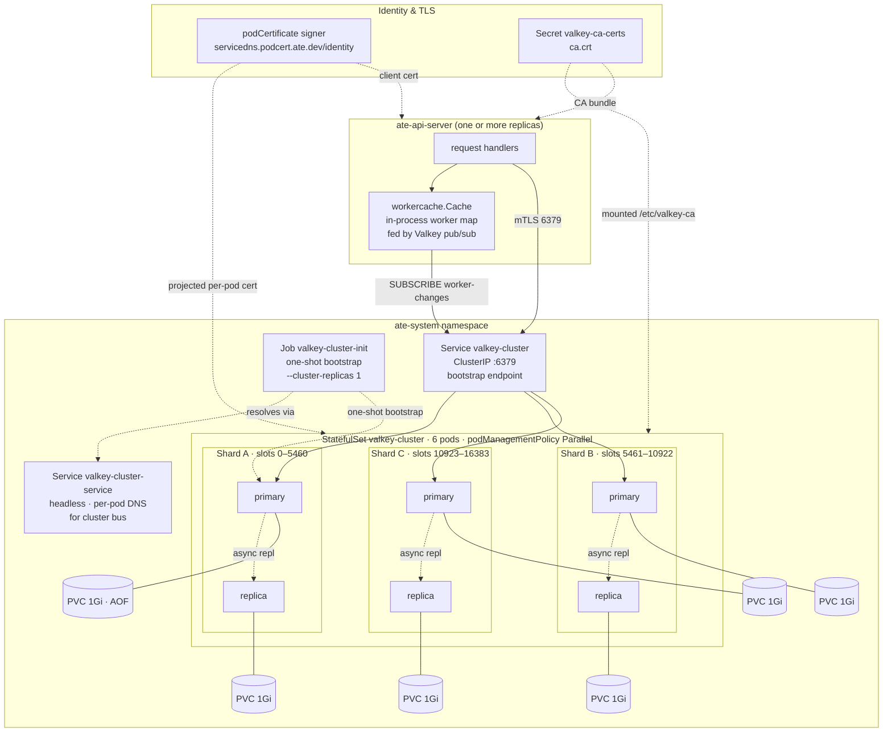

# Topology

This page describes what is deployed for Substrate's storage tier, how
the pieces fit together, and how it sizes against MVP and target-scale
workloads. The storage tier has two cooperating components: a Valkey
cluster (source of truth) and a per-API-server in-process worker cache
(read-side optimization for the actor-scheduling critical path).

## Deployment overview

## Valkey cluster

Source of truth: `manifests/ate-install/valkey.yaml`.

- **StatefulSet** `valkey-cluster`, image `valkey/valkey:9.1` (pinned
  by SHA), 6 pods, `podManagementPolicy: Parallel`. Each pod gets a
  **1 Gi PVC** for AOF + `nodes.conf`.
- **Cluster mode** enabled via the ConfigMap (`cluster-enabled yes`,
  `cluster-node-timeout 5000`, `appendonly yes`). No override of
  `appendfsync` (defaults to `everysec`), no `min-replicas-to-write`,
  no `cluster-require-full-coverage` override (default `yes`), no
  `maxmemory` override.
- **TLS auto-reload** via `tls-auto-reload-interval 43200` — Valkey
  re-reads its cert and key from the projected volume every 12 hours,
  so routine cert rotation does not require pod restarts. The path
  to a stale cert is still possible if the gap between the volume
  refresh and the next reload is operationally important — see
  `operations.md`.
- **Shape**: bootstrapped with `--cluster-replicas 1` → **3 primaries
  + 3 replicas**, one replica per primary. The 16,384 hash slots are
  split into three roughly equal ranges.
- **Services**: a headless service `valkey-cluster-service` provides
  per-pod DNS for cluster-bus gossip. A ClusterIP service
  `valkey-cluster` is the client bootstrap endpoint; clients populate
  their slot map and then talk to each primary directly.
- **mTLS**: full mTLS on the data path. Per-pod server certs come
  from a `podCertificate` projected volume signed by
  `servicedns.podcert.ate.dev/identity` (ECDSA P-256). The CA bundle
  is mounted from the `valkey-ca-certs` secret. The `ate-api-server`
  mounts matching client credentials.
- **Bootstrap**: an idempotent `valkey-cluster-init` Job waits for
  all 6 pod DNS names to resolve, then runs `valkey-cli --cluster
  create` if the cluster is not already initialized. Safe to re-run.

### Sharding model

A key's home slot is `CRC16(key) mod 16384`. Application keys:

- **Actors**: `actor:<actor-id>` (set in
  `cmd/ateapi/internal/store/ateredis/ateredis.go`, `actorDBKey`).
- **Workers**: `worker:<ns>:<pool>:<pod>` (`workerDBKey`).
- **Locks**: `lock:actor:<id>` (`AcquireLock` call sites in
  `controlapi/workflow.go`).

No hash tags are used today, so every key hashes independently and
distribution is roughly uniform across primaries. Multi-key
operations across slots are forbidden — the application either
denormalizes (worker status inlined into actor) or accepts
non-atomicity across keys.

## API server worker cache

Source of truth: `cmd/ateapi/internal/workercache/workercache.go`.

Each `ate-api-server` pod holds an in-process worker cache that
mirrors the workers stored in Valkey. The cache exists so that the
actor-scheduling critical path (`AssignWorkerStep`) does not pay an
O(N) `ListWorkers` scan against Valkey per resume — it reads the
cache in microseconds.

How the cache stays current:

1. On startup, the cache calls `WatchWorkers` to open a Valkey pub/sub
   subscription, then runs `ListWorkers` once to load the initial
   snapshot. The `Workers()` method returns "not ready" until this
   completes.
2. On every `CreateWorker` / `UpdateWorker` / `DeleteWorker` against
   the store, ateredis publishes a `WorkerEvent` on the
   `worker-changes` channel.
3. The cache's subscriber goroutine receives events and applies them.
   Version-based ordering protects against out-of-order delivery.
4. A periodic relist re-runs `ListWorkers` to catch events that pub/sub
   missed (slow subscriber, transient drops, subscriber disconnect).
5. On subscription disconnect, the cache marks itself not-ready and
   resyncs with exponential backoff.

The cache is **per API-server pod**. Each pod has its own subscriber
and its own copy of the map. Pub/sub broadcasts cluster-wide, so all
pods see the same events; pods stay eventually-consistent with each
other on the order of pub/sub latency (sub-second steady state).

`Workers()` returns pointers directly from the cache. Callers that
need to mutate a worker (e.g. setting `actor_id` during assignment)
must `proto.Clone` first to avoid corrupting the cache.

## Sizing math

Two memory budgets that grow with scale.

### Valkey working set

The Actor record dominates Valkey memory. The proto is twelve
scalar/string fields plus a `SnapshotInfo` sub-message; JSON-encoded
with realistic snapshot URIs it lands in the **500 B – 1 KB** range
in practice. Add ~60–100 B per key for Valkey's `dictEntry` and key
string, so plan for **~1 KB per actor** in primary memory.

A practical per-primary memory ceiling on cloud-hosted Valkey is
**4–32 GB**. Above that, `BGSAVE` / `BGREWRITEAOF` fork latency and
full-resync time after a replica restart all become operationally
painful.

| Actor count | Working set | Primaries @ 8 GB | Primaries @ 16 GB | Primaries @ 32 GB |
|---|---|---|---|---|
| 1 M     | 1 GB    | 1   | 1  | 1  |
| 10 M    | 10 GB   | 2   | 1  | 1  |
| 100 M   | 100 GB  | 13  | 7  | 4  |
| 1 B     | 1 TB    | **125** | **63** | **32** |

Multiply by 2 for replicas. At target scale, primary counts approach
the practical cluster-bus comfort ceiling (~500 primaries); above
that, gossip cost grows O(N²) and becomes meaningful.

### Worker cache memory (per API-server pod)

Each API-server pod's cache holds every worker proto in memory.
Worker protos are smaller than Actor protos (no snapshot URIs) —
plan for **~200 B per worker** in the cache map.

| Worker count | Cache memory per API-server pod |
|---|---|
| 1 k    | ~200 KB |
| 10 k   | ~2 MB   |
| 100 k  | ~20 MB  |
| 1 M    | ~200 MB |

At 100 k workers across, say, 5 API-server pods, the cache adds
~100 MB of resident memory across the fleet. Workable; observable.

The cache also pays a one-time `ListWorkers` cost at every API-server
pod startup (the initial sync). At 10 k workers this is seconds; at
100 k workers it's tens of seconds, during which the pod accepts
connections but `Workers()` returns "not ready" and ResumeActor calls
fail with a clear error.

## Configuration knobs not set today

Several Valkey-level safety knobs ship at defaults that are fine at
MVP and concerning at target scale. They are not bugs; they are
deliberate deferrals that should be revisited before scaling
significantly.

| Setting | Default | Why it matters | When to revisit |
|---|---|---|---|
| `cluster-require-full-coverage` | `yes` | Any uncovered slot range (including during a normal primary failover) pauses **all** writes cluster-wide, not just for the affected slot. | Flip to `no` before any deployment that can't tolerate brief cluster-wide pauses during routine failovers. |
| `min-replicas-to-write` | unset | Primary acks writes even with zero healthy replicas — async-replication tail can be lost on failover. | Set to `1` with `min-replicas-max-lag 10` before durability becomes a hard requirement. **No per-write latency cost** — the check is in-memory; cost is availability under replica trouble. |
| `maxmemory` | unset | Pod grows until K8s OOMKills it (which means AOF replay on restart, lost writes, possible failover). | Set explicitly at ~75 % of pod memory limit with `maxmemory-policy noeviction` (writes fail with a clear error instead of triggering opaque OOMKill). |
| Pod anti-affinity / topology spread | none | Primary and replica of the same shard can land on the same K8s node, so a single node failure can take both pods of a shard. | Add required anti-affinity before any production deployment. |
| Off-cluster backups | none | Total loss of both PVCs of a shard = permanent data loss. | Required before GA. |
| Pod Disruption Budget | none | Rolling deploys / autoscaler actions can disrupt multiple Valkey pods at once. | Add `maxUnavailable: 1` before any deployment with concurrent K8s lifecycle activity. |

These flags compose. The combination of `cluster-require-full-coverage yes`
+ no anti-affinity + no PDB is the single largest source of
"unexpected cluster-wide outage on small disturbance" risk in the
current configuration. Even one of them addressed materially
reduces that risk.
