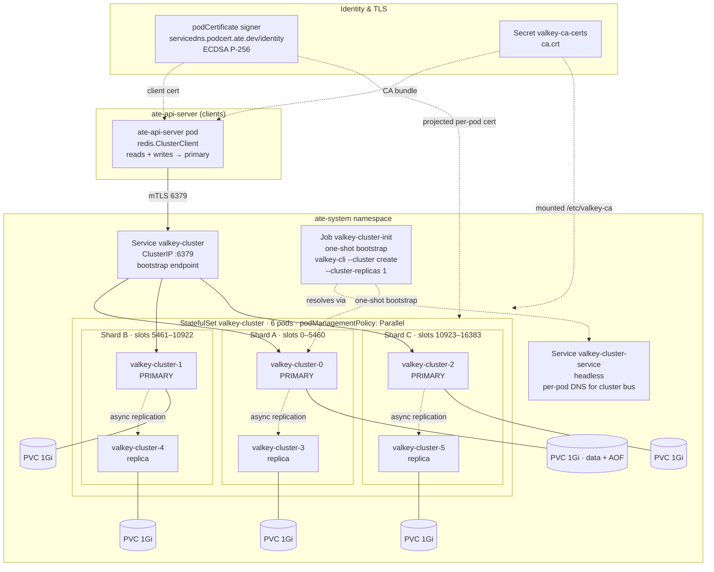
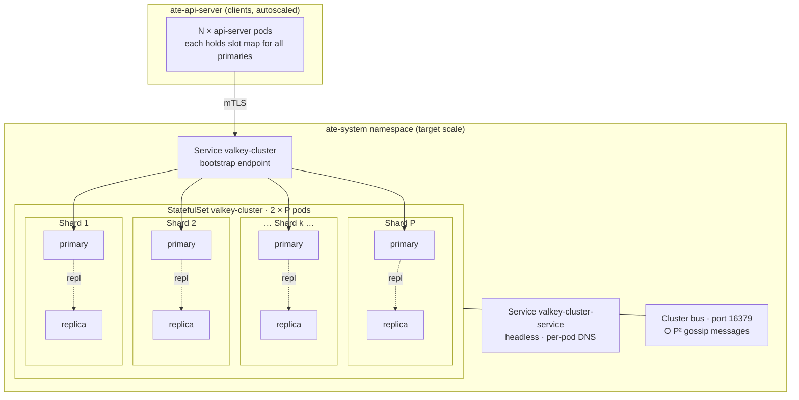

# Valkey Topology

This page documents the current Valkey deployment, projects what the topology
must look like at Substrate's target scale, and offers an explicit go/no-go
verdict for both the alpha/MVP release and the long-term 1B-actor / 100k-worker
target.

The framing is intentional. Substrate's persistence layer is pluggable behind
`store.Interface` (10 methods, no Valkey types leak through), so the question
this page exists to answer is not "is Valkey perfect" — it is "is Valkey
good-enough for the next milestone, and at what point do we need to have an
alternative ready."

## Current deployment

Source of truth: `manifests/ate-install/valkey.yaml`, `cmd/ateapi/main.go`
(see `connectRedis`).

### Component summary

- **StatefulSet** `valkey-cluster`, 6 pods, image `valkey/valkey:8.0`,
  `podManagementPolicy: Parallel`. Each pod gets a 1 Gi PVC for AOF +
  `nodes.conf`.
- **Cluster mode**: `cluster-enabled yes`, `cluster-node-timeout 5000`,
  `appendonly yes`. No override of `appendfsync` (defaults to `everysec`),
  no `min-replicas-to-write`, no `cluster-require-full-coverage` override.
- **Shape**: 6 nodes bootstrapped with `--cluster-replicas 1` → **3 primaries
  + 3 replicas**, one replica per primary. The 16,384 hash slots are split
  into three roughly-equal ranges, one per primary.
- **Services**: a headless service `valkey-cluster-service` provides per-pod
  DNS for the cluster bus, and a ClusterIP service `valkey-cluster` is the
  client bootstrap endpoint. Clients populate their slot map from the
  bootstrap node and connect to every primary directly thereafter.
- **TLS**: full mTLS on the data path. Per-pod server certificates come from
  a `podCertificate` projected volume signed by
  `servicedns.podcert.ate.dev/identity` (ECDSA P-256). The CA bundle is
  mounted from the `valkey-ca-certs` secret. The `ate-api-server` mounts
  matching client credentials.
- **Bootstrap**: an idempotent `valkey-cluster-init` Job waits for all 6 pod
  DNS names to resolve, then runs `valkey-cli --cluster create` if the
  cluster is not already initialized. Safe to re-run.

### Client wiring

`connectRedis` in `cmd/ateapi/main.go` constructs `redis.ClusterClient` with
only `Addrs` and `TLSConfig`. Defaults from go-redis apply:

- `MaxRetries = 3`, `MaxRedirects = 3` — three transparent retries plus three
  hops to follow `MOVED`/`ASK` redirections after a slot-map staleness event.
- `ReadOnly = false` — **all reads route to primaries**. Replicas serve only
  failover capacity; they do not provide read scale-out.
- No `RouteByLatency` / `RouteRandomly` — same conclusion.

### Sharding model

A key's home slot is `CRC16(key) mod 16384`. The keys used by the storage layer
(`cmd/ateapi/internal/store/ateredis/ateredis.go`, see `actorDBKey` and
`workerDBKey`) are `actor:<id>` and `worker:<ns>:<pool>:<pod>` — no hash
tags, so every key hashes independently and the load distribution across
primaries is roughly uniform.

A single write touches **one** primary (and is asynchronously copied to its
replica). A multi-key operation that spans two slots is **forbidden by
Valkey Cluster** — the codebase calls this out in its package doc and
denormalizes worker state into the Actor record to avoid the cross-slot
trap.

## Scaling projection

At Substrate's stated long-term target — **1 billion actors, 100,000+
workers** — the topology must grow significantly. The mechanics of Valkey
Cluster do not change with scale; the number of pods, services, and the
operational burden do.

### Sizing math

The `Actor` proto (defined in `pkg/proto/ateapipb/ateapi.proto`) is twelve
scalar/string fields. JSON-serialized with realistic snapshot URIs, an
in-memory Actor record lands in the range **~500 bytes (lean) to ~1 KB
(populated)**. Add roughly **60–100 bytes per key** for Valkey's `dictEntry`,
expiration metadata, and the key string itself. Worst-case budget for the
following table: **1 KB per actor in primary memory**.

A practical per-primary working-set ceiling on cloud-hosted Valkey is
**4–32 GB**. Above that, `BGSAVE`/`BGREWRITEAOF` fork latency, full-resync
times after a replica restart, and OOM blast radius all get ugly. The
ceiling is not an absolute Valkey limit, it is an operational one.

| Actor count | Working set (1 KB/actor) | Primaries @ 8 GB | Primaries @ 16 GB | Primaries @ 32 GB |
|---|---|---|---|---|
| 1 M     | 1 GB    | 1   | 1  | 1  |
| 10 M    | 10 GB   | 2   | 1  | 1  |
| 100 M   | 100 GB  | 13  | 7  | 4  |
| 500 M   | 500 GB  | 63  | 32 | 16 |
| **1 B** | **1 TB** | **125** | **63** | **32** |

Multiply by 2 to include replicas. At target scale on 16 GB primaries, that
is **126 pods** in the StatefulSet (63 primaries + 63 replicas); on 32 GB
primaries, **64 pods**.

### What changes with scale

The mechanics that stay the same:

- 16,384 hash slots, regardless of primary count.
- Async replication, single-threaded command execution per primary, AOF
  per pod, cluster bus gossip.

The properties that degrade non-linearly:

- **Gossip cost.** Each node periodically pings every other node, so total
  cluster-bus traffic grows O(P²). The Valkey project tests configurations
  up to 1,000 nodes, but the practical comfort zone is widely cited as
  ≤500 primaries. At P = 63 we are well inside; at P = 200+ we are
  approaching the operational edge.
- **Failover frequency.** With more nodes, the probability that *some* node
  is failing over at any given moment grows. Every failover spends
  `cluster-node-timeout` (5 s here) plus election + slot-map refresh on the
  affected slot range. At P = 63 with reasonable per-node MTBF, expect
  multiple failover events per day; the SLO impact compounds.
- **Full-coverage failure mode.** Default `cluster-require-full-coverage
  yes` means **one shard's total loss takes down the entire cluster**.
  Independent shard failure probability of even 0.1 % gives cluster
  availability of `(1 − 0.001)^63 ≈ 93.9 %`, vs. 99.9 % per shard.
  Operating at target scale almost certainly requires flipping this to `no`
  and accepting per-slot availability instead.
- **Per-primary write QPS ceiling.** Single-threaded command execution caps
  each primary's write QPS regardless of cluster size. Published benchmarks
  put modest cloud VMs at 50k–150k QPS per primary; the cluster-wide
  ceiling scales linearly with primary count. At 100k workers issuing
  heartbeats + state updates, this is binding and must be measured under
  realistic load before committing to a primary count.
- **Reboot / rebalance time.** Each replica resyncs from its primary on
  restart. Full resync of a 16 GB shard over a network-attached link is
  measured in minutes, during which the shard runs without HA.

### What does *not* change with scale

- The sharding model. Adding primaries just slices the existing 16,384
  slots more finely.
- The cluster-mode constraints in application code. Cross-slot atomicity is
  forbidden at any cluster size; the denormalization choices in
  `ateredis.go` remain correct.
- The client. `redis.ClusterClient` handles slot-map updates automatically.
  The client wiring needs no changes from 6 pods to 200 pods.

## Go/no-go for alpha/MVP

**Verdict: GO.** Valkey in the current 6-node topology is the right call
for the alpha/MVP release and very probably for the first general-purpose
production release as well.

Reasoning:

- The 6-node cluster has headroom of **3–4 orders of magnitude** over
  realistic alpha scale (think 10k–10M actors, hundreds to a few thousand
  workers). Memory, QPS, and gossip overhead are all far below any
  binding constraint.
- mTLS, cluster mode, AOF persistence, and replica failover are all
  configured and exercised today. The operational story is real, not
  aspirational.
- The pluggable `store.Interface` means MVP commits do not lock in the
  long-term choice. The contract is small, free of Valkey-specific types,
  and could be reimplemented against any backend that provides per-key
  CAS and bounded list iteration.

What to watch during MVP and the first production release:

- Per-primary memory utilization. The first time any primary exceeds ~50 %
  of its node's memory budget, treat that as the early-warning signal
  that scale planning needs to start.
- p99 latency on `GetActor` / `UpdateActor` end-to-end. If steady-state
  p99 starts trending toward the <10 ms whole-path budget under modest
  load, that points at either the optimistic-concurrency retry pattern or
  network round-trips, both of which need to be characterized before
  scale-up.
- Failover incidents. Every real failover event is data: how long did the
  slot range stay unavailable, did go-redis retries cover it, did
  application code surface a user-visible error.

## Pivot triggers for target scale

A pivot away from Valkey should be **planned, not reactive**. The
following conditions should each trigger a formal re-evaluation of the
storage choice rather than a config tweak:

1. **Working set approaches per-primary ceiling.** Once any primary's
   resident-set size hits 50–70 % of its node's memory budget under
   steady-state load, the runway to target scale needs to be sized
   explicitly. If sharding further is the answer, do it before the
   ceiling is hit, not after.
2. **Sustained write QPS approaches per-primary ceiling.** Single-threaded
   command execution puts a hard ceiling on per-primary throughput. If a
   primary spends >50 % of a measurement window at its measured QPS
   ceiling, the cluster is already throttled at the queue.
3. **Failover-induced unavailability becomes user-visible.** If even one
   failover event per quarter surfaces to API clients as errors beyond
   the go-redis retry budget, the assumption that "failover is invisible"
   is wrong for Substrate's latency profile.
4. **`cluster-require-full-coverage yes` fires for real.** A single
   correlated shard loss taking down the whole cluster at any non-trivial
   scale is the loudest possible signal that the current configuration
   does not match the durability story.
5. **Operational burden grows faster than scale.** If the team spends
   more than ~10 % of its on-call cycles on Valkey rebalance / resync /
   failover incidents, the operational cost is no longer free.

## Pluggable persistence: the safety net

The store contract in `cmd/ateapi/internal/store/store.go` (see
`Interface`) is the reason this evaluation can be honest rather than
anxious. The interface
exposes:

- Per-entity CRUD with optimistic concurrency (`expectedVersion` on
  updates).
- Paginated listing with explicitly soft semantics (the proto comments
  acknowledge actors may be missed or duplicated under churn).
- A distributed-lock primitive (`AcquireLock` / `ReleaseLock`).
- No Valkey-specific types in the surface. The implementation in
  `ateredis.go` is the *only* place that knows about cluster slots,
  pipelines, or Lua scripting.

The pivot insurance only stays valid if the interface stays clean and at
least one alternative implementation is kept alive. Whichever backend the
project selects as the formal "plan B" should land on main as a real
implementation behind `store.Interface`, with a comparative benchmark in
CI, even while Valkey is the production backend. That way a forced pivot
is a deployment decision rather than a months-long port, and interface
drift is caught the moment it happens rather than discovered during the
pivot.

## What this analysis cannot answer alone

To convert these projections into a defensible production plan, the
following measurements are required and currently absent:

- **Actual per-actor byte cost.** The 1 KB estimate is conservative but
  unverified. A measurement under realistic actor lifecycle (with
  snapshot URIs of production-realistic length) would tighten every
  sizing entry on this page.
- **Per-primary QPS ceiling on the deployment's actual VM / disk class.**
  Published Valkey benchmarks vary across hardware by 3–5×; the only
  number that matters is the one measured on the platform Substrate
  will actually run on.
- **`UpdateActor` retry rates under contention.** The optimistic
  concurrency pattern is fine at low contention and pathological at
  high contention. Measuring the retry distribution at 1k, 10k, 100k
  concurrent workers is the only way to know which regime we are in.
- **End-to-end p99 latency budget breakdown.** A clear decomposition of
  the <10 ms budget across API server, network, Valkey, and retries is
  required to know how much of the budget is actually available to the
  storage tier today.

The forthcoming `latency-budget.md` and `failure-modes.md` pages should
treat the items above as work-in-flight requirements rather than
assumptions.
