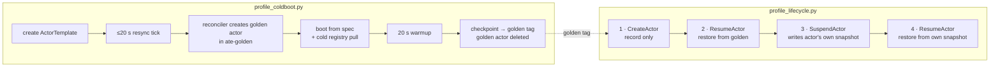

# Actor lifecycle profiling

Two scripts that measure where time goes in an actor's cold boot, suspend and
resume, using only the telemetry Substrate already emits. They make no code
changes. Each one drives the operation through `kubectl-ate`, then scrapes the
structured logs of ate-api-server, atelet and the ateom worker pods over the
window of that operation.

The main purpose is a **cold-registry-pull baseline** that future image
streaming work can be compared against, plus a phase breakdown of warm resume
latency against the sub-500 ms target.

> [!WARNING]
> `design.md` describes an earlier plan and is **out of date**. The
> `benchmark_substrate.py` script it lists was never built. It also refers to
> `internal/imagecache/streaming_linux.go` and an atelet flag
> `--image-streaming-poc`, and neither exists at `bb0effed`. atelet pulls images
> into its own layer cache (`internal/imagecache`) and never goes through
> containerd, so GKE Image Streaming (`gcfs`) has no effect on this path.
> Only its table of mirrored image digests is still accurate.

## Contents

| file | purpose |
|---|---|
| `deploy-pool.sh` | Creates the `ate-profiling` namespace, WorkerPool and atespace |
| `profiling-pool.yaml.tmpl` | The WorkerPool manifest that `deploy-pool.sh` fills in |
| `swebench-template.sh` | Creates an ActorTemplate from a mirrored SWE-bench image, pinned by digest, and waits for its golden snapshot |
| `profile_coldboot.py` | Profiles **template creation**: cold registry pull, boot from spec, golden checkpoint |
| `profile_lifecycle.py` | Profiles **one actor**: create → initial activation → suspend → resume |
| `run-*.json` | Results from past runs (see [Results](#results)) |

## What each script measures



**`profile_coldboot.py` never calls `CreateActor`.** It creates a template.
ateapi's template reconciler then creates, boots, checkpoints and deletes a
golden actor by itself (`cmd/ateapi/internal/controlapi/template_reconciler.go`).
That golden actor is the only thing in either script that boots from spec
(`Actor has no snapshot; Booting from ActorTemplate spec`). It is also the only
thing that pays a registry pull on a node that has never seen the image.

**`profile_lifecycle.py` never boots from spec.** Every actor it creates starts
out holding the template's golden tag, so step 2 is a restore. Steps 2 and 4 run
the same code path (`Actor has durable snapshot; Restoring from snapshot`). The
only difference is which snapshot they read. Step 2 pays a pull only when the
scheduler places the actor on a node without the image.

Neither script exercises `onResume` / `ResumeSource`. The template uses FULL
snapshots, and `from_data` applies only to DATA-scope snapshots.

### Where each number comes from

| tag | meaning |
|---|---|
| **M** | Measured: a duration the server wrote into one log record, or the difference between two log timestamps |
| **R** | Residual: a parent duration minus its measured children. Nothing logs this; it is a subtraction |
| **C** | Constant read from configuration, e.g. the 20 s golden warmup |

| component | log record | field |
|---|---|---|
| ate-api-server | `Handle RPC` | `elapsed-time` (Go duration string) |
| ate-api-server | `Picked worker` | worker pod and node |
| ate-api-server | `FinalizeSuspended store call durations` | per-store-call durations (int64 ns) |
| atelet | `Image cache hit` / `Image cache miss` | per image reference |
| atelet | `Image pulled into layer cache` | `took` (int64 ns): the registry pull, including gunzip and untar |
| atelet | `Restore timing breakdown` | `ate.actor.restore.duration.<phase>` (float **seconds**) |
| ateom | `Actor starting/started`, `restoring/restored`, `checkpointing/checkpointed` | lifecycle envelope timestamps |
| ateom | `About to run runsc <verb>` | per-container step markers |

Residuals exist because the per-step OTel spans (`stepSpan`,
`cmd/ateapi/internal/controlapi/workflow.go`) are only emitted as traces. On the
original project, Cloud Trace was blocked by a domain admin policy
(`ACCESS_TOKEN_TYPE_UNSUPPORTED`), so those spans could not be read. If your
project can read traces, you can get the steps the residuals hide.

## Machine and environment assumptions

The recorded results come from this setup. The scripts work on other setups,
but the numbers will not be comparable.

| | value | why it matters |
|---|---|---|
| cluster | GKE `substrate-poc`, zone `us-west1-c` | |
| nodes | **2 × `c3-standard-4`** (4 vCPU, 16 GB each; ~27 Gi allocatable in total) | `deploy-pool.sh` defaults are sized for this |
| node disk | **100 GB `pd-balanced`** | holds atelet's layer cache. Unpack speed is limited by this volume's throughput (see `--image-cache-dir` in `cmd/atelet/main.go`) |
| sandbox | gVisor (`SANDBOX_CLASS_GVISOR`, config `gvisor-default`) | |
| Substrate | `bb0effed` | the phase names and log messages the scripts read are specific to a version |
| registry | Artifact Registry, `us-west1-docker.pkg.dev/<project>/swebench-mirror/swebench-verified`, same region as the cluster | the pull baseline includes this network path |
| snapshot store | GCS bucket `snapshot-substrate-test-<project>` | `manifest_fetch` and `download` are GCS reads, not registry reads |

Local tools: `go`, `kubectl`, `kubectl-ate`, `crane`, `jq`, `gcloud`, and
`python3` (standard library only).

## Topology

```
          ┌──────────────── node A ────────────────┐   ┌──────────────── node B ────────────────┐
          │ atelet (DaemonSet)                     │   │ atelet (DaemonSet)                     │
          │   └─ layer cache (per node × digest)   │   │   └─ layer cache (per node × digest)   │
          │ worker pod  profiling-…  (1 CPU, 2 Gi) │   │ worker pod  profiling-…  (1 CPU, 2 Gi) │
          │ worker pod  profiling-…  (1 CPU, 2 Gi) │   │                                        │
          └────────────────────────────────────────┘   └────────────────────────────────────────┘
                         ate-system control plane (ate-api-server, Postgres) shares both nodes
```

- **Namespace, atespace and pool are all dedicated**: `ate-profiling` /
  `ate-profiling` / `profiling`. The template selects the pool with
  `workload: profiling`. Keeping this separate from the demo pools means a demo
  redeploy cannot change things under a profiling run.
- **3 workers across 2 nodes**, 1 CPU / 2 Gi each. The template asks for the
  same, so **an actor takes up its whole worker**. The pool has more than one
  worker, spread over both nodes, so that step 4 can turn out to be a cross-node
  migration.
- **One actor at a time.** The runsc step markers in ateom logs do not carry the
  actor's name. They are attributed by worker pod and time window, so two actors
  on one pod at the same time would mix their numbers together.
- **Placement is not pinned.** The scheduler picks the node for every resume.
  The node is read from `Picked worker` on each run, not assumed. This is how the
  recorded run got two independent pulls of the same image. It also means a
  cache HIT or MISS on step 2 depends on luck, not on the script.
- **"Warm" means the layer cache HIT, not same-node.** A cross-node migration to
  a node that already has the image is warm. A same-node resume after eviction
  would be cold.

## Setup

Run each step once per cluster, from the repo root.

**1. Environment.** Copy `hack/ate-dev-env.sh.example` to `.ate-dev-env.sh`,
set `PROJECT_ID`, `CLUSTER_LOCATION=us-west1-c`,
`NODE_MACHINE_TYPE=c3-standard-4` and `KO_DOCKER_REPO`, then:

```bash
source .ate-dev-env.sh
export PATH="$HOME/go/bin:$PATH"   # kubectl-ate and crane live here
```

**2. GCP resources and cluster.** `bootstrap` creates the cluster, the snapshot
bucket and the IAM bindings. That includes `roles/artifactregistry.reader` for
the atelet Workload Identity principal, which it needs to pull the SWE-bench
images.

```bash
go run ./tools/setup-gcp bootstrap
```

**3. Deploy Substrate.** This also labels the nodes with
`ate.dev/substrate-version`. Without that label the profiling workers stay
Pending.

```bash
./hack/install-ate.sh --deploy-ate-system
```

**4. CLI.** `make build-atectl` writes to `bin/`, not to `$GOPATH/bin`. If you
skip the copy, the old binary on your `PATH` fails with `missing bearer token`.

```bash
make build-atectl && cp bin/kubectl-ate ~/go/bin/kubectl-ate
go install github.com/google/go-containerregistry/cmd/crane@latest
```

**5. Mirror the SWE-bench images** into Artifact Registry. `crane copy` keeps
digests and does not need a local Docker daemon:

```bash
REPO=us-west1-docker.pkg.dev/${PROJECT_ID}/swebench-mirror/swebench-verified
crane copy swebench/sweb.eval.x86_64.<instance>:latest ${REPO}:sweb.eval.x86_64.<instance>
```

**6. Profiling pool.**

```bash
profiling/deploy-pool.sh
```

Check that the last lines list workers on **both** nodes. `WORKER_COUNT`,
`WORKER_CPU` and `WORKER_MEMORY` override the defaults. Keep the template's
`ACTOR_CPU` / `ACTOR_MEMORY` at or below the worker size, or the actor will
never be placed.

## Running

### Pre-flight

```bash
kubectl-ate get actor -a ate-profiling            # expect empty
kubectl-ate get actor-template -a ate-profiling   # note which instances are used
```

If an actor is left over from an interrupted run, remove it before you start.
It holds a worker, and its logs could be mistaken for the new run's. Only
`SUSPENDED` and `CRASHED` actors can be deleted normally. An actor stuck in
`SUSPENDING` needs:

```bash
kubectl-ate delete actor <name> -a ate-profiling --any-state
```

### 1. Cold boot

```bash
python3 profiling/profile_coldboot.py \
  --instance <instance> \
  --json profiling/run-coldboot-<instance>.json
```

This creates `ate-profiling/swebench-<instance>` and waits for its golden tag.
It takes about a minute. The pull is only cold if **no node** has pulled this
digest before, so **use an instance this cluster has never seen**. Running it
again on the same instance recreates the template but not the cache, and
reports `HIT`. The cache is keyed by node × manifest digest. Recreating a
template does not evict anything.

Read the result as:

- `pull … (10 layers)` and `MB/s`: **the baseline**. One sample.
- `template created → reconciler noticed`: waiting for the resync tick. It is a
  uniform draw over 0–20 s and says nothing about the system.
- The 20 s warmup is a constant, not a measurement. It drops to 0 only if every
  container declares `readyz`.

### 2. Lifecycle

Run this against the template the cold boot just created:

```bash
python3 profiling/profile_lifecycle.py \
  --atespace ate-profiling \
  --template swebench-<instance-with-dashes> \
  --worker-namespace ate-profiling --worker-pool profiling \
  --json profiling/run-lifecycle-<instance>.json
```

Each step runs as its own `kubectl-ate` process, with a 3 s `--settle` pause
before its logs are scraped. **The steps do not add up to a single timeline.**
The script deletes the actor at the end unless you pass `--keep`.

### 3. Resume distribution (repeat batch)

A resume leaves the cluster as it was before, so it can be repeated as often as
you like. Take at least 10 runs:

```bash
for I in $(seq -w 1 10); do
  echo "=== run $I ==="
  python3 profiling/profile_lifecycle.py \
    --atespace ate-profiling --template swebench-<instance-with-dashes> \
    --worker-namespace ate-profiling --worker-pool profiling \
    --json profiling/run-lifecycle-<instance>-$I.json
done
kubectl-ate get actor -a ate-profiling   # expect empty
```

Summarize the batch **in run order**. Sorting by duration makes the list look
like a trend over time:

```bash
python3 - <<'EOF'
import json, glob, statistics as st
v = []
for f in sorted(glob.glob('profiling/run-lifecycle-<instance>-*.json')):
    for s in json.load(open(f))['steps']:
        if ('resume' in s['step'] or 'activation' in s['step']) \
           and 'MISS' not in (s.get('images') or {}).values():
            v.append(s['ateapi']['ateapi_rpc_total'] * 1000)
steady = v[2:]  # drop run 01's two samples
print('in order:', ' '.join(f'{x:.0f}' for x in v))
print(f'steady n={len(steady)} mean={st.mean(steady):.1f} '
      f'p50={st.median(steady):.1f} max={max(steady):.1f}')
EOF
```

## Reading the results correctly

- **Discard the first run of a batch.** Run 01 always comes out slow. The cause
  is new TLS connections to GCS inside atelet (`manifest_fetch` 61–76 ms against
  a 32 ms median), not anything being measured.
- **Say which boundary a number is from.** `ateapi_rpc_total` is the server's
  handler time. `client_wall` adds about 420 ms of `kubectl-ate` process start
  and mTLS, which a long-running client pays once, not on every resume.
- **Resume numbers are a lower bound.** The template runs `sleep infinity` with
  no `readyz` probe, so the actor counts as RUNNING as soon as `runsc restore`
  returns. That measures *sandbox restored*, not *application serving*.
- **Cold-pull numbers are single samples.** A cold pull fills the cache it
  depends on being empty, so it cannot be repeated on the same node. Report each
  one as a single observation. Do not fit a model through them.
- **Pull throughput varies between sessions.** Two pulls of the identical image a
  minute apart differed by 8%. Throughput also differed by about 25% between
  days, which is more than the effect of image size across the range tested.
  **Measure an image-streaming result and its baseline in the same session.**
- **Warm path vs miss path.** A warm resume never contacts the registry.
  `oci_unpack` is under 1 ms on a HIT. On a MISS it contains the whole pull
  (about 21 s in the recorded run), so that one phase is where image streaming
  can help.

## Results

| file | contents |
|---|---|
| `run-coldboot-scikit-learn__scikit-learn-10908.json` | cold boot, 2026-09-22 |
| `run-lifecycle-scikit-learn__scikit-learn-10908.json` | one lifecycle run, same session; step 2 was a cache MISS |
| `run-lifecycle-scikit-learn__scikit-learn-10908-{01..10}.json` | repeat batch, 20 warm resume samples |
| `run-coldboot-scikit-learn__scikit-learn-26194.json`, `run-lifecycle-scikit-learn__scikit-learn-26194.json` | earlier session, 2026-09-21 |
| `run-goldenboot.json` | `matplotlib__matplotlib-23476` cold boot, 2026-09-21 |
| `run-coldboot.json`, `run-verify.json`, `run-postrebuild.json` | older runs from while the scripts were being developed. Older files use the step label `create + register`, which is now `create actor record` |

`report.md` has the phase-by-phase write-up for `scikit-learn-10908`.

Headline figures for `scikit-learn__scikit-learn-10908` (1 473 765 596 bytes,
10 layers):

| | value | n |
|---|---|---|
| cold boot, end to end | 54.6 s | 1 |
| cold registry pull | 19.2 s (76.6 MB/s) | 1 |
| resume on a cache MISS | 21.1 s | 1 |
| warm resume, steady state | **242 ms** mean, p90 266, max 289 | 18 |
| warm resumes over 500 ms | 0 of 20 | 20 |
