# Actor lifecycle & image-streaming profiling

Scripts that measure where time goes in an actor's cold boot, suspend, and
resume—comparing GKE Image Streaming (`gcfsd` + Riptide snapshotter) against
`atelet`'s baseline registry pull (`internal/imagecache`) using structured logs
from `ate-api-server`, `atelet`, and `ateom` worker pods.

## Contents

| file | purpose |
|---|---|
| `deploy-pool.sh` | Creates the `ate-profiling` namespace, WorkerPool, and atespace for single-pool runs |
| `profiling-pool.yaml.tmpl` | The WorkerPool manifest template rendered by `deploy-pool.sh` and `repeat_matplotlib.sh` |
| `swebench-template.sh` | Creates an ActorTemplate from a mirrored SWE-bench image, pinned by digest, and waits for its golden snapshot |
| `profile_coldboot.py` | Profiles **template creation**: cold registry pull or streaming `PrepareLayers`, boot from spec, and golden checkpoint |
| `profile_lifecycle.py` | Profiles **one actor**: create → initial activation → suspend → resume (supports `--step-gap` between steps) |
| `repeat_matplotlib.sh` | Runs the N-rep paired `stream` vs. `pull` benchmark on freshly recreated node pools per repetition |
| `aggregate_repeats.py` | Aggregates `repeat_matplotlib.sh` output directories (`rep-01..rep-N`) into median / min / max markdown tables |

## What each script measures

```mermaid
flowchart LR
    subgraph C["profile_coldboot.py"]
        T["create ActorTemplate"] --> R["≤20 s resync tick"]
        R --> G["reconciler creates golden actor<br/>in ate-golden"]
        G --> B["boot from spec<br/>+ cold pull OR stream PrepareLayers"]
        B --> W["20 s warmup"]
        W --> K["checkpoint → golden tag<br/>golden actor deleted"]
    end
    subgraph L["profile_lifecycle.py"]
        A1["1 · CreateActor<br/>record only"] --> A2["2 · ResumeActor<br/>restore from golden"]
        A2 --> A3["3 · SuspendActor<br/>writes actor's own snapshot"]
        A3 --> A4["4 · ResumeActor<br/>restore from own snapshot"]
    end
    K -. "golden tag" .-> A1
```



**`profile_coldboot.py` never calls `CreateActor`.** It creates a template.
`ateapi`'s template reconciler then creates, boots, checkpoints, and deletes a
golden actor by itself (`cmd/ateapi/internal/controlapi/template_reconciler.go`).
That golden actor is the only thing in either script that boots from spec
(`Actor has no snapshot; Booting from ActorTemplate spec`).

**`profile_lifecycle.py` never boots from spec.** Every actor it creates starts
out holding the template's golden tag, so step 2 is a restore. Steps 2 and 4 run
the same code path (`Actor has durable snapshot; Restoring from snapshot`). The
only difference is which snapshot they read. Step 2 pays a cold image fetch on a
node only when the scheduler places the actor on a node that has not seen the
image yet.

Neither script exercises `onResume` / `ResumeSource`. The template uses `FULL`
snapshots, and `from_data` applies only to `DATA`-scope snapshots.

### Where each number comes from

| component | log record | field |
|---|---|---|
| `ate-api-server` | `Handle RPC` | `elapsed-time` (Go duration string) |
| `ate-api-server` | `Picked worker` | worker pod and node |
| `ate-api-server` | `FinalizeSuspended store call durations` | per-store-call durations (int64 ns) |
| `atelet` (pull arm) | `Image cache hit` / `Image cache miss` | per image reference |
| `atelet` (pull arm) | `Image pulled into layer cache` | `took` (int64 ns): registry download + gunzip + untar |
| `atelet` (stream arm) | `PrepareLayers` / `Image prepared via streaming` | `resolve`, `stat`, `prepare`, `view`, `listable`, `wrapper`, `total` |
| `atelet` (restore) | `Restore timing breakdown` | `ate.actor.restore.duration.<phase>` (float **seconds**; emitted on `Restore`, not cold `Run`) |
| `ateom` | `Actor starting/started`, `restoring/restored`, `checkpointing/checkpointed` | lifecycle envelope timestamps |
| `ateom` | `About to run runsc <verb>` | per-container step markers |

## Machine and environment assumptions

| | value | why it matters |
|---|---|---|
| cluster | GKE Standard cluster in `us-west1-c` with Image Streaming enabled | Required for `gcfsd` on `--enable-image-streaming` node pools |
| paired node pools (`repeat_matplotlib.sh`) | `pool-stream` (`--enable-image-streaming`) and `pool-pull` (`--no-enable-image-streaming`), 2 nodes each (`c3-standard-4`, 100 GB `pd-balanced` by default; overridable via `MACHINE_TYPE`, `DISK_TYPE`, `DISK_SIZE`) | Isolates streaming vs. baseline pull on freshly created nodes every repetition |
| sandbox | gVisor (`SANDBOX_CLASS_GVISOR`, config `gvisor-default`) | |
| registry | Artifact Registry, `us-west1-docker.pkg.dev/<project>/swebench-mirror/swebench-verified`, **same region as the cluster** | GKE Image Streaming only streams from Artifact Registry in the same region/multi-region (not Docker Hub) |
| snapshot store | GCS bucket `snapshot-substrate-test-<project>` | `manifest_fetch` and `download` are GCS reads, not registry reads |

Local tools: `go`, `kubectl`, `kubectl-ate`, `crane`, `jq`, `gcloud`, and
`python3` (standard library only).

## Setup

Run each step once per cluster, from the repo root.

**1. Environment.** Copy `hack/ate-dev-env.sh.example` to `.ate-dev-env.sh`,
set `PROJECT_ID`, `CLUSTER_LOCATION=us-west1-c`,
`NODE_MACHINE_TYPE=c3-standard-4`, and `KO_DOCKER_REPO`, then:

```bash
source .ate-dev-env.sh
export PATH="$HOME/go/bin:$PATH"   # kubectl-ate and crane live here
```

**2. GCP resources and cluster.** `bootstrap` creates the cluster, the snapshot
bucket, and the IAM bindings (including `roles/artifactregistry.reader` for the
`atelet` Workload Identity principal). Pass `--enable-image-streaming` so GKE
allows `--enable-image-streaming` node pools (`pool-stream`):

```bash
go run ./tools/setup-gcp bootstrap --enable-image-streaming
```

**3. Deploy Substrate.** This deploys `ate-system` and labels the nodes with
`ate.dev/substrate-version`.

```bash
./hack/install-ate.sh --deploy-ate-system
kubectl create namespace ate-profiling 
```

**4. CLI.** Build `kubectl-ate` and copy it to your `PATH`:

```bash
make build-atectl && cp bin/kubectl-ate ~/go/bin/kubectl-ate
go install github.com/google/go-containerregistry/cmd/crane@latest
```

**5. Create and populate the regional Artifact Registry mirror** (`crane copy`
preserves digests without requiring a local Docker daemon):

```bash
gcloud artifacts repositories create swebench-mirror \
  --repository-format=docker --location=us-west1 || true
export REPO=us-west1-docker.pkg.dev/${PROJECT_ID}/swebench-mirror/swebench-verified
export BUCKET_NAME=snapshot-substrate-test-${PROJECT_ID}
crane copy swebench/sweb.eval.x86_64.matplotlib__matplotlib-23476:latest \
  ${REPO}:sweb.eval.x86_64.matplotlib__matplotlib-23476
```

## Running

### Paired N-rep Stream vs. Pull Benchmark (Recommended)

`repeat_matplotlib.sh` recreates both `pool-stream` and `pool-pull` before every
repetition (evicting both `gcfsd` and `atelet` node caches), alternates arm execution
order (`stream pull` on odd reps, `pull stream` on even reps), waits for background
`gcfsd` layer downloads (`wait_gcfsd_idle` + `--step-gap 90`) between steps, and
saves JSON telemetry + node pool configuration under `OUT`:

```bash
export CLUSTER=<cluster-name>
export ZONE=us-west1-c
export NODE_VERSION=$(gcloud container clusters describe "$CLUSTER" --zone "$ZONE" --format='value(currentNodeVersion)')
export DS=$(kubectl get ds -n ate-system -l app=atelet -o jsonpath='{.items[0].metadata.name}')
export VER=$(kubectl get ds -n ate-system "$DS" -o jsonpath='{.metadata.labels.ate\.dev/substrate-version}')
export REPO=us-west1-docker.pkg.dev/${PROJECT_ID}/swebench-mirror/swebench-verified
export BUCKET_NAME=snapshot-substrate-test-${PROJECT_ID}

# Run 15 paired cold repetitions (defaults to c3-standard-4 + 100 GB pd-balanced):
N=15 GAP=90 OUT=profiling/results/v3/repeat profiling/repeat_matplotlib.sh

# Aggregate across repetitions into a markdown report:
profiling/aggregate_repeats.py profiling/results/v3/repeat > summary.md
```

To benchmark an alternate VM or disk shape (for example `e2-standard-32` + `pd-ssd`),
override `MACHINE_TYPE`, `DISK_TYPE`, and `DISK_SIZE`:

```bash
MACHINE_TYPE=e2-standard-32 DISK_TYPE=pd-ssd DISK_SIZE=100 \
  N=15 GAP=90 OUT=profiling/results/v3-e2ssd/repeat profiling/repeat_matplotlib.sh
```

### Single-Arm / Interactive Profiling

Deploy the standalone profiling WorkerPool:

```bash
profiling/deploy-pool.sh
```

Run a single cold boot + lifecycle measurement:

```bash
python3 profiling/profile_coldboot.py \
  --instance matplotlib__matplotlib-23476 \
  --json profiling/run-coldboot-matplotlib__matplotlib-23476.json

python3 profiling/profile_lifecycle.py \
  --atespace ate-profiling \
  --template swebench-matplotlib-matplotlib-23476 \
  --worker-namespace ate-profiling --worker-pool profiling \
  --step-gap 90 \
  --json profiling/run-lifecycle-matplotlib__matplotlib-23476.json
```

## Reading the results correctly

- **Both node caches persist across template recreation.** Deleting or recreating an
  `ActorTemplate` does not evict `atelet`'s layer cache (`/var/lib/ateom-gvisor/image-cache`)
  or `gcfsd`'s node content cache. True cold pulls and cold streams require fresh nodes
  (as `repeat_matplotlib.sh` enforces per repetition).
- **Say which boundary a number is from.** `ateapi_rpc_total` is the server's
  handler time. `client_wall` adds ~420 ms of `kubectl-ate` process startup and mTLS.
- **Cold-boot `atelet` vs. restore `atelet`.** Cold boot invokes `AteomHerder.Run`
  (reporting `pull took` on the pull arm or `PrepareLayers` phases on the stream arm),
  whereas snapshot resume invokes `AteomHerder.Restore` (reporting `Restore timing breakdown`).
- **Warm path vs. cold miss path.** On `matplotlib__matplotlib-23476` (`3,073 MB`,
  10 layers), GKE Image Streaming cuts cold `atelet` image preparation from ~`51 s`
  (`c3-standard-4`) / ~`70 s` (`e2-standard-32`) down to ~`2.3–2.5 s` (`PrepareLayers.total`),
  while warm resumes (`stat-hit` / layer cache `HIT`) complete in ~`225–245 ms` (`ateapi_rpc_total`).
